# Chapter 1 - Basics

Your customer *Pencilla Inc.* wants to take the first step toward a digital factory. You start small: create **PencilFactory** and bring one manual station online.

> [Table of contents](README.md) | [Next](chapter-02-drivers.md)

**On this page:** [Use Case](#use-case) | [Goals](#learning-goals) | [Starting point](#before-you-start) | [Practice](#practice) | [Check your reasoning](#check-your-reasoning) | [Troubleshooting](#troubleshooting)

## Use Case

*Pencilla Inc.* produces pencils from wooden slats and graphite. Production has four steps:

* Assembling: Glue slats and graphite together and shape them
* Colorizing: Add paint and imprint text
* Testing: Check writing quality and color visibility
* Packing: Pack each article in a box

Each step runs on a separate workstation. A worker follows instructions and may
operate a machine.

For more information about pencil production, look [here](https://musgravepencil.com/blogs/news/howapencilismade).

This chapter covers **Assembling** only. The other three stations come in later
chapters, once you can run Assembling from an order through to completion.

## Learning goals

By the end of this chapter, you should be able to:

* Create a MORYX application with the CLI and run it with databases ready
* Model `ProductType` properties for the UI and persistence, configure AssemblingCell + VisualInstructor
* Connect products to cells with a Workplan and Recipe, start an Order and confirm the instruction in Worker Support

## Where you are in the journey

* **Assembling**: this chapter (manual cell, instructions in Worker Support)
* Colorizing: chapter 2
* Testing / Packing: chapters 4 and 7-8

Later chapters extend that same line. Each chapter states what is new.

## Before you start

Start from an empty training folder after you installed the tools from the README. This chapter creates the application from scratch. Later chapters continue on the same solution.

## Setup

To setup a new project, you need the *MORYX CLI* installed. If you have installed
Visual Studio already, you would use `dotnet` tools:

```bash
dotnet tool install -g moryx.cli
```

Use `moryx new` to create a new MORYX application. It bootstraps a new C# solution
using the provided name and optionally takes additional parameters like `--steps`,
`--products`. Thus, it enables you to initialize everything you need in a single
command:

```bash
moryx new <NAME> --steps <LIST-OF-STEPS> --products <LIST-OF-PRODUCTS>
```

Considering *Pencilla Inc.* to apply MORYX to the whole factory, you decide to
use `PencilFactory` as the project name but it could also be a machine name, for
example. Optionally you can provide the steps and products already to the `new`
command. The products (`GraphitePencil`, made from `Slat` and `Graphite`) have already been
identified, but only `GraphitePencil` is needed so far.
Even though there are four production steps, in the first iteration,
only the `Assembling` step should be covered by MORYX. This information results
in the following command:

```bash
moryx new PencilFactory --steps Assembling --products GraphitePencil
```

> **Note:** This training uses a simplified application template tailored to this scenario. For real-world applications you would usually pick a different default setup or customize it (see the [Moryx.Cli README](https://www.nuget.org/packages/Moryx.Cli#readme-body-tab) or `moryx --help`).

This should not only leave you with a solution `PencilFactory.sln` inside
the new folder `PencilFactory`, it also does some initial configuration.

That means you can open `PencilFactory.sln` in Visual Studio **or** open the folder in any editor (VS Code, Rider, …) and work from the terminal.

**Start the application** (pick one):

* **Visual Studio:** open the solution, set `PencilFactory.App` as startup project if needed, press `F5`.
* **Any editor / terminal:** from the solution root (`PencilFactory`, the folder that contains the `.sln`):

```bash
dotnet run --project src/PencilFactory.App
```

Or `cd` into `src/PencilFactory.App` and run `dotnet run`.

> **Note:** The first start restores NuGet packages automatically (`dotnet run` / F5) and can take a few minutes. If restore fails (**NU1301** / proxy **407**), see [NuGet restore / proxy (MyGet)](#nuget-restore--proxy-myget).

Open the URL shown in the console (usually `https://localhost:5000`). Later chapters use the same start command whenever they say “start the app” or “press F5”.

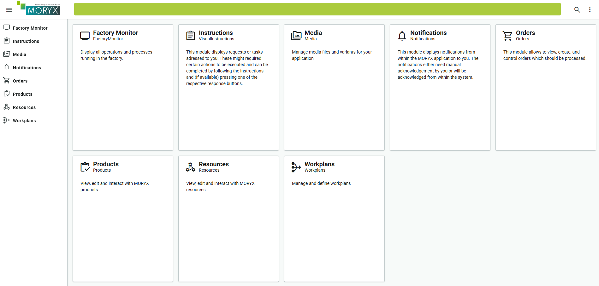

Now that you have a running MORYX instance, you need to create some databases.
To skip the UI here and speed things up, you'll use the MORYX CLI again.

While the application is still running, `moryx exec post-setup` will create empty
databases and restart dependent modules. If your application runs on a different
host than `https://localhost:5000`, you can specify that by the `--endpoint <URL>`
option.

```bash
moryx exec post-setup
```

If Products/Resources fail or modules look broken afterwards, jump to [Encountering database issues after setup](#encountering-database-issues-after-setup-section).

## Project structure

After `moryx new`, open `PencilFactory.sln` (or the folder) in your editor. The solution contains several projects. Almost every chapter only changes a few of them.

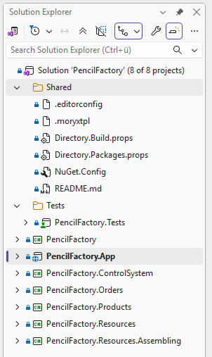

The template uses the SDK-style project format. Shared build settings and package versions live in files such as `Directory.Build.props` and `Directory.Packages.props`. Prefer updating MORYX package versions there instead of only through the NuGet Package Manager.

`PencilFactory` is the shared domain project (root namespace). It holds types used across the solution, for example product types and activities.

| Project | Purpose |
| ------- | ------- |
| `PencilFactory` | Domain model: product types, activities, parameters, later capabilities |
| `PencilFactory.Resources` / `PencilFactory.Resources.Assembling` | Resources for the plant (cells, VisualInstructor, later drivers) |
| `PencilFactory.App` | Starts the application and references the other projects |
| `PencilFactory.Products`, `ControlSystem`, `Orders` | Plugins for later chapters |
| `PencilFactory.Tests` | Unit tests |

Later chapters add more resource projects the same way. `PencilFactory.App` must reference each resource project you want to see in the UI.

### What you will touch in this chapter

| Kind | Items |
| ---- | ----- |
| Projects | `PencilFactory` (`Products/`, `Activities/`), `PencilFactory.Resources.Assembling`, `PencilFactory.App` |
| Types | `GraphitePencilType`, `PencilColor`, `GraphiteHardness`, `AssemblingCell`, `AssemblingParameters` |
| UI | Products, Resources, Workplans, Orders, Worker Support |

If a type never shows up in the Add Resource dialog, check the App project references first (see [Troubleshooting](#troubleshooting)).

### Check your progress

* Solution/folder opens in your editor and the app starts (dashboard visible)
* `moryx exec post-setup` completed without errors while the app was running
* You can name the domain project, the Assembling resource project and the App host

---

## Products

At first, you will model [products](https://github.com/PHOENIXCONTACT/MORYX-Framework/blob/main/docs/articles/module-products/product-definition.md).
Products represent the articles to be manufactured. MORYX differentiates between
`ProductType` and `ProductInstance`:

| | ProductType | ProductInstance |
| --- | --- | --- |
| Idea | Catalog entry (what you can order) | Concrete piece in production (serial / instance) |
| Example | Green HB graphite pencil as a type | One pencil currently on the assembling station |
| You model | Classes under Products, properties, later PartLinks | Created by the system when an order runs |

In order for a `ProductType` to be produced, it needs a corresponding `ProductInstance` at runtime.
For further information on how to create a product, see [this tutorial](https://github.com/PHOENIXCONTACT/MORYX-Framework/blob/main/docs/tutorials/how-to-create-a-product.md).

Let's take a look at the composition of the pencil *Pencilla Inc.* produces.

* A pencil consists of 2 wooden slats and 1 graphite in the middle.
* The pencil has a color (green or brown).
* Graphite can have different hardness grades. This training implements *B* and *HB*, *2B* is another possible grade.

> **Note:** When defining the hardness of pencils, the number (degree) is put first (2B, 2H, etc.). Since this can't be represented in code, it is switched for names, while for everything else the official format is used. If you are interested, you will find more about [grading and classification here](https://en.wikipedia.org/wiki/Pencil#Grading_and_classification).


From the details above, the `GraphitePencilType` needs

* a color property
* a hardness property

Open `GraphitePencilType` in the `PencilFactory` project under the `Products` folder
(with the other generated `*Type` classes).

> **Concept:** MORYX does not expose every C# property automatically. You mark members with
> attributes (metadata). At runtime the framework reads them through reflection.
>
> * [`EntrySerialize`](https://github.com/PHOENIXCONTACT/MORYX-Framework/blob/main/docs/articles/framework/serialization/entry-convert.md#entryserialize-attribute):
>   show and edit the property in the Products UI
> * [`DataMember`](https://learn.microsoft.com/en-us/dotnet/api/system.runtime.serialization.datamemberattribute):
>   store the property with the product data
>
> Use **both** on Color and Hardness. Missing `EntrySerialize` -> nothing to edit in the UI.
> Missing `DataMember` -> a saved UI value may vanish after restart.
>
> If an attribute is underlined red, press `Ctrl + .` and add the using
> (`Moryx.Serialization` / `System.Runtime.Serialization`).

Add these properties:

```cs
[EntrySerialize]
[DataMember]
public PencilColor Color { get; set; }

[EntrySerialize]
[DataMember]
public GraphiteHardness Hardness { get; set; }
```

`PencilColor` and `GraphiteHardness` do not exist yet. Put the cursor on the red
name, press `Ctrl + .` and choose **Generate class 'PencilColor' in new file**.
Open that file, change `class` to `enum` and fill in the values:

```cs
public enum PencilColor
{
    Green = 1,
    Brown = 2,
}
```

Do the same for `GraphiteHardness`. Optionally add
`[Display(Name = "...")]` (`System.ComponentModel.DataAnnotations`) on enum values.
That only changes the **label** in the dropdown. The C# name stays `B` / `HB`
(identifiers cannot start with a digit, so you cannot name a member `1B`).

```cs
using System.ComponentModel.DataAnnotations;

public enum GraphiteHardness
{
    [Display(Name = "B")]
    B = 1,
    [Display(Name = "HB")]
    HB = 2
}
```

Rebuild so the new type appears in the Products UI.

### Create Products

To create a product, you need to run the application now and head to the
**Products UI**.

Click on the plus button to open the 'Product Importer' menu. This title may
sound a bit confusing, but it lets you add new products.

> **Note:** The naming here comes from the fact, that you wouldn't necessarily add products here, but 'import' them from other systems.


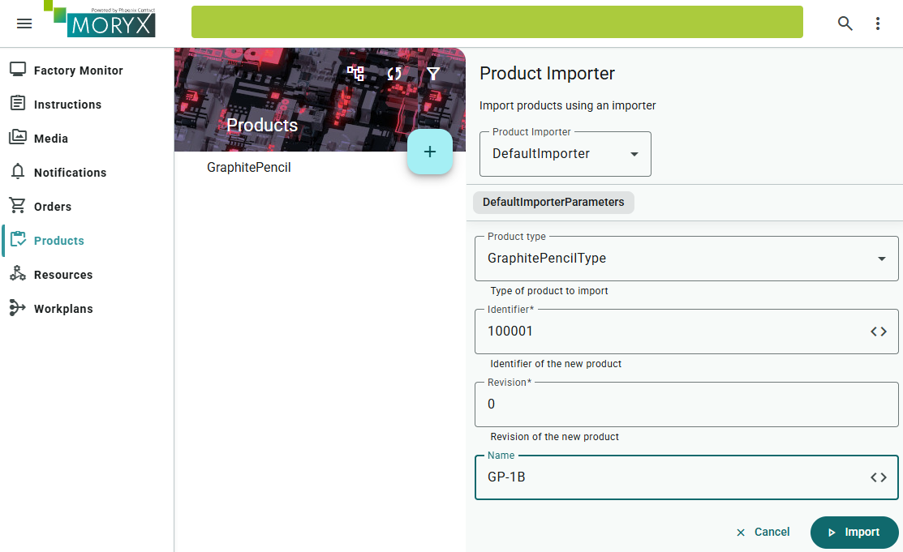

* Click on the ProductType dropdown and select **GraphitePencilType**
* Fill in the fields
  * *Identifier*: `100001`
  * *Revision*:  `0`
  * *Name*: `GP-1B`
* Click on **Import**.
* Click on the product you just added: `100001-00 GP-1B`
* Click on the edit icon at the top left to edit.
* In the `Color` dropdown choose `Green`
* In the `Hardness` dropdown choose `B` as the hardness, which represents `1B`
  in this case.
* Save your changes by clicking on the save icon at the top left corner.

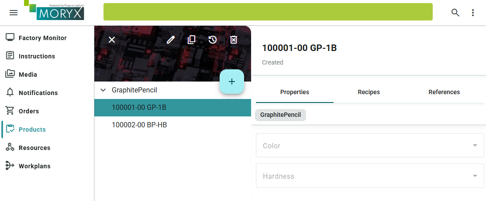

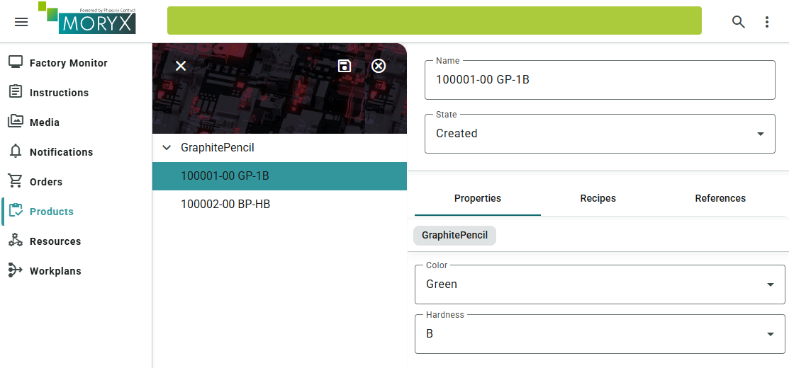

Repeat the same steps for a second product:

* `GraphitePencilType`
  * *Identifier*: `100002`
  * *Revision*: `0`
  * *Name*: `BP-HB`
  * *Hardness*: `HB`
  * *Color*: `Brown`

If you did everything correctly, you should end up with something more or less
similar to the image below.

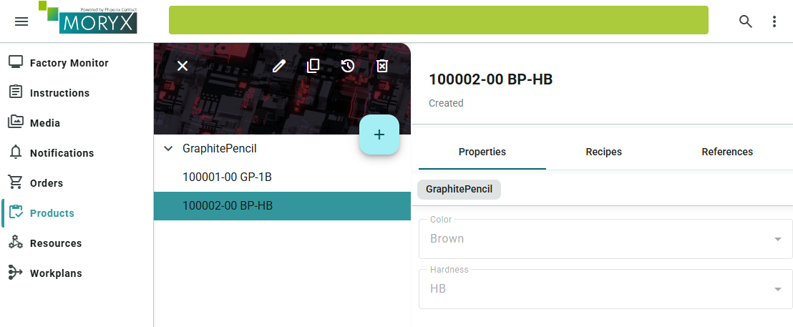

Now you should have your products `100001-00 Green Pencil GP-1B` and
`100002-00 Brown Pencil BP-HB`.

### Check your progress

* Products `100001` (Green / B) and `100002` (Brown / HB) exist and show Color and Hardness after save
* After an app restart, those property values are still there

### Quick experiment: EntrySerialize vs DataMember

You already know from the Concept box what each attribute is for. Now prove it.

Important: you edit attributes on `GraphitePencilType`. That change applies to **every**
product of this type (including `100001` / `100002`).

**First, guess:**

* If only `DataMember` is missing: can you still edit Color in the UI? Will a new value survive a restart?
* If only `EntrySerialize` is missing: will Color still appear in the product editor?

**Then run** (observe on any GraphitePencil product, for example `100001`):

1. Both attributes present -> set Color, save, restart -> value still there.
2. Remove only `[EntrySerialize]` on `Color` -> rebuild, restart -> open the product. Is Color still editable? Put the attribute back, rebuild, restart.
3. Remove only `[DataMember]` on `Color` -> rebuild, restart -> change Color, save, restart again. Is the new value still there? Put the attribute back, rebuild, restart and set Color back to the intended training values (Green on `100001`, Brown on `100002`).

<details>
<summary>Expected outcome</summary>

Without `EntrySerialize`, Color disappears from the editor (or is not editable) for all GraphitePencil products. Without `DataMember`, you may still edit Color, but the change does not stick after restart. That is why Color and Hardness keep both attributes for the rest of the training.

</details>

Next you model a resource so a Recipe and [Workplan](https://github.com/PHOENIXCONTACT/MORYX-Framework/blob/main/docs/articles/abstractions/processing/workplans.md) can actually produce pencils.

## Resources

We begin with modeling the assembling station, used to assemble the pencils. This
is where resources come into play.

Resources represent physical assets and logical objects like robots or drivers
within a cyber physical system. They can be coupled with active devices or represent
passive objects like a table. The main advantage of this concept is that the
resource interface and implementation structure is the same for all resources.
So accessing a resource is done in an abstract and general way. Processing,
configuring and visualization of a resource is done in the same way with the
same classes. Extending a default resource can be done in a standard way and
includes expansion of the default UI as well.

Together with the customer you have figured out the following requirements as
the first steps to digitalize their factory:

* They want to equip their assembling station with a screen
* The screen should display the instructions, a worker should follow
* When workers have finished a task, they click on the screen to confirm it

Based on these requirements

* The cell should display a worker support screen to the worker
* Depending on the workers input (*success*, *failure*) the product either moves
  to the next station or goes into a scrap container

### Add worker support

The `AssemblingCell`, which you will find in `PencilFactory.Resources.Assembling`,
already has an instructor.

``` cs
[ResourceReference(ResourceRelationType.Extension)]
public IVisualInstructor VisualInstructor { get, set, }
```

`IVisualInstructor`
is the interface for a digital resource displaying the visual instructions on a
screen and requires workers to interact by pressing buttons.

`ResourceReference`
is an attribute that links two or more resources together. It's a mechanism that
is used to save and load the source and the target relationship in the database.

You can start now to map the real world into digital twins using MORYX. As a
recap, the following is planned for the pencil factory:

There should be one assembling station (cell), which will have a monitor to show
instructions to a worker. So the following resources are needed:

* 1 `AssemblingCell`
* 1 `VisualInstructor`

You will set up these in MORYX within the *Resources UI* by clicking the "+"
button and selecting the required cell.

> **Note:** Make sure to deselect all cells before adding more, so that they will be added to the root level and not as children of other resources. Even though, that wouldn't do any harm.


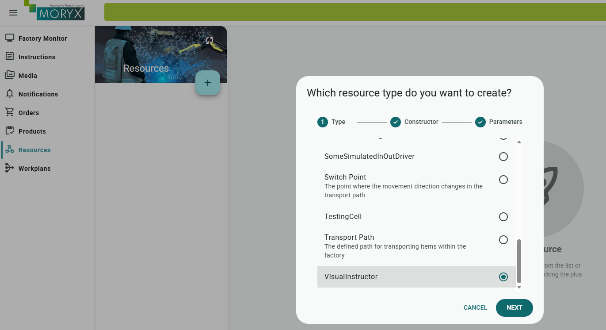

In the following dialog it is ok to go with just the typename as the cell
identifier.

If you select the *AssemblingCell* and click the edit button, you can assign
the previously created *VisualInstructor* to its *Instructor* property.

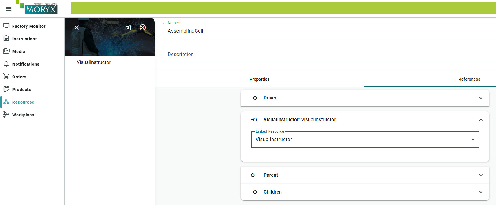

### Check your progress

* AssemblingCell and VisualInstructor exist at root level in Resources
* AssemblingCell's VisualInstructor reference points to the VisualInstructor

### Sessions

Make sure the assembling cell file imports visual instructions:

```cs
using Moryx.VisualInstructions;
```

Cell and Instructor are now connected, but they do not interact with each other.
Therefore, you need to implement the cell's session handling. But before you do,
you will get a short introduction about how this works in theory and the
vocabulary that is used within MORYX.

*Sessions* are considered the sum of all tasks a resource (in this case a cell)
has to perform on a single product instance. A session may consist of multiple
*sequences*, which contain a single *activity*.

While *sessions* and *activities* are represented by types, *sequences* are more
of a concept.

Usually a *session* (and with it a *sequence*) is started by a resource, telling
the process engine, that it is *ReadyToWork*.

Then with `ActivityStart()` the process engine can tell a resource, that it
should start working on a product. After the resource has finished its job, it
will signal this with `ActivityCompleted()`.

When the process engine has processed the *ActivityResult* (submitted by `ActivityCompleted`),
it will "close" the sequence with `SequenceCompleted()`.

Then, the resource could continue the current *session* (`ContinueSession`) with
another *sequence* or start a whole new *session* by signaling `ReadyToWork`.

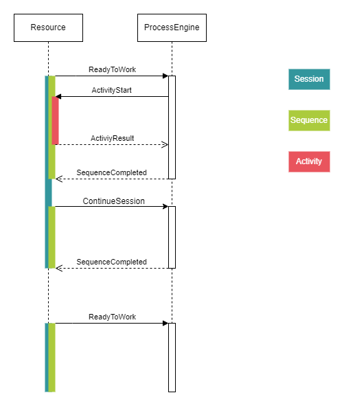

Now, you will convert theory into practice and begin with starting a *session*.

**Subgoal: Signal ready to work**

To do so, update the `ProcessEngineAttached()` method to the following: 

```cs
protected override IEnumerable<Session> ProcessEngineAttached()
{
    yield return Session.StartSession(ActivityClassification.Production, ReadyToWorkType.Push);
}
```

`ProcessEngineAttached()` gets called in the event of the ProcessEngine being 
attached to the resource, which is, when the application gets started.

In here you will yield return a new session using `Session.StartSession()` and
thus signal `ReadyToWork` to the ProcessEngine.

* `ReadyToWorkType.Pull` is used to retrieve an activity, that is assigned to
  the cell. If there is no activity, it would result in a `SequenceCompleted()`.
  This is typically used to start activities if a product is already 'in' a
  cell.
* `ReadyToWorkType.Push` *won't* result in a `SequenceCompleted()`, but would
  'wait' for an activity, like subscribing for push notifications.
* `ActivityClassification.Production` is used to notify that the cell is ready to
 work on an `Activity` of type `production`.

**Subgoal: Start the activity (show instruction)**

Since that should result in an `StartActivity()` call, the next thing to
do will be to implement this function. Find the comment
`/* Start execution here */` and replace it so that the whole function looks
like this:

```cs
public override void StartActivity(ActivityStart activityStart)
{
    _currentSession = activityStart;
    switch (activityStart.Activity)
    {
        case AssemblingActivity activity:
            _currentInstruction = VisualInstructor.Execute(Name, activityStart, InstructionCompleted);
            break;
    }
}
```

That wouldn't compile so far, because there is no `InstructionCompleted()` callback right 
now, which is provided as a delegate to `VisualInstructor.Execute`. That means, you 
have to implement `InstructionCompleted()`, that gets called, when an instruction
has finished, i.e.: When a worker has finished its task.

**Subgoal: Complete the activity and re-offer ReadyToWork**

```cs
private void InstructionCompleted(int instructionResult, ActivityStart activity)
{
    _currentInstruction = 0;
    var result = activity.CreateResult(instructionResult);
    _currentSession = result;
    PublishActivityCompleted(result);
}
```

These previous lines will publish an `ActivityCompleted` result to the ProcessEngine. 

And finally, the method that gets called on a cell after completing work is
`SequenceCompleted()`. In here you start a *ReadyToWork* session again, using
`PublishReadyToWork()` and update `_currentSession`.

```cs
public override void SequenceCompleted(SequenceCompleted completed)
{
    _currentSession = completed;

    var rtw = Session.StartSession(ActivityClassification.Production, ReadyToWorkType.Push);
    PublishReadyToWork(rtw);
    _currentSession = rtw;
}
```

## Start production

### Create a *Workplan*

In order to produce pencils, you have to establish the connection between cells
and products: MORYX needs to know, how a product flows through the production
line. This is not done in the code, but modelled within [Workplans](https://github.com/PHOENIXCONTACT/MORYX-Framework/blob/main/docs/articles/abstractions/processing/workplans.md).

This allows you to define in a rather abstract way, *what* needs to be done without
going much more into details. MORYX will find the way later, *how* this is done
for a running order.

Start the application, go to *Workplans* and click on the plus button.

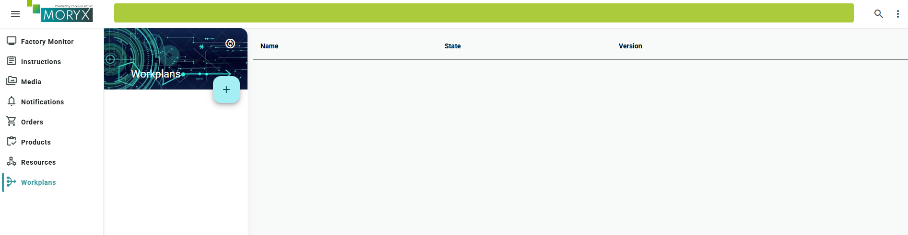

Drag an *Assembling Task* step to the workplan and connect the inputs and outputs.

The available *Steps* correlate to the code, that has been generated and was
shipped together with the *assembling* resources.

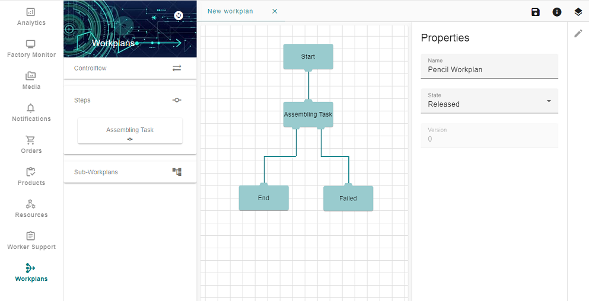

### Make instructions configurable

The instruction texts should not be hard-coded in the cell. They belong in the
workplan per task. For that, the parameters inherit from
`VisualInstructionParameters`. `Populate` can pull values from the running
process. For Assembling, calling the base class is enough, the instructions
come from the Workplan UI.

File: `src/PencilFactory/Activities/AssemblingStep/AssemblingParameters.cs`

```cs
public class AssemblingParameters : VisualInstructionParameters
{
    protected override void Populate(Process process, Parameters instance)
    {
        base.Populate(process, instance);
    }
}
```

You want to configure the text that is displayed on the worker instruction.
Click on the *Assembling Task* step to edit it and configure it as shown in
the screenshot below. The text to put in could be `Put the graphite into the slats and glue them together. Then cut the result into pieces and shape each of them`. But could be
anything you want.

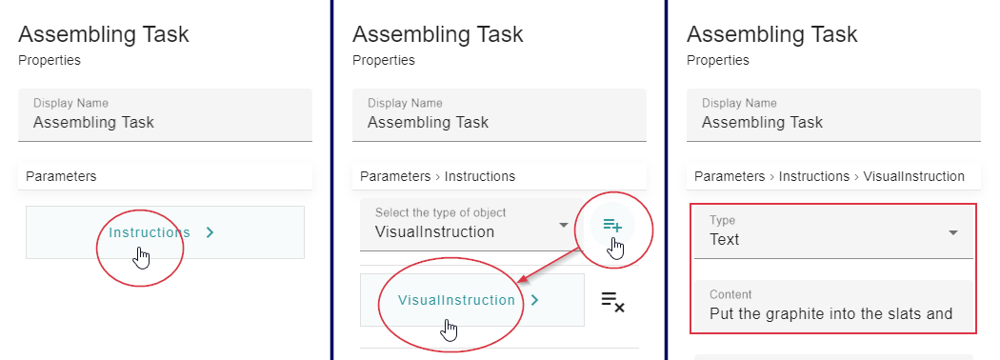

When you are done, modeling your workflow, you have to save the workplan.

### Add a *Recipe*

In order to make the connection between a `Product` and the `Workplan` you just
created, you need a *Recipe*.

Go to *Products* and select the *Product* you want to produce, that is the
*GraphitePencil*. Click on the *Recipes* tab and the edit button located on the
top right corner. Click the *Add Recipe* button, located on the bottom left
corner to add a new recipe.

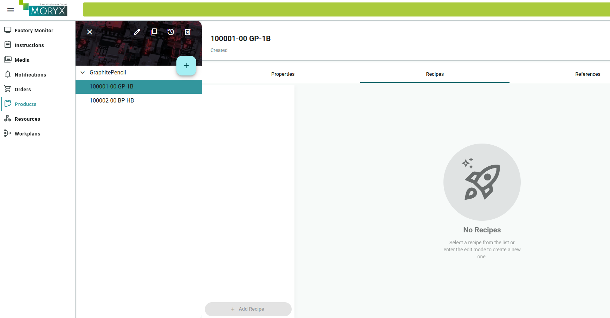

* Select the **ProductionRecipe**, give the recipe a name `PencilRecipe` and select
your created workplan `Workplan`.

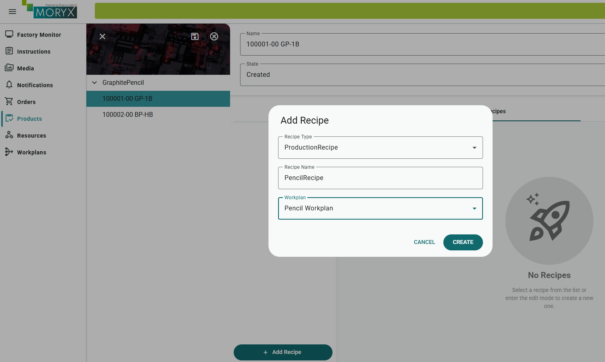

* Click on **Create** for the recipe to show up in the products UI.
* For the recipe to be automatically selected when the product is produced, select
`Default` Classification.
* Save your changes by clicking on the save icon located at the top right corner.

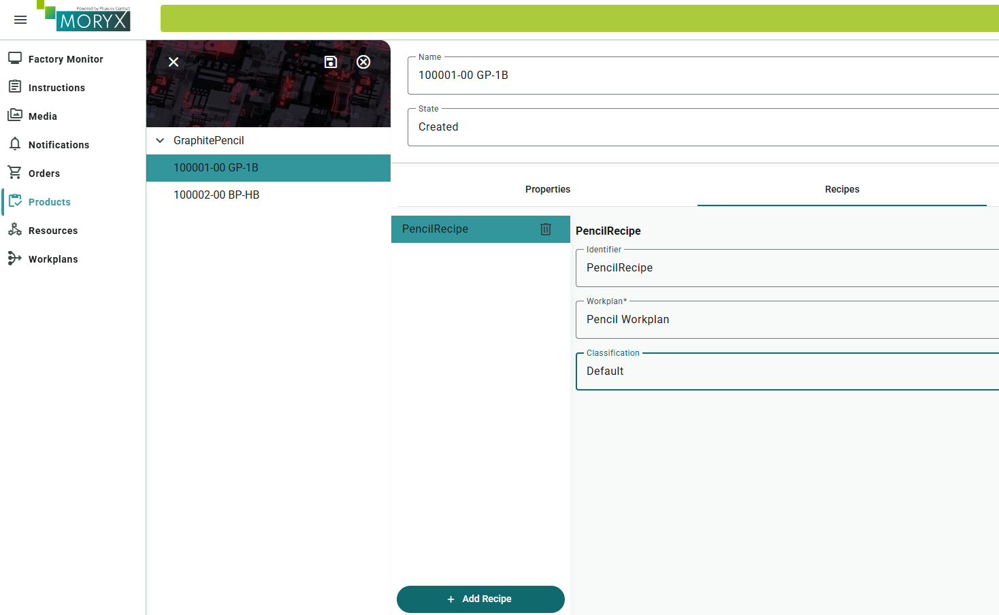

* Repeat the same steps for the second product `100002-00 Brown Pencil BP-HB`.

### Check your progress

* Workplan contains an Assembling Task with instruction text and connected inputs/outputs
* Both products have a Default `PencilRecipe` pointing at that workplan

### Start production

To create a new `Order`. Navigate to the *Orders* UI.

* Click on the add button at the top right.

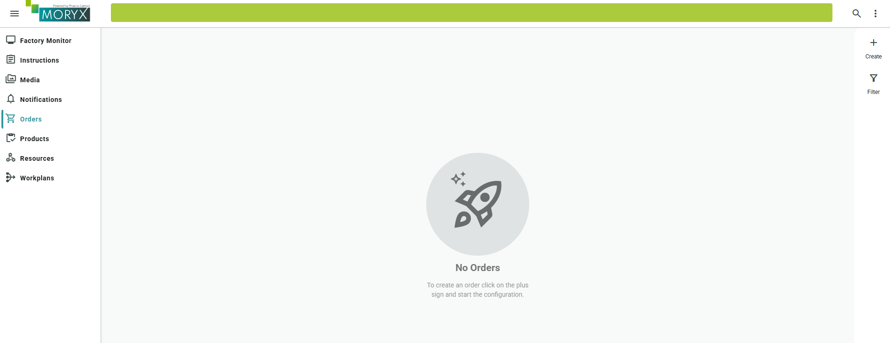

Fill in the details of the `Order`:

* *Order Number*: `000001` .
* *Operation Number*: `0001`.
* *Product*: `100001-00 GP-1B`
* *Recipe*: `Pencil Recipe`
* *Amount*: `5`

Click on the plus button to add this as an operation to the order. One order
can have multiple operations, but this is not needed here. Click *CREATE* to
create the order.

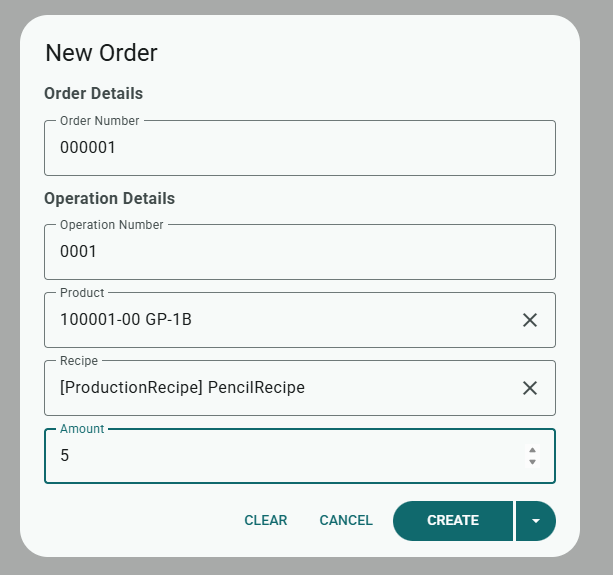

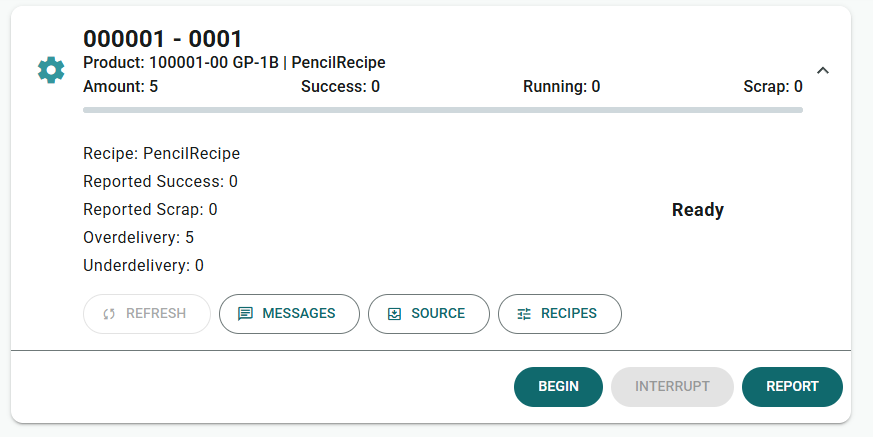

* Click on *BEGIN* to start the production of the order.
* Enter `1` as the `Partial Amount`.
* Then click on  *BEGIN* to start the production.

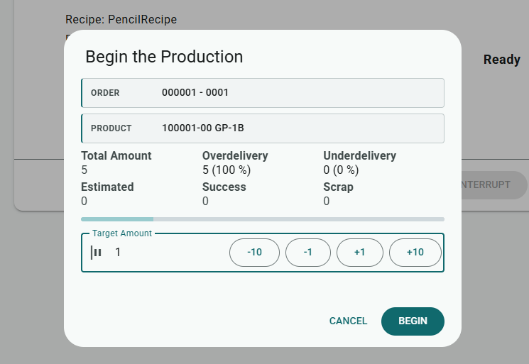

Now the production is running!

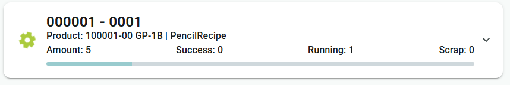

That's it, you should now be able to let the pencils flow through the assembling
cell.

In order to see the visual instructions, go to the module `Worker Support`.
Select VisualInstructor as Display, if this is not already done by default.
You can manually select it by clicking on the Settings icon at the top right.

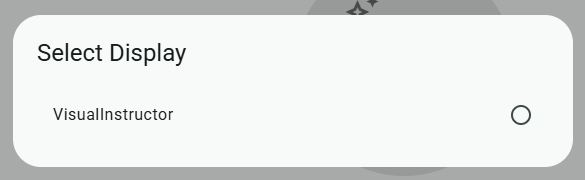

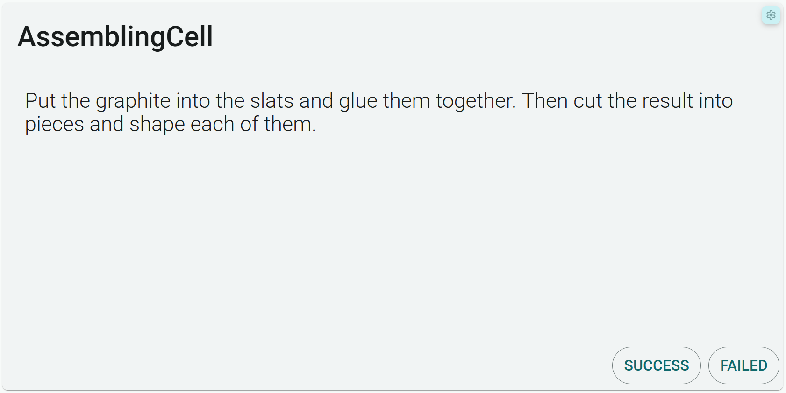

Use the `SUCCESS` and `FAILED` action to make the products flow through the production line

### Check your progress

* Order `000001` is running (or completed) after BEGIN
* Worker Support shows the Assembling instruction. SUCCESS / FAILED advances the product

## Checklist

* [ ] `PencilFactory` created with the CLI and running
* [ ] Products `100001` (Green) and `100002` (Brown) created
* [ ] AssemblingCell linked to VisualInstructor
* [ ] Workplan, recipe and first order completed in Worker Support

## Summary

You have a running host, persistent product data, a manual cell and a recipe/workplan that can start an operation. Product classes describe the article. Session methods implement the cell's interaction with the Process Engine. The UI connects the objects.

## Reflect

1. What can happen when a property has EntrySerialize but no DataMember? What changes when the attributes are reversed?
2. Why does SequenceCompleted offer ReadyToWork again?
3. Which requirement belongs in workplan configuration and which requires cell code?

## Practice

Create a separate test product `100099`, revision `0`, using the existing `GraphitePencilType`. Create a second workplan with an Assembling task and a different instruction text. Give the test product a Default recipe that points to that workplan. Run one piece in Orders / Worker Support.

**Acceptance checks:** the test product shows the new instruction. `100001` and `100002` still use the original recipe/workplan. You did not change AssemblingCell code.

Keep `100099` if you want. Later chapters rely on `100001` and `100002`.

## Check your reasoning

<details>
<summary>Compare your answers after attempting the questions and practice</summary>

1. With EntrySerialize but no DataMember, Color can appear in the Products UI, but a new value may be gone after restart. With DataMember but no EntrySerialize, the value can still be stored, but you cannot edit that field in the UI.
2. ProcessEngineAttached offers readiness at the start. After a finished sequence, SequenceCompleted must offer ReadyToWork again so the next piece can start.
3. Instruction text belongs in the workplan task. Cell code handles ActivityStart, worker completion and ReadyToWork. A second instruction therefore needs a new workplan (and recipe), not a changed AssemblingCell.

</details>

## Troubleshooting

Common problems in this chapter:

### NuGet restore / proxy (MyGet)

**Problem:** `dotnet run` fails while restoring with **NU1301** on MyGet / proxy **407**. Visual Studio may still work.

**Fix:** In the solution `NuGet.Config`, comment out or remove the `MORYX Open Source CI Packages` (MyGet) line under `packageSources` (keep `nuget.org`), then start again with `dotnet run --project src/PencilFactory.App`.

More background (why open source can still hit a proxy): [Troubleshooting](troubleshooting.md#nuget-restore-fails-nu1301--myget--proxy-407-dotnet-run-fails-visual-studio-works).

### Encountering database issues after setup section

> Something went wrong on the server.

> The connection to the server could not be established. Please check your network connection or try again later.

If you encounter issues when opening Products or Resources for the first time at the end of the setup,
consider checking the databases in the command center.
There you may have to create the missing databases.

If the issue occurs during the ADP at a later stage due to messing up the order of steps or making changes to classes, of existing entries, you may also need to delete the DB.

#### Step 1: Open the Command Center

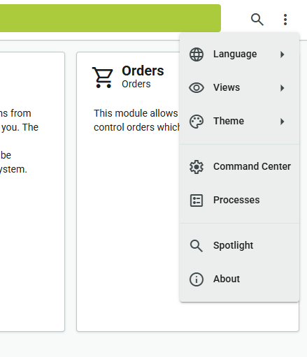

#### Step 2: Check the databases and create missing ones

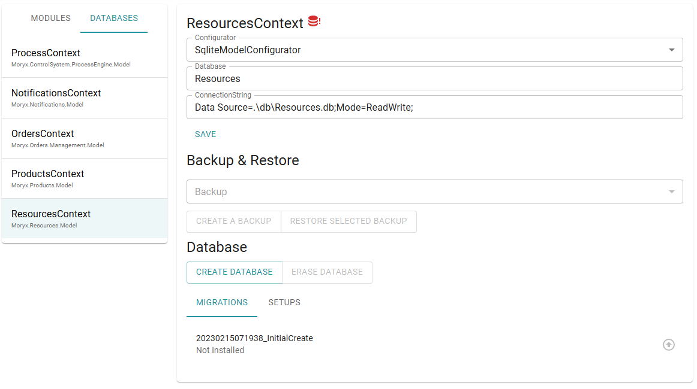

#### Step 3: Reincarnate the failed services

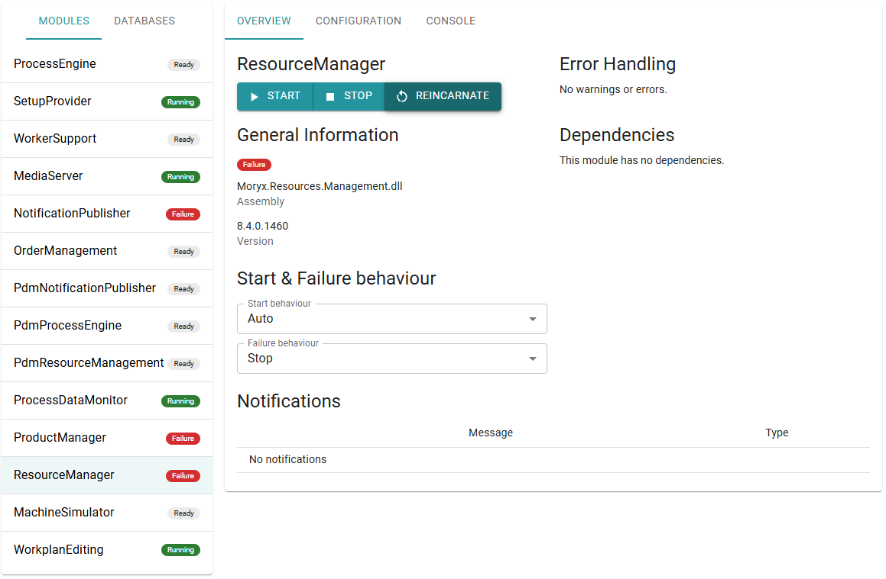

### Orders blocked / production does not start

If BEGIN does nothing useful, check in order: recipe Classification is `Default`,
workplan inputs/outputs are connected, AssemblingCell has a VisualInstructor
and the cell session methods publish `ReadyToWork` / `ActivityCompleted` as above.
Also confirm Worker Support is showing the VisualInstructor display.

### I cannot find a resource in the add dialog

If you cannot find an expected resource in the Add Resource dialog, the corresponding assembly is usually not referenced.
MORYX uses reflection to find public classes that inherit from `Resource`, but only in assemblies loaded into the AppDomain (here `PencilFactory.App`).
To fix the problem, add any missing project or package references and check the dialog again.

See also [Troubleshooting](troubleshooting.md) and [Help](README.md#help).

> [Table of contents](README.md) | [Next](chapter-02-drivers.md)
