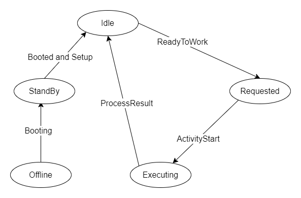
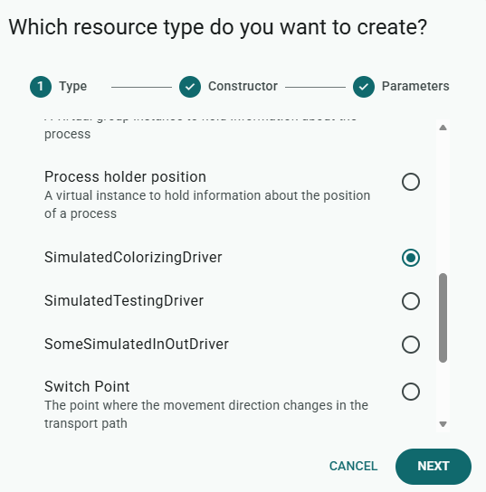
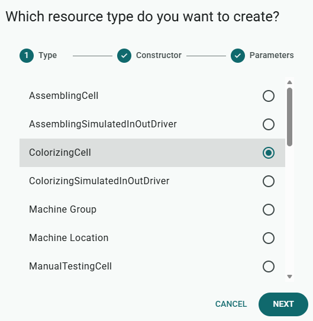
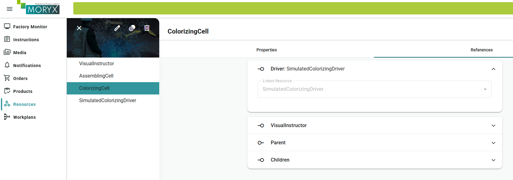
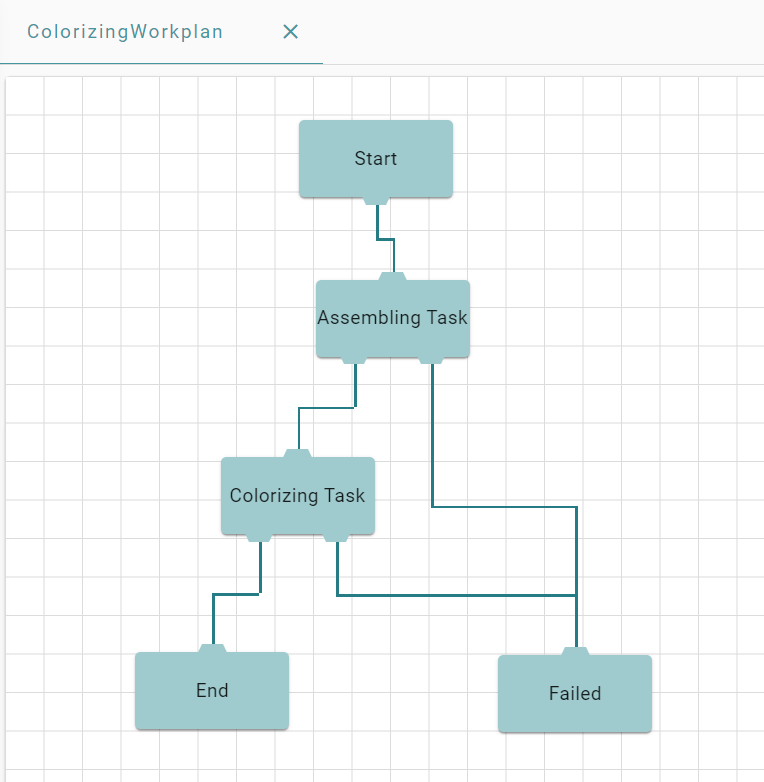

# Chapter 2 - Drivers

Demand keeps growing. Assembling can stay with the worker for now, but Colorizing should run without constant manual confirmation. You connect the ColorizingCell to hardware through a Driver and use simulation until the real machine is ready.


> [Table of contents](README.md) | [Previous](chapter-01-basics.md) | [Next](chapter-03-capabilities.md)

**On this page:** [Goals](#learning-goals) | [Starting point](#before-you-start) | [Practice](#practice) | [Check your reasoning](#check-your-reasoning) | [Troubleshooting](#troubleshooting)

## Learning goals

By the end of this chapter, you should be able to:

* Add Colorizing and talk to the machine through an `IInOutDriver`
* Implement the Ready / ProcessStart / ProcessResult handshake with a `SimulatedColorizingDriver`
* Extend the workplan so Assembling and Colorizing run in one order

## Where you are in the journey

* Assembling: done (manual Worker Support)
* **Colorizing**: this chapter (driver + simulation)
* Testing: chapter 4 (same pattern). Packing: later

## Before you start

Finish chapter 1 so that an order reaches Assembling, Worker Support shows the instruction and SUCCESS / FAILED completes the step.

Colorizing has no worker button. Something else must report that the station is ready and what the result was. In this chapter that "something" is a simulated driver. Later you could replace it with a real machine driver that uses the same signal names.

## What you will touch

| Kind | Items |
| ---- | ----- |
| CLI | `moryx add step Colorizing` |
| Projects | `PencilFactory.Resources.Colorizing` (add package `Moryx.Drivers.Simulation`) |
| Classes | `ColorizingCell`, `SimulatedColorizingDriver` |
| UI | Resources (driver + cell), Workplans, Orders, Worker Support, Simulation |

A [Driver](https://github.com/PHOENIXCONTACT/MORYX-Framework/blob/main/docs/tutorials/how-to-build-a-driver.md) encapsulates communication with a machine. You usually pick one of two interfaces:

* [`IMessageDriver`](https://github.com/PHOENIXCONTACT/MORYX-Framework/blob/main/src/Moryx.AbstractionLayer/Drivers/Message/IMessageDriver.cs): send and receive messages, an event fires when something arrives (typical example: MQTT).
* [`IInOutDriver`](https://github.com/PHOENIXCONTACT/MORYX-Framework/blob/main/src/Moryx.AbstractionLayer/Drivers/InOut/IInOutDriver.cs): read and write named variables on a server (typical example: OPC UA).

Colorizing uses variable-style signals, so this chapter uses `IInOutDriver`.

You create the driver resource in the **Resources** UI, set connection settings there (for example broker URL or OPC UA server) and link it on the cell, the same place you linked the VisualInstructor.

Optional deeper reading (only if you need it later): [Driver resource](https://github.com/PHOENIXCONTACT/MORYX-Framework/blob/main/docs/articles/module-resources/Types/driver-resource.md), [How to build a driver](https://github.com/PHOENIXCONTACT/MORYX-Framework/blob/main/docs/tutorials/how-to-build-a-driver.md), [OPC UA driver](https://github.com/PHOENIXCONTACT/MORYX-Framework/blob/main/docs/articles/driver-opc-ua/index.md), [MQTT driver](https://github.com/PHOENIXCONTACT/MORYX-Framework/blob/main/docs/articles/driver-mqtt/driver-mqtt.md).

## Simulated InOutDriver

More background on simulation architecture and states: [How to simulate my production](https://github.com/PHOENIXCONTACT/MORYX-Framework/blob/main/docs/tutorials/how-to-simulate-my-production.md).

The Colorizing cell is not finished for real hardware yet, so you simulate the machine first.

```bash
moryx add step Colorizing
```

Add the package `Moryx.Drivers.Simulation` to `PencilFactory.Resources.Colorizing`.

The ColorizingCell uses a protocol where it can read and write variables on the physical cell through an `IInOutDriver`:

1. When the physical cell is ready to work, it sets the input `Ready` to `true`.
2. The driver raises an input-changed event. The cell can then request work.
3. When the cell receives an activity, it sets the output `ProcessStart` to `true`.
4. When the machine is done, it sets the input `ProcessResult`. The cell reads that value and resets `ProcessStart` to `false`.

> **Concept:** The cell talks to a **driver**, not to the machine cable.
>
> * `ColorizingCell` only uses `Driver.Input`, `Driver.Output` and `InputChanged`.
> * The driver implements `IInOutDriver` and hides *how* the machine is reached.
> * Simulation and real hardware both use that same cell pattern.
>
> **This chapter:** `SimulatedColorizingDriver` pretends to be the machine. Methods like `Ready`, `Result` and `OnOutputSet`, plus states Idle / Requested / Executing, exist so the Simulation module can drive the fake. A real OPC UA or MQTT driver does **not** implement those simulation methods, the real machine changes the values and the real driver forwards them as inputs/outputs.
>
> **Later, with a real machine:** keep the cell. In Resources, link a real driver instead of the simulator and configure the connection there. The handshake Ready / ProcessStart / ProcessResult stays the same idea.
>
> More on simulation: [How to simulate my production](https://github.com/PHOENIXCONTACT/MORYX-Framework/blob/main/docs/tutorials/how-to-simulate-my-production.md), [Simulation driver](https://github.com/PHOENIXCONTACT/MORYX-Framework/blob/main/docs/articles/module-simulation/simulation-driver.md).

Open `ColorizingCell`. It should already contain an `IInOutDriver`. Add constants for the variable names:

```cs
[ResourceRegistration]
public class ColorizingCell : Cell, IAsyncStateContext
{
    private const string ProcessStart = "ProcessStart";
    private const string ProcessResult = "ProcessResult";
    private const string Ready = "Ready";

    [ResourceReference(ResourceRelationType.Driver)]
    public IInOutDriver Driver { get; set; }
    
    ...
}
```

**Subgoal: Subscribe to driver input changes**

In order to recognize, when an input changes, subscribe to that in when the driver is set. If you don't also subscribe to the event in the setter of the driver, you will always have to restart the system after changing the driver of a cell.
Adjust the Driver variable and functions to match the following.

```cs
[ResourceReference(ResourceRelationType.Driver)]
public IInOutDriver Driver
{
    get => field;
    set
    {
        if (field?.Input != null)
        {
            field.Input.InputChanged -= OnInputChanged;
        }

        field = value;

        if (field?.Input != null)
        {
            field.Input.InputChanged += OnInputChanged;
        }
    }
}
```


**Subgoal: On Ready, publish ReadyToWork (Pull)**

In the method `OnInputChanged` you will check, if the value of `Ready` has changed. If it is true, send a `ReadyToWork` to the ProcessEngine.
Replace the contents of the function with the following two code segments.

```cs
private void OnInputChanged(object sender, InputChangedEventArgs args)
{
    if (args.Key == Ready && (bool)args.Value && _currentSession is not ActivityStart)
    {
        var rtw = Session.StartSession(ActivityClassification.Production, ReadyToWorkType.Pull);
        _currentSession = rtw;
        PublishReadyToWork(rtw);
    }

    ...
}
```

**Subgoal: On ProcessResult, complete activity and reset ProcessStart**

If the changed input is `ProcessResult`, read the result from the input and publish it as `ActivityCompleted`. Also set the output `ProcessStart` back to false, so that the physical cell is able to detect when to start the next process. If you don't reset the value of `ProcessStart`, the physical cell is not able to recognize the specific moment an activity should start. Some physical cells also only recognize rising or falling edges. Constant values would trigger nothing.

```cs
private void OnInputChanged(object sender, InputChangedEventArgs args)
{
    ...
    else if (args.Key == ProcessResult && _currentSession is ActivityStart activitySession)
    {
        Driver.Output[ProcessStart] = false;
        var processResult = (bool)Driver.Input[ProcessResult];

        var result = activitySession.CreateResult(processResult ? (int)ColorizingActivityResults.Success : (int)ColorizingActivityResults.Failed);
        _currentSession = result;
        PublishActivityCompleted(result);
    } 
}
```

**Subgoal: Start the assigned activity: set ProcessStart**

In order to start an activity on the physical cell when an activityStart is received, set `ProcessStart` to `true`.

```cs
public override void StartActivity(ActivityStart activityStart)
{
    _currentSession = activityStart;
    switch (activityStart.Activity)
    {
        case ColorizingActivity:
            Driver.Output[ProcessStart] = true;
            break;
    }
}
```

In `ProcessAborting`, reset the same output. The generated template may still use
`"Start"`, change it to `ProcessStart`:

```cs
public override void ProcessAborting(Activity affectedActivity)
{
    if (_currentSession is ActivityStart activityStart)
    {
        VisualInstructor?.Clear(_currentInstruction);
        if (Driver != null)
        {
            Driver.Output[ProcessStart] = false;
        }

        activityStart.CreateResult((int)ColorizingActivityResults.Failed);
    }
}
```

The `SequenceCompleted` can be implemented in the same way as in the AssemblingCell.

```cs
public override void SequenceCompleted(SequenceCompleted completed)
{
    _currentSession = completed;

    var rtw = Session.StartSession(ActivityClassification.Production, ReadyToWorkType.Push);
    PublishReadyToWork(rtw);
    _currentSession = rtw;
}
```

The same applies for `ProcessEngineAttached`.

```cs
protected override IEnumerable<Session> ProcessEngineAttached()
{
    yield return Session.StartSession(ActivityClassification.Production, ReadyToWorkType.Push);
}
```

For the new driver file, let Visual Studio add the usings (`Ctrl + .`). If a type stays unknown, check the Simulation package reference.

Now you have to implement the driver. Create a new driver `SimulatedColorizingDriver` in the project `PencilFactory.Resources.Colorizing`, which is derived from `SimulatedInOutDriver` and add the constants for the variable names.

```cs
[ResourceRegistration]
public class SimulatedColorizingDriver : SimulatedInOutDriver
{
    private const string ProcessStart = "ProcessStart";
    private const string ProcessResult = "ProcessResult";
    private const string ReadyToWork = "Ready";

    ...
}
```

A `SimulatedInOutDriver` also reports Idle -> Requested -> Executing so the Simulation module can show what the fake machine is doing. After boot it is Idle. When the simulator calls `Ready`, it becomes Requested and raises the Ready input. When the cell sets ProcessStart, it becomes Executing. When ProcessStart goes back to false, it returns to Idle.



> **Concept:** Idle / Requested / Executing belong to **simulation only**. They are not part of the Ready / ProcessStart / ProcessResult handshake that the cell uses.

The method `Ready` is called by the **Simulation module** when it pretends that a product has arrived. Your simulated driver must raise the Ready **input** for the cell. Always pass **key and value**, otherwise the cell does not see a matching `args.Key`. A real driver never gets this call. The machine sets Ready instead.

```cs
public override void Ready(Activity activity)
{
    SimulatedState = SimulationState.Requested;
    SimulatedInput.Values[ReadyToWork] = true;
    SimulatedInput.RaiseInputChanged(ReadyToWork, SimulatedInput.Values[ReadyToWork]);
}
```

The method `OnOutputSet` runs when the cell writes an output (here: ProcessStart). In the **simulator** you use that to update `SimulationState`. On a real driver the same cell write goes out to the machine, you do not write this simulation hook.

```cs
protected override void OnOutputSet(object sender, string key)
{
    if (key == ProcessStart)
    {
        SimulatedInput.Values[ReadyToWork] = false;
        if ((bool)SimulatedOutput.Values[ProcessStart])
        {
            SimulatedState = SimulationState.Executing;
        }
        else
        {
            SimulatedState = SimulationState.Idle;
        }
    }
}
```

The method `Result` is called by the Simulation module when the fake machine is done. Set the ProcessResult input and raise `InputChanged` so the cell can finish the activity. On real hardware the machine sets ProcessResult, the real driver only forwards that change.

```cs
public override void Result(SimulationResult result)
{
    SimulatedInput.Values[ProcessResult] = result.Result == (int)ColorizingActivityResults.Success;
    SimulatedInput.RaiseInputChanged(ProcessResult, SimulatedInput.Values[ProcessResult]);
}
```

Now you have to configure the driver and the cell in the UI.





Add the driver as a reference to the cell the same way as you did with the VisualInstructor.



### Check your progress

* `SimulatedColorizingDriver` and `ColorizingCell` exist in Resources
* ColorizingCell's Driver reference points to the simulated driver
* After linking the driver, you do **not** need a full system restart solely because of a missing event subscription (setter handles subscribe/unsubscribe)

Create a workplan containing Assembling and Colorizing. For both existing pencil products (`100001` and `100002`), set the Default recipe to use this two-step workplan. The screenshot shows the target graph, both colors will need this path in chapter 3.



Assembling still needs Worker Support. Colorizing should complete through the simulated driver.

### Check your progress

* Workplan includes Assembling + Colorizing with connected paths
* A test order: Assembling completes via SUCCESS in Worker Support. Colorizing advances without a worker click (simulation)
* Process / order view shows ColorizingActivity completing Success or Failed from the simulator

## Checklist

* [ ] Colorizing step added and `Moryx.Drivers.Simulation` referenced
* [ ] `ColorizingCell` talks to the driver (subscribe in the setter, `OnInputChanged`, StartActivity / SequenceCompleted)
* [ ] `SimulatedColorizingDriver` implemented (`Ready`, `OnOutputSet`, `Result`)
* [ ] Driver linked on the cell in Resources
* [ ] Workplan Assembling + Colorizing runs for both products

## Summary

The ColorizingCell reads and writes Ready, ProcessStart and ProcessResult through an `IInOutDriver`. In this chapter a simulated driver fakes those values. Idle / Requested / Executing and the methods `Ready` / `Result` / `OnOutputSet` belong to simulation. A real driver is configured and linked in Resources. The cell code stays.

## Reflect

1. What do you keep in `ColorizingCell` if you replace the simulated driver with a real one?
2. Why do you set ProcessStart back to `false` after ProcessResult?
3. In this chapter, when does the code use Pull and when does it use Push?

## Practice

Prove why ProcessStart must be cleared after a result:

1. Temporarily remove `Driver.Output[ProcessStart] = false` from `OnInputChanged` (ProcessResult branch).
2. Run two Assembling + Colorizing orders **without** restarting the app.
3. Put the line back and run two orders again.

**Acceptance checks:** without the reset, the second Colorizing cycle misbehaves (stalls or the simulation does not return to Idle). With the reset restored, both cycles finish.

## Check your reasoning

<details>
<summary>Compare your answers after attempting the questions and practice</summary>

1. Keep the cell logic: listen to `InputChanged`, request work on Ready, set and reset ProcessStart, complete on ProcessResult and publish Push after a sequence. You do not need the simulation methods `Ready` / `Result` / `OnOutputSet` on a real driver. Configure the real connection in Resources. See [OPC UA driver](https://github.com/PHOENIXCONTACT/MORYX-Framework/blob/main/docs/articles/driver-opc-ua/index.md) or [MQTT driver](https://github.com/PHOENIXCONTACT/MORYX-Framework/blob/main/docs/articles/driver-mqtt/driver-mqtt.md) if your machine uses those protocols.
2. Many machines need ProcessStart to go false and then true again for the next product. In this simulator, clearing ProcessStart also returns the state to Idle. Your practice run should match that.
3. Use Pull when Ready becomes true in `OnInputChanged` (ask for work now). Use Push in `ProcessEngineAttached` and `SequenceCompleted` (say that the cell can take work when something is available).

</details>

## Troubleshooting

| Symptom | Likely cause |
| --- | --- |
| Driver change in UI has no effect until full restart | `InputChanged` not subscribed/unsubscribed in the Driver setter |
| Cell never sees Ready / ProcessResult | `RaiseInputChanged` without matching **key and value**, or wrong constant names |
| Simulation stuck / next cycle never starts | `ProcessStart` not reset to `false` after `ProcessResult` |
| Colorizing never advances | Driver not linked, Simulation package missing, workplan path not connected |
| Assembling works, Colorizing hangs | Colorizing is still waiting for Worker Support. It should use the driver |

See also [Troubleshooting](troubleshooting.md) and [Help](README.md#help).

> [Table of contents](README.md) | [Previous](chapter-01-basics.md) | [Next](chapter-03-capabilities.md)
