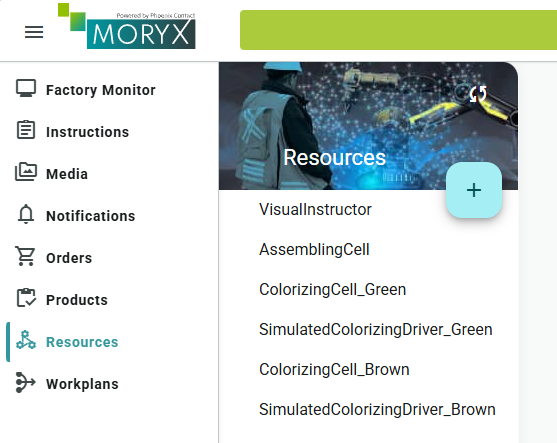
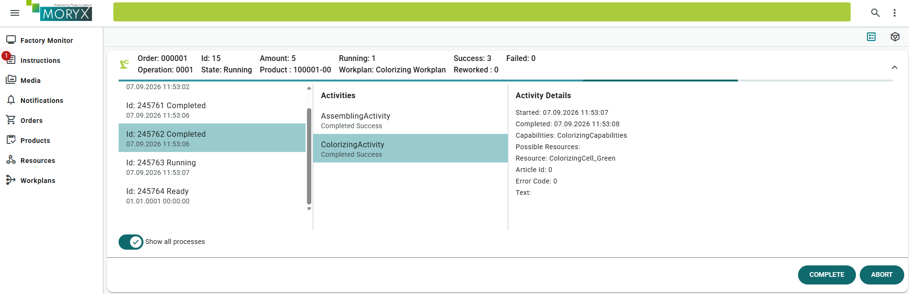
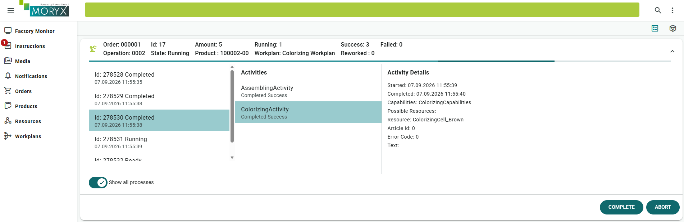

# Chapter 3 - Capabilities

Switching paint on a single ColorizingCell for every green or brown order slows the line down. *Pencilla Inc.* therefore wants one ColorizingCell per color. You teach the Process Engine which cell fits which product through Capabilities and ParameterBinding.

> [Table of contents](README.md) | [Previous](chapter-02-drivers.md) | [Next](chapter-04-testing.md)

Add a ColorizingCell for Green and one for Brown. First publish the cell color through [Capabilities](https://github.com/PHOENIXCONTACT/MORYX-Framework/blob/dev/docs/articles/abstractions/processing/capabilities.md). `[EntrySerialize]` makes the property editable in the Resources UI.

```cs
[ResourceRegistration] 
public class ColorizingCell : Cell
{
    [DataMember]
    private PencilColor _color;

    [EntrySerialize]
    public PencilColor Color
    {
        get => _color;
        set
        {
            _color = value;
            Capabilities = new ColorizingCapabilities { Color = value };
        }
    }

    protected override void OnInitialize()
    {
        base.OnInitialize();

        Capabilities = new ColorizingCapabilities { Color = _color };

        if (Driver != null)
        {
            Driver.Input.InputChanged += OnInputChanged;
        }
    }

    ...
}

```

> **Note:** The private variable with DataMember attribute and the public property attributed with EntrySerialize are separated from each other here. DataMember attributes are committed to the database before EntrySerialize ones are initialized. Here this would lead to not executing the setter before writing to the database.


For this to work add the property `Color` to the `ColorizingCapabilities` and check if the colors of the provided Capabilities match the ones you need.

```cs
public class ColorizingCapabilities : CapabilitiesBase
{
    public PencilColor Color { get; set; }

    protected override bool ProvidedBy(ICapabilities provided)
    {
        var providedCapabilities = provided as ColorizingCapabilities;
        if (providedCapabilities != null && providedCapabilities.Color == Color)
        {
            return true;
        }

        return false;
    }
}
```

Now MORYX knows, which cell uses which color, but it still doesn't know which color the current activity needs. This information can only be found in the product.

In order to let the activity know, which color it needs, you will use Parameters.

Parameters are the connection between *Tasks* and *Activities*.
In the production process it looks like this:

[](https://mermaid.live/edit#pako:eNpdktuO2jAQhl_F8g1BChQngRwuWnV3u1KrHlBBqlTlxsRmsUg8ke3sbpbl3WsnJKDmJrbnm9_zz_iEC2AcZ3hfwktxoMqg7V0ukf204TXxNsad_aq5okaARH1s8gCIoFoBawozmaLZ7GPHB9694tRw9A1206tMMALhABC0VlBwrXM52R644khoBLJsr7pISG2oLPjESnXJo0zkfQc4WmBQmWj0B9SxLqm8wNEIL09fNTLdHRRJ_mpGtCc_nfv_0mW8P9JS83e3X3neF8mm09voVjV9MPa29MjRxi4vQDxemAwmPxdGPAvTXohkJFJvDXVTOmZNFa244QrB3lX5f1I6JpHF6VFIhn5QUxyEfMrlPa3pTpQWRo3uTpyAbcmzYJzdtbm0ygdgaLBIFjcee1Hi2RlD_SGX62ZXCn1AP8GIvSi6eQ_uL4mjfRJ4v7mGRhWuB-6JvNie2hIG_jpyEl5RO2MGkncDuIGvg11iH1dcVVQw-yhP7gnl2JqqeI4zu2R8T5vS5DiXZ4vSxsCmlQXOjK3Mx03NbE8fBH2yTcXZ3vn0cU3lX4BqgOwWZyf8ijMSpvN4kYTxIk5IGCRh5OMWZ7MgiuZhmARJFK6iIIiWq7OP3zoJMk8tmAZxmoZxHEUkOP8DohsVrg)

As you can see the resource will only get the *Activity*.
The *Task*, which is equivalent to the *workplan step*, can be parameterized and parameters can
be transferred to the activity.
Under the hood, however, the parameters can do even more: Instances of the
process and product will be provided to the Populate method and can thus
get lots of information. For example, order numbers can be read from the recipe or the ProductType can be read from the process.

Now add the color as property to the `ColorizingParameters` found in the folder `Activities`. Since the property is automatically set using the product information, it doesn't need to be displayed in the UI.

When populating parameters, the current object always represents the parameters in the workplan, while `instance` (the parameter of the populate method) holds the parameters passed by the activity. The resource gets them during the `StartActivity` method.
Now you have to set the color of `instance` to the color of the product. In order to get the ProductType, cast the process to a `ProductionProcess` and get the ProductType from the ProductInstance.

```cs
public class ColorizingParameters : VisualInstructionParameters
{
    public PencilColor Color { get; set; }

    protected override void Populate(Process process, Parameters instance)
    {
        base.Populate(process,instance);

        var parameters = (ColorizingParameters) instance;
        var productionProcess = (ProductionProcess) process;

        var product = (GraphitePencilType)productionProcess.ProductInstance.Type;
        parameters.Color = product.Color;
    }
}
```

The color in the `ColorizingParameters` defines which color is needed for the activity.
This information still has to be passed on to ProcessEngine, which is done, by adjusting the RequiredCapabilities.
The ProcessEngine routes a product to a Cell, which can perform the next activity to be done.

Go to the `ColorizingActivity` also found in the folder `Activities` and set the color in the RequiredCapabilities.

```cs
[ActivityResults(typeof(ColorizingActivityResults))]
public class ColorizingActivity : Activity<ColorizingParameters>
{
    ...

    public override ICapabilities RequiredCapabilities => new ColorizingCapabilities() { Color = Parameters.Color };

    ...
}
```

Now you have done everything to have separate Cells for each pencil color. Start your project and create two different ColorizingCells, one for each color (for example `ColorizingCell_Green` and `ColorizingCell_Brown`), each with its own simulated driver. Do not forget to configure a driver for each cell just like shown at the end of [chapter 2](chapter-02-drivers.md).



Open the **Processes** view while an order runs. You can inspect activities and see which resource handled them.


Example: open a `ColorizingActivity`. The Process Engine selected `ColorizingCell_Green` for a green product via capabilities.



For a brown product, the Process Engine routes to `ColorizingCell_Brown` instead.



In the first chapter you set values in your parameters using the workplans UI. In this chapter the color was automatically fetched from the product.
This concept of not having to set the value of parameters explicitly using the UI, but instead automatically fetching them from somewhere is called `ParameterBinding`.

## When to use ParameterBinding and when write new Capabilities

In order to produce different colored pencils, you added the property `Color` to the `ColorizingCapabilities` and the `ColorizingActivityParameters`. In this paragraph you will learn different approaches and in which scenarios they should be used.

In this example both ColorizingCells are identical. The only difference is the color they are setup with.

One approach would be to create a production step for each color. Then you have a `ColorizingGreenActivity` and a `ColorizingBrownActivity`, each with matching Capabilities.
This has the downside of you needing a separate workplan for each color, which would create a lot of boilerplate.
Different steps should be used, when you use them in the same workplan.
Imagine the right half of your pencil is green and the other one brown, but you only have one `ColorizingActivity`.
In order to know which color is still missing on the pencil, you would need to know, if the pencil was already partly colored.
Just the information of the product wouldn't be sufficient anymore.

Instead of creating different steps, you could also create different capabilities. You could have made the `ColorizingCapabilities` abstract and then derive `ColorizingGreenCapabilities` and `ColorizingBrownCapabilities` from it.
This should be used, when it's not possible to setup a resource in order to change its characteristic.
Let's look at the example of printing a label. The label should be printed in a specific color and with a specific method (pad printing or laser printing).
Nearly all printers can print any color. In worst case you have to change the color manually, but it is still possible. Changing the printing method is most of the time physically impossible.
In that case you will create abstract `PrintingCapabilities`, which contain the color.

```cs
public abstract class PrintingCapabilities : CapabilitiesBase
{
    public Color Color { get; set; }

    protected override bool ProvidedBy(ICapabilities provided)
    {
        var providedCapabilities = provided as PrintingCapabilities;
        if (providedCapabilities != null && providedCapabilities.Color == Color)
        {
            return true;
        }

        return false;
    }
}
```

Now you will derive one capability for each printing method you have.

```cs
public class LaserPrintingCapabilities : PrintingCapabilities
{
    protected override bool ProvidedBy(ICapabilities provided)
    {
        var providedColorizing = provided as LaserPrintingCapabilities;
        if (providedColorizing == null)
        {
            return false;
        }

        return base.ProvidedBy(provided);
    }
}
```

In this way, it is not possible to change the printing method using the UI.

## Checklist

* [ ] `Color` on ColorizingCell and ColorizingCapabilities
* [ ] ParameterBinding reads product color into ColorizingParameters
* [ ] ColorizingActivity requires capabilities with that color
* [ ] Separate Green and Brown cells with drivers; routing verified in Processes

> [Table of contents](README.md) | [Previous](chapter-02-drivers.md) | [Next](chapter-04-testing.md)

