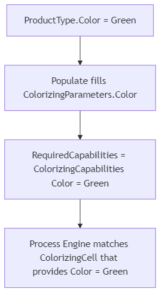

# Chapter 3 - Capabilities

Switching paint on a single ColorizingCell for every green or brown order slows the line down. *Pencilla Inc.* therefore wants one ColorizingCell per color. You teach the Process Engine which cell fits which product through Capabilities and ParameterBinding.


> [Table of contents](README.md) | [Previous](chapter-02-drivers.md) | [Next](chapter-04-testing.md)

**On this page:** [Goals](#learning-goals) | [Starting point](#before-you-start) | [Practice](#practice) | [Check your reasoning](#check-your-reasoning) | [Troubleshooting](#troubleshooting)

## Learning goals

By the end of this chapter, you should be able to:

* Publish cell color via Capabilities and bind product color with `ParameterBinding`
* Let `RequiredCapabilities` route green and brown products to matching cells
* Decide when ParameterBinding, capabilities, or separate activities fit best

## Where you are in the journey

* Assembling: manual. Colorizing: chapter 2 (one automatic cell)
* **This chapter**: one ColorizingCell per color + routing
* Testing: chapter 4. Packing: later

## Before you start

Finish chapter 2 so both pencil products (`100001` and `100002`) use the Assembling + Colorizing workplan and Colorizing completes through simulation.

In this chapter you add routing: a green product should go to a green ColorizingCell, a brown product to a brown one. First you change the **code**, then you create the two cells in the **Resources** UI.

## What you will touch

| Kind | Items |
| ---- | ----- |
| Projects / files | `ColorizingCell` in `PencilFactory.Resources.Colorizing`, `Capabilities/ColorizingCapabilities.cs`, `Activities/ColorizingStep/*` |
| Classes / types | `ColorizingCapabilities`, `ColorizingParameters`, `ColorizingActivity` |
| UI areas | Resources (two ColorizingCells + drivers), Processes view, Orders |

Publish each cell's paint color through [Capabilities](https://github.com/PHOENIXCONTACT/MORYX-Framework/blob/main/docs/articles/abstractions/processing/capabilities.md). `[EntrySerialize]` makes `Color` editable later in the Resources UI when you create the cells.

> **Concept:** **Capabilities** describe what a *resource* can provide (here: paint color Green or Brown).
> The Process Engine matches an activity's `RequiredCapabilities` against cells that *provide* those
> capabilities. Capabilities are about **routing**, not about filling in instruction text.

```cs
[ResourceRegistration] 
public class ColorizingCell : Cell, IAsyncStateContext
{
    [DataMember]
    private PencilColor _color;

    [EntrySerialize]
    public PencilColor Color
    {
        get => _color;
        set
        {
            _color = value;
            Capabilities = new ColorizingCapabilities { Color = value };
        }
    }

    protected override async Task OnInitializeAsync(CancellationToken cancellationToken)
    {
        await base.OnInitializeAsync(cancellationToken);

        Capabilities = new ColorizingCapabilities { Color = _color };

        if (Driver != null)
        {
            Driver.Input.InputChanged += OnInputChanged;
        }
    }

    ...
}

```

> **Why a backing field?** Persistence restores `_color`. The UI edits `Color`. The setter updates the published capabilities when an operator changes the color. Initialization publishes capabilities from the restored field as well, so routing works after restart. Merge this into the template's `OnInitializeAsync`, keep the Driver setter from chapter 2 as the single subscription point.


For this to work add the property `Color` to the `ColorizingCapabilities` and check if the colors of the provided Capabilities match the ones you need.

```cs
public class ColorizingCapabilities : CapabilitiesBase
{
    public PencilColor Color { get; set; }

    protected override bool ProvidedBy(ICapabilities provided)
    {
        var providedCapabilities = provided as ColorizingCapabilities;
        if (providedCapabilities != null && providedCapabilities.Color == Color)
        {
            return true;
        }

        return false;
    }
}
```

Now MORYX knows, which cell uses which color, but it still doesn't know which color the current activity needs. This information can only be found in the product.

In order to let the activity know, which color it needs, you will use Parameters.

Parameters are the connection between *Tasks* and *Activities*.
In the production process it looks like this:

[](https://mermaid.live/edit#pako:eNpdktuO2jAQhl_F8g1BChQngRwuWnV3u1KrHlBBqlTlxsRmsUg8ke3sbpbl3WsnJKDmJrbnm9_zz_iEC2AcZ3hfwktxoMqg7V0ukf204TXxNsad_aq5okaARH1s8gCIoFoBawozmaLZ7GPHB9694tRw9A1206tMMALhABC0VlBwrXM52R644khoBLJsr7pISG2oLPjESnXJo0zkfQc4WmBQmWj0B9SxLqm8wNEIL09fNTLdHRRJ_mpGtCc_nfv_0mW8P9JS83e3X3neF8mm09voVjV9MPa29MjRxi4vQDxemAwmPxdGPAvTXohkJFJvDXVTOmZNFa244QrB3lX5f1I6JpHF6VFIhn5QUxyEfMrlPa3pTpQWRo3uTpyAbcmzYJzdtbm0ygdgaLBIFjcee1Hi2RlD_SGX62ZXCn1AP8GIvSi6eQ_uL4mjfRJ4v7mGRhWuB-6JvNie2hIG_jpyEl5RO2MGkncDuIGvg11iH1dcVVQw-yhP7gnl2JqqeI4zu2R8T5vS5DiXZ4vSxsCmlQXOjK3Mx03NbE8fBH2yTcXZ3vn0cU3lX4BqgOwWZyf8ijMSpvN4kYTxIk5IGCRh5OMWZ7MgiuZhmARJFK6iIIiWq7OP3zoJMk8tmAZxmoZxHEUkOP8DohsVrg)

As you can see the resource will only get the *Activity*.
The *Task*, which is equivalent to the *workplan step*, can be parameterized and parameters can
be transferred to the activity.
Under the hood, however, the parameters can do even more: Instances of the
process and product will be provided to the Populate method and can thus
get lots of information. For example, order numbers can be read from the recipe or the ProductType can be read from the process.

> **Concept:** **ParameterBinding** means parameters are filled from process/product data in `Populate`.
> Here, color comes from `GraphitePencilType`.
> Binding answers *what does this activity need?* Capabilities answer *which cell can provide it?*

Now add the color as property to the `ColorizingParameters` found in the folder `Activities`. Since the property is automatically set using the product information, it doesn't need to be displayed in the UI.

When populating parameters, the current object always represents the parameters in the workplan, while `instance` (the parameter of the populate method) holds the parameters passed by the activity. The resource gets them during the `StartActivity` method.
Now you have to set the color of `instance` to the color of the product. In order to get the ProductType, cast the process to a `ProductionProcess` and get the ProductType from the ProductInstance.

```cs
public class ColorizingParameters : VisualInstructionParameters
{
    public PencilColor Color { get; set; }

    protected override void Populate(Process process, Parameters instance)
    {
        base.Populate(process,instance);

        var parameters = (ColorizingParameters) instance;
        var productionProcess = (ProductionProcess) process;

        var product = (GraphitePencilType)productionProcess.ProductInstance.Type;
        parameters.Color = product.Color;
    }
}
```

The color in the `ColorizingParameters` defines which color is needed for the activity.
This information still has to be passed on to ProcessEngine, which is done, by adjusting the RequiredCapabilities.
The ProcessEngine routes a product to a Cell, which can perform the next activity to be done.

Go to the `ColorizingActivity` also found in the folder `Activities` and set the color in the RequiredCapabilities.

```cs
[ActivityResults(typeof(ColorizingActivityResults))]
public class ColorizingActivity : Activity<ColorizingParameters>
{
    ...

    public override ICapabilities RequiredCapabilities => new ColorizingCapabilities() { Color = Parameters.Color };

    ...
}
```

How the pieces connect for a green pencil:



ParameterBinding answers "what does this activity need?". Capabilities answer "which cell can do it?".
More background: [Capabilities](https://github.com/PHOENIXCONTACT/MORYX-Framework/blob/main/docs/articles/abstractions/processing/capabilities.md).

Now you have done everything in code. Start the project and create **two** ColorizingCells in Resources (for example `ColorizingCell_Green` and `ColorizingCell_Brown`), each with its own simulated driver and with `Color` set to Green or Brown. Configure each driver like at the end of [chapter 2](chapter-02-drivers.md).


Open the **Processes** view while an order runs. You can inspect activities and see which resource handled them.


Example: open a `ColorizingActivity`. The Process Engine selected `ColorizingCell_Green` for a green product via capabilities.


For a brown product, the Process Engine routes to `ColorizingCell_Brown` instead.


### Check your progress

* Two ColorizingCells exist (Green and Brown), each with its own simulated driver and Color set in Resources
* A green order's ColorizingActivity is handled by the green cell, a brown order by the brown cell (Processes view)
* One workplan / recipe still covers both colors. Color is not hard-coded as separate workplan steps

In the first chapter you set values in your parameters using the workplans UI. In this chapter the color was automatically fetched from the product.
This concept of not having to set the value of parameters explicitly using the UI, but instead automatically fetching them from somewhere is called `ParameterBinding`.

## When to use ParameterBinding and when to write new Capabilities

In order to produce differently colored pencils, you added `Color` to `ColorizingCapabilities` and to `ColorizingParameters`. This section shows other modelling options and when they fit.

In this example both ColorizingCells are identical. The only difference is the color they are set up with.

One approach would be to create a production step for each color. Then you would have a `ColorizingGreenActivity` and a `ColorizingBrownActivity`, each with matching capabilities. The downside is a separate workplan for each color and a lot of boilerplate. Different steps belong in the **same** workplan when the process itself needs distinct actions. Imagine the right half of the pencil is green and the other half brown, but you only have one ColorizingActivity. To know which color is still missing, product data alone would not be enough.

Instead of different steps, you could also create different capabilities. You could make `ColorizingCapabilities` abstract and derive `ColorizingGreenCapabilities` and `ColorizingBrownCapabilities`. Prefer that when it is **not** possible to change a resource characteristic by setup. Printing is a typical example: the label should be printed in a specific color and with a specific method (pad printing or laser printing). Nearly all printers can print any color (in the worst case you change it manually). Changing the printing method is often physically impossible. Then you create abstract `PrintingCapabilities` that contain the color:

```cs
public abstract class PrintingCapabilities : CapabilitiesBase
{
    public Color Color { get; set; }

    protected override bool ProvidedBy(ICapabilities provided)
    {
        var providedCapabilities = provided as PrintingCapabilities;
        if (providedCapabilities != null && providedCapabilities.Color == Color)
        {
            return true;
        }

        return false;
    }
}
```

Derive one capability for each printing method:

```cs
public class LaserPrintingCapabilities : PrintingCapabilities
{
    protected override bool ProvidedBy(ICapabilities provided)
    {
        var providedColorizing = provided as LaserPrintingCapabilities;
        if (providedColorizing == null)
        {
            return false;
        }

        return base.ProvidedBy(provided);
    }
}
```

In this way it is not possible to change the printing method using the UI.

> **Concept:** Do not model from the C# property name alone. Ask what you need the value **for**.
>
> * **Color in this chapter:** The product has a color **and** only the matching cell may paint it -> bind Color in `Populate` **and** use it in capabilities for routing.
> * **Hardness in the Practice:** The product has a hardness, but every ColorizingCell can handle every grade -> bind Hardness in `Populate` only. No Hardness in capabilities.
>
> Quick check:
>
> | If you need... | Then... |
> | --- | --- |
> | The activity to know a product value | `Populate` / parameters |
> | Only some cells to be allowed | Capabilities |
> | Two different actions in the workplan | Separate activities / steps |

## Checklist

* [ ] `Color` on ColorizingCell and ColorizingCapabilities
* [ ] ParameterBinding reads product color into ColorizingParameters
* [ ] ColorizingActivity requires capabilities with that color
* [ ] Separate Green and Brown cells with drivers, routing verified in Processes

## Summary

Populate copies product values into parameters. Capabilities decide which cell may run the activity. Color links the product to the matching cell. One Colorizing step is enough for green and brown.

## Reflect

1. What different problems do ParameterBinding and Capabilities solve?
2. Why can both products use the same Colorizing task and workplan?
3. What requirement would justify a separate activity instead of another bound parameter?

## Practice

Hardness should be available on the Colorizing activity as data (for example to send to the machine or show in an instruction later). It must **not** change which cell is used. Only color does that.

Bind the product's Hardness onto the Colorizing parameters yourself. Then debug in Visual Studio: breakpoint in `Populate`, run an order and check that `parameters.Hardness` matches the product.

**Done when:** Hardness is filled from the product. Green/brown routing is unchanged.

<details>
<summary>Hint</summary>

Look at how Color is handled in `ColorizingParameters`. Do not put Hardness into capabilities.

</details>

## Check your reasoning

<details>
<summary>Compare your answers after attempting the questions and practice</summary>

1. ParameterBinding fills activity data from the product. Capabilities choose the cell. Put a value into capabilities only if it must change **which** cell is allowed.
2. Both products share one Colorizing step. At runtime, Populate reads that product's color, so the Process Engine can pick the matching cell.
3. Use a separate activity when the workplan needs a second different action, not only because a product property has another name.

</details>

## Troubleshooting

| Symptom | Likely cause |
| --- | --- |
| Both colors go to the same cell | Cell `Color` / Capabilities not set, or `RequiredCapabilities` not using `Parameters.Color` |
| Order stalls: no resource for ColorizingActivity | Missing second cell/driver, or `ProvidedBy` never matches |
| Color wrong after restart | `DataMember` on backing field vs `EntrySerialize` on property. See the Note above |
| Parameter always default | `Populate` not casting to `GraphitePencilType` / `ProductionProcess` correctly |

See also [Troubleshooting](troubleshooting.md) and [Help](README.md#help).

> [Table of contents](README.md) | [Previous](chapter-02-drivers.md) | [Next](chapter-04-testing.md)
