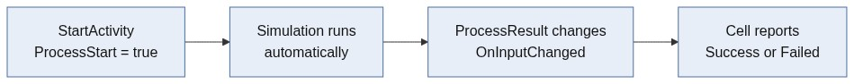
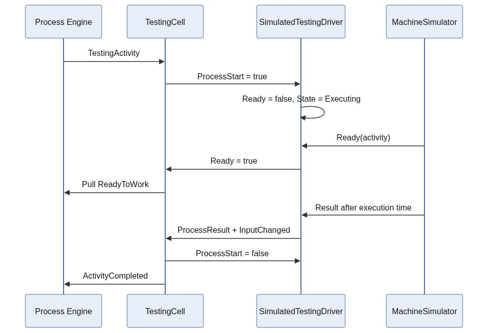
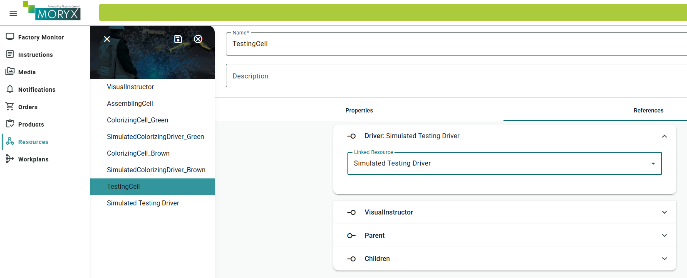
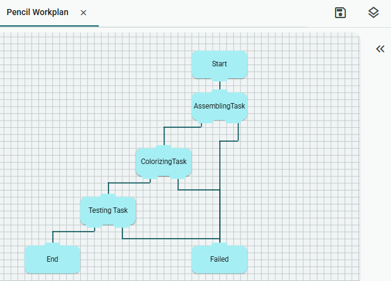
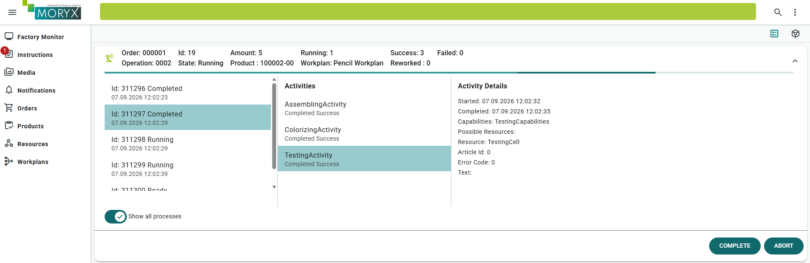

# Chapter 4 - Testing

Too many pencils leave the line unchecked. After Assembling and Colorizing, *Pencilla Inc.* adds Testing as a third station. You automate it the same way as Colorizing: an `IInOutDriver` plus a `SimulatedTestingDriver` when no real hardware is available.

> [Table of contents](README.md) | [Previous](chapter-03-capabilities.md) | [Next](chapter-05-setup.md)

## Add the Testing step

First add the Testing step with the CLI (from the PencilFactory project root):

```bash
moryx add step Testing
```

That scaffolds the activity, cell project, and related files. You will wire the
driver and simulation in the sections below.

If you have not already added simulation support in chapter 2, add the package
`Moryx.Drivers.Simulation` to the relevant resource project(s).

> **Note:** The CLI often leaves placeholders (`Some`, `MyApplication`) or does not wire the new project into the solution. If the build or IntelliSense fails after the command, jump to [Troubleshooting: CLI leftovers](#troubleshooting-cli-leftovers-after-moryx-add-step-testing) at the end of this chapter, fix those points, then continue here.

## Driver and Cell

A driver is the resource layer toward the PLC or a simulation: inputs (signals from
the machine) and outputs (commands to the machine). The cell stays domain-focused:
it starts the process, waits for completion, and reports Success or Failed to the
Process Engine.

The interface here is `IInOutDriver`. Constants for the signal names avoid typos.
In the `Driver` setter, subscribe to `InputChanged` and unsubscribe when the driver
changes. Otherwise, after a driver swap in the UI, you stay hooked to a dead event.


```cs
private const string ProcessStart = "ProcessStart";
private const string ProcessResult = "ProcessResult";
private const string Ready = "Ready";

[ResourceReference(ResourceRelationType.Driver)]
public IInOutDriver Driver
{
    get => field;
    set
    {
        if (field?.Input != null)
            field.Input.InputChanged -= OnInputChanged;

        field = value;

        if (field?.Input != null)
            field.Input.InputChanged += OnInputChanged;
    }
}
```

As with the manual cells, the [Cell](https://github.com/PHOENIXCONTACT/MORYX-Framework/blob/dev/docs/articles/abstractions/control-system/cell-resource.md) first announces readiness via Push:

```cs
 protected override IEnumerable<Session> ProcessEngineAttached()
    {
        yield return Session.StartSession(ActivityClassification.Production, ReadyToWorkType.Push);
    }
```

### Starting an activity

Instead of a worker instruction, the cell sets the driver output so the testing
process starts:

```cs
   public override void StartActivity(ActivityStart activityStart)
    {
        _currentSession = activityStart;
        if (activityStart.Activity is TestingActivity)
        {
            Driver.Output[ProcessStart] = true;
        }
    }
```

In `ProcessAborting`, change the output variable from `"Start"` to `ProcessStart`:

```cs
public override void ProcessAborting(Activity affectedActivity)
    {
        if (_currentSession is ActivityStart activityStart)
        {
            VisualInstructor?.Clear(_currentInstruction);
            if (Driver != null)
            {
                Driver.Output[ProcessStart] = false;
            }

            activityStart.CreateResult((int)TestingActivityResults.Failed);
        }
    }
```

After the sequence completes, offer ReadyToWork (Push) again:

```cs
    public override void SequenceCompleted(SequenceCompleted completed)
    {
        _currentSession = completed;

        var rtw = Session.StartSession(ActivityClassification.Production, ReadyToWorkType.Push);
        PublishReadyToWork(rtw);
        _currentSession = rtw;
    }
```

### Reacting to driver events

`OnInputChanged` evaluates the driver signals: readiness (Pull) and process result:

```cs
private void OnInputChanged(object sender, InputChangedEventArgs args)
{
    if (args.Key == Ready && (bool)args.Value && _currentSession is not ActivityStart)
    {
        var rtw = Session.StartSession(ActivityClassification.Production, ReadyToWorkType.Pull);
        _currentSession = rtw;
        PublishReadyToWork(rtw);
    }
    else if (args.Key == ProcessResult && _currentSession is ActivityStart activitySession)
    {
        Driver.Output[ProcessStart] = false;
        var processResult = (bool)Driver.Input[ProcessResult];

        var result = activitySession.CreateResult(
            processResult
                ? (int)TestingActivityResults.Success
                : (int)TestingActivityResults.Failed);
        _currentSession = result;
        PublishActivityCompleted(result);
    }
}
```

| **`args.Key`** | **Which** variable changed, e.g. `"Ready"` or `"ProcessResult"` |
| --- | --- |
| **`args.Value`** | **New value** of exactly that variable, e.g. `true` or `false` |

### Branch 1: `Ready == true`

```
if (args.Key == Ready && (bool)args.Value && _currentSession is not ActivityStart)
```

- Driver reports: "I am ready" (`Ready = true`)
- The cell is not currently executing an activity
- The cell tells the Process Engine it can accept work (`ReadyToWork`, Pull).

**Pull** means: the cell waits for the hardware signal. **Push** (chapters 1-3) means:
the cell offers itself without a sensor.

---

### Branch 2: `ProcessResult`

```
else if (args.Key == ProcessResult && _currentSession is ActivityStart activitySession)
```

- A TestingActivity is currently running
- Driver reports: process finished (result is available)
- Cell reads `Driver.Input[ProcessResult]`: `true` is Success, `false` is Failed
- Sets `ProcessStart = false` (stop the process)
- Reports ActivityCompleted (Success or Failed) to the engine

### Overall flow



## SimulatedTestingDriver

Create a new file: `src/PencilFactory.Resources.Testing/SimulatedTestingDriver.cs`

Package required: `Moryx.Drivers.Simulation` (often already present in the
Colorizing/Testing/Assembling csproj files)

The simulation driver sets the inputs `Ready` and `ProcessResult` and reacts to
`ProcessStart` on the output, so you can test without real hardware:

```cs
using System;
using System.Collections.Generic;
using System.Text;
using Moryx.AbstractionLayer.Activities;
using Moryx.AbstractionLayer.Resources;
using Moryx.ControlSystem.Simulation;
using Moryx.Drivers.Simulation.InOutDriver;
using PencilFactory.Activities.TestingStep;

namespace PencilFactory.Resources.Testing;

[ResourceRegistration]
public class SimulatedTestingDriver : SimulatedInOutDriver
{
    private const string ProcessStart = "ProcessStart";
    private const string ProcessResult = "ProcessResult";
    private const string ReadyToWork = "Ready";

    public override void Ready(Activity activity)
    {
        SimulatedState = SimulationState.Requested;
        SimulatedInput.Values[ReadyToWork] = true;
        SimulatedInput.RaiseInputChanged(ReadyToWork, SimulatedInput.Values[ReadyToWork]);
    }

    protected override void OnOutputSet(object sender, string key)
    {
        if (key == ProcessStart)
        {
            SimulatedInput.Values[ReadyToWork] = false;
            SimulatedState = (bool)SimulatedOutput.Values[ProcessStart]
                ? SimulationState.Executing
                : SimulationState.Idle;
        }
    }

    public override void Result(SimulationResult result)
    {
        SimulatedInput.Values[ProcessResult] = result.Result == (int)TestingActivityResults.Success;
        SimulatedInput.RaiseInputChanged(ProcessResult, SimulatedInput.Values[ProcessResult]);
    }
}
```

### Step-by-step flow

Simulation applies the result automatically after the execution time (no Success/Failed click):



## Resources in the UI (Testing)

1. Create **SimulatedTestingDriver**
2. Create **TestingCell**
3. Open TestingCell, set the **Driver** reference to the SimulatedTestingDriver



Edit the existing [Workplan](https://github.com/PHOENIXCONTACT/MORYX-Framework/blob/dev/docs/articles/abstractions/processing/workplans.md)
and insert the Testing task between Colorizing and the end. Route Failed back to
the Failed connector, Success onward to the next step.



Start an order and run production through. Top right under **Processes** you see
the running order: current activity, selected cells, results. That is how you
verify that capabilities and the workplan take effect  -  including the new
`TestingActivity`.



## Troubleshooting: CLI leftovers after `moryx add step Testing`

The CLI can leave placeholder names (`Some`, `MyApplication`) or skip wiring the
new project into the solution. If build or IntelliSense fails after the command,
fix the following.

**1. Add the project to the solution and to the App**

- Solution -> right-click -> **Add** -> **Existing Project** -> `PencilFactory.Resources.Testing.csproj`
- Right-click **PencilFactory.App** -> **Add** -> **Project Reference** ->  Check **PencilFactory.Resources.Testing**

**2. Fix the resource project reference**

In `PencilFactory.Resources.Testing.csproj`, replace a leftover template reference:

```xml
<!-- Wrong (CLI placeholder) -->
<ProjectReference Include="..\MyApplication\MyApplication.csproj" />

<!-- Correct -->
<ProjectReference Include="..\PencilFactory\PencilFactory.csproj" />
```

**3. Fix namespaces in `TestingCell.cs`**

```csharp
// Wrong (CLI placeholder)
using MyApplication.Activities.SomeStep;
using MyApplication.Capabilities;

// Correct
using PencilFactory.Activities.TestingStep;
using PencilFactory.Capabilities;

namespace PencilFactory.Resources.Testing;
```

**4. Replace leftover `Some` placeholders**

Search the Testing resource project (Ctrl+F) for `Some` and rename to `Testing`,
for example:

- `SomeStateBase`: keep or rename, class should target `TestingCell`
- `public class TestingCell : Cell, IAsyncStateContext`
- `Capabilities = new TestingCapabilities { Value = Value };`
- `activityStart.CreateResult((int)TestingActivityResults.Failed);`

Example for the generated state base file (`TestingStateBase.cs`):

```csharp
using Moryx.StateMachines;

namespace PencilFactory.Resources.Testing;

internal abstract class SomeStateBase(TestingCell context, StateBase.StateMap stateMap)
    : AsyncStateBase<TestingCell>(context, stateMap)
{
}
```

If the class is still named `SomeStateBase`, rename it for clarity (e.g. `TestingStateBase`)
or leave it until chapter 12 if you do not use states on Testing yet. The important part
is that the generic argument and usings refer to **Testing**, not `Some` / `MyApplication`.

Then rebuild the solution.


## Checklist

* [ ] `moryx add step Testing` executed
* [ ] If needed: project added to solution/App, namespaces and `Some`/`MyApplication` placeholders fixed
* [ ] Driver reference with constants and event subscription in the TestingCell
* [ ] `StartActivity`, `ProcessAborting`, `SequenceCompleted`, and `OnInputChanged` implemented
* [ ] `SimulatedTestingDriver` created
* [ ] Driver and TestingCell linked in the UI
* [ ] Testing step added to the workplan and production tested

> [Table of contents](README.md) | [Previous](chapter-03-capabilities.md) | [Next](chapter-05-setup.md)
