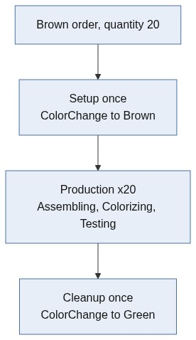

# Chapter 6 - Cleanup

A brown order leaves the ColorizingCell brown. The next green order would then need another setup first, or worse, start from the wrong state. *Pencilla Inc.* wants the cell reset to a default color after the job. You reuse ColorChange with an `AfterProduction` trigger.

> [Table of contents](README.md) | [Previous](chapter-05-setup.md) | [Next](chapter-07-partlinks.md)

**On this page:** [Goals](#learning-goals) | [Starting point](#before-you-start) | [Practice](#practice) | [Check your reasoning](#check-your-reasoning) | [Troubleshooting](#troubleshooting)

## Learning goals

By the end of this chapter, you should be able to:

* Contrast Setup (`BeforeProduction`) and Cleanup (`AfterProduction`)
* Reuse ColorChange for cleanup with a second SetupTrigger
* Verify cleanup runs once per finished job and leaves a known default color

## Where you are in the journey

* Chapter 5: prepare the cell **before** production
* **This chapter**: reset the cell **after** production
* Chapters 7-8: retail packs (BOM + packing)

## Before you start

Finish chapter 5 so one ColorizingCell can change color via ColorChange (setup before production) and Failed leaves the old color unchanged.

You will reuse that ColorChange activity. The new part is a second trigger that runs **after** the production job finishes. It is not a new activity type.

## What you will touch

| Kind | Items |
| ---- | ----- |
| Projects / files | `PencilFactory.ControlSystem/SetupTriggers/` (`ResetColorAfterProduction*`) |
| Classes / types | Cleanup config + trigger, reuse `ColorChangeActivity` from chapter 5 |
| UI areas | SetupProvider configuration, Worker Support, Resources (Color property), Orders |

For new files, let Visual Studio add missing usings (`Ctrl + .`). Keep the namespaces shown in the chapter examples.

## Setup vs Cleanup

|  | Setup | Cleanup |
| --- | --- | --- |
| When | Before production | After production |
| Why | Plant does not yet match the order | Return plant to a neutral state |
| Here | Set Color to the product color | Reset Color to default (Green) |

> **Concept:** Cleanup is still driven by the **SetupProvider**, but with
> `SetupExecution.AfterProduction`. You usually **reuse** the same setup activity
> (here ColorChange) instead of inventing a second activity type. Timing differs:
> cleanup is tied to the **production job**, not to each pencil. With quantity 20,
> cleanup runs after that job finishes, not after the first piece. An order may contain several operations and partial production can create separate jobs.

Overall flow with one ColorizingCell:



The cleanup instruction appears only when the production job is finished.

On the next order (e.g. Brown again after a Green reset), the cell is back on Green.
Setup must change over again. That way you see setup and cleanup alternating.

## Cleanup trigger

Create these two files under `src/PencilFactory.ControlSystem/SetupTriggers/`:

- `ResetColorAfterProductionConfig.cs`
- `ResetColorAfterProductionTrigger.cs`

They follow the same pattern as chapter 5's `ProvideColorConfig` / `ProvideColorTrigger`.
Only a few differences:

**Config**: Add one property, `DefaultColor`
(default `PencilColor.Green`), with `[DataMember]` and `[EntrySerialize]` so you can
set the default later in the Command Center UI.

**Trigger**: Set `Execution` to `AfterProduction`.

In `Evaluate`, return `false` when the product already uses `DefaultColor`.
Otherwise call `SetupEvaluation.Remove` instead of `Provide`. Pass three parameters:

1. capability to remove: the product color
2. capability afterwards: `DefaultColor`
3. classification: same as chapter 5 (`Manual`)

In `CreateSteps`, keep the `ColorChangeTask` pattern, but target `Config.DefaultColor`
and adjust the instruction text for cleanup.

No new activity type, only this second trigger. Open a reference below only if you get stuck.

More on the [Setups module](https://github.com/PHOENIXCONTACT/MORYX-Framework/blob/main/docs/articles/module-setups/index.md)
in the framework.

### ResetColorAfterProductionConfig

`ResetColorAfterProductionConfig.cs`

<details>
<summary>Reference: cleanup configuration</summary>

```cs
namespace PencilFactory.ControlSystem.SetupTriggers;

/// <summary>
/// Config for <see cref="ResetColorAfterProductionTrigger"/>.
/// </summary>
public class ResetColorAfterProductionConfig : SetupTriggerConfig
{
    public override string PluginName => nameof(ResetColorAfterProductionTrigger);

    /// <summary>
    /// Color the colorizing cell is reset to after production (cleanup).
    /// </summary>
    [DataMember]
    [EntrySerialize]
    public PencilColor DefaultColor { get; set; } = PencilColor.Green;
}

```

</details>

### ResetColorAfterProductionTrigger

`ResetColorAfterProductionTrigger.cs`

<details>
<summary>Reference: cleanup trigger</summary>

```cs
namespace PencilFactory.ControlSystem.SetupTriggers;

/// <summary>
/// After the production job finished: reset the colorizing cell to the default color (cleanup)
/// Runs once per production job (e.g. after all 20 pencils), not after each single piece
/// </summary>
[ExpectedConfig(typeof(ResetColorAfterProductionConfig))]
[Plugin(LifeCycle.Transient, typeof(ISetupTrigger), Name = nameof(ResetColorAfterProductionTrigger))]
public class ResetColorAfterProductionTrigger : SetupTriggerBase<ResetColorAfterProductionConfig>
{
    public override SetupExecution Execution => SetupExecution.AfterProduction;

    public override SetupEvaluation Evaluate(IProductRecipe recipe)
    {
        if (recipe.Product is not GraphitePencilType product)
            return false;

        // Product already uses the default color, nothing to reset
        if (product.Color == Config.DefaultColor)
            return false;

        // Remove the production color, target state is the default color on the cell
        // SetupProvider can skip cleanup if no cell still provides the production color
        return SetupEvaluation.Remove(
            new ColorizingCapabilities { Color = product.Color },
            new ColorizingCapabilities { Color = Config.DefaultColor },
            SetupClassification.Manual);
    }

    public override IReadOnlyList<IWorkplanStep> CreateSteps(IProductRecipe recipe)
    {
        return
        [
            new ColorChangeTask
            {
                Parameters = new ColorChangeParameters
                {
                    Color = Config.DefaultColor,
                    Instructions =
                    [
                        new VisualInstruction
                        {
                            Type = InstructionContentType.Text,
                            Content = $"Cleanup: reset colorizing cell to default color '{Config.DefaultColor}'"
                        }
                    ]
                }
            }
        ];
    }
}
```

</details>

## Activate the config

Restart the app after the code change. In Command Center **SetupProvider**, tab
**Configuration**, **SetupTriggers**: add type `ResetColorAfterProductionConfig`,
then Save and Restart.


## Test flow

1. ColorizingCell starts on Green (check Resources UI)
2. Create a Brown order and BEGIN
3. Setup: instruction to Brown, then SUCCESS
4. Run production completely (full quantity)
5. Cleanup: instruction to Green, then SUCCESS


6. ColorizingCell property Color is Green again

### Check your progress

* After a Brown order finishes completely: Worker Support shows cleanup to Green, then SUCCESS
* Resources UI: ColorizingCell.Color is Green again
* A following Brown order needs setup again (cell no longer stays Brown)

## Checklist

* [ ] `ResetColorAfterProductionConfig` and `-Trigger` created under SetupTriggers
* [ ] `Execution = AfterProduction`, same activity as setup
* [ ] Trigger activated in SetupProvider (Save + Restart)
* [ ] Order with a color other than Green: setup, production, cleanup tested
* [ ] ColorizingCell.Color is Green again after cleanup

## Summary

Cleanup reuses ColorChange with AfterProduction and a configured default. It is a job-level operating policy. Setup alone can prepare the next order. A default reset is useful only when required by the plant's operating rules.

## Reflect

1. Why is the cleanup trigger evaluated for a production job rather than after every pencil?
2. When might keeping the current color be preferable to resetting it?
3. Why can setup and cleanup reuse ColorChange in this example?

## Practice

Your Green cleanup from the test flow already works. Now change **only** `DefaultColor` to **Brown** in SetupProvider configuration (Save + Restart, no C# changes).

First predict, then run:

1. Complete a **Green** job. What cleanup (if any) do you see and to which color?
2. Complete a **Brown** job. What cleanup (if any) do you see?

When you are done, restore `DefaultColor` and the cell Color to **Green** before the next chapter.

<details>
<summary>Hint</summary>

Cleanup runs only when the product color differs from `DefaultColor`. Finish the full production job before looking for the instruction.

</details>

## Check your reasoning

<details>
<summary>Compare your answers after attempting the questions and practice</summary>

1. The reset is a postcondition of the job. Doing it after each activity would change the resource between pieces and require repeated changeovers. An order, operation and job are not interchangeable terms.
2. For repeated Brown jobs, keeping Brown avoids unnecessary Green resets and later Brown setups. A reset can still be required for an explicit operating, maintenance, or handover rule.
3. The physical action is the same: change the color and update capabilities on success. The trigger differs in timing and target, so a second activity class would duplicate behavior for this case.

**Practice feedback:** With DefaultColor Brown, a Green job needs cleanup to Brown. A Brown job needs none (already the default).

</details>

## Troubleshooting

| Symptom | Likely cause |
| --- | --- |
| No cleanup after the order | Order not fully completed, trigger not added / `Disabled`, wrong `Execution`, app not restarted after SetupProvider Save |
| Cleanup after every piece | Expected only once per finished **job**. Wait until the full quantity completes |
| Config change ignored | App not restarted after SetupProvider Save |
| Color not Green after cleanup | ColorChange Success path does not set Color via the property setter |
| Cleanup for a product that already uses DefaultColor | `Evaluate` should return false when `product.Color == Config.DefaultColor`. Check that condition |

See also [Troubleshooting](troubleshooting.md) and [Help](README.md#help).

> [Table of contents](README.md) | [Previous](chapter-05-setup.md) | [Next](chapter-07-partlinks.md)
