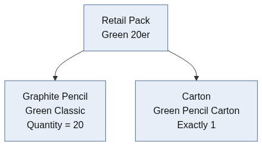
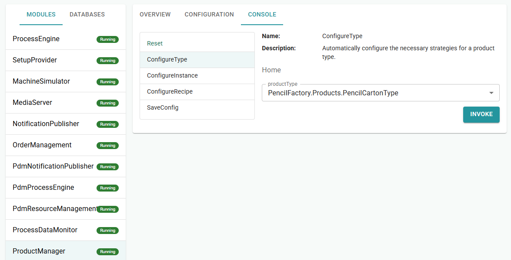
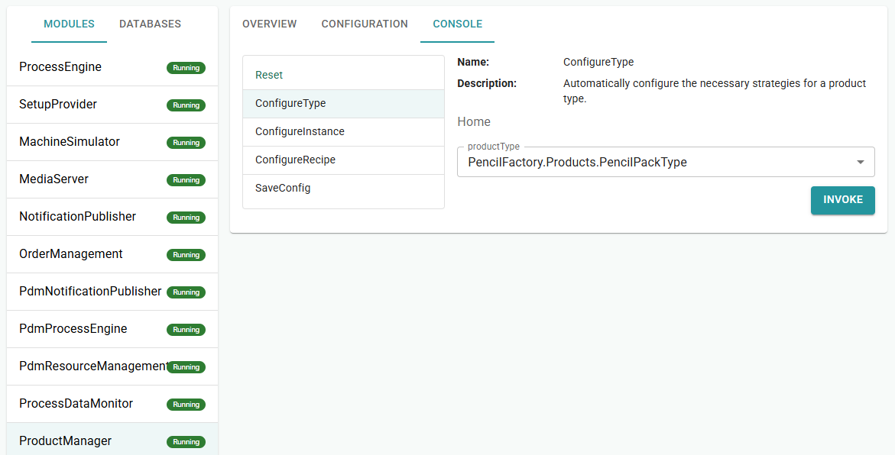
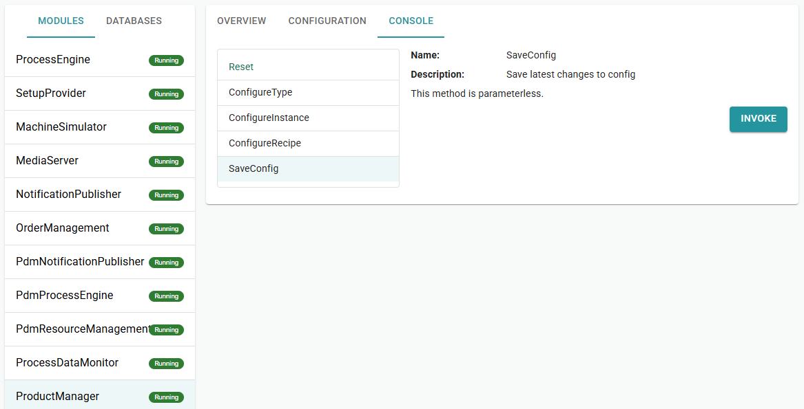
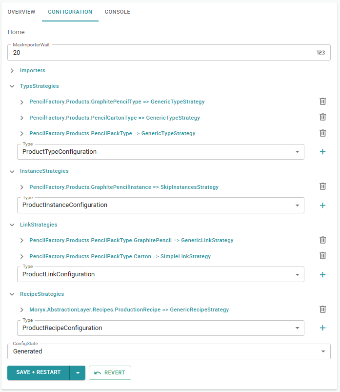
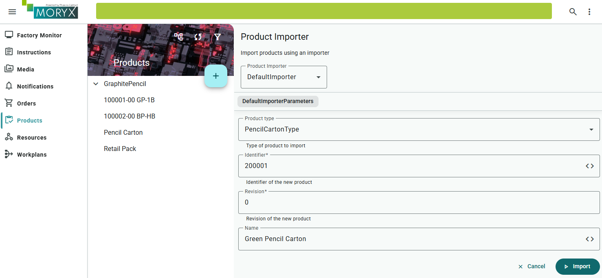
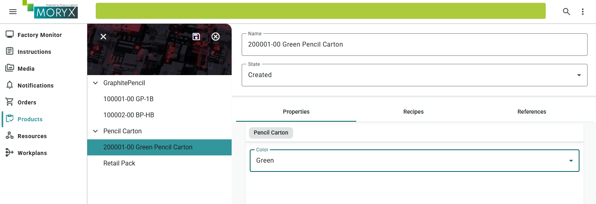
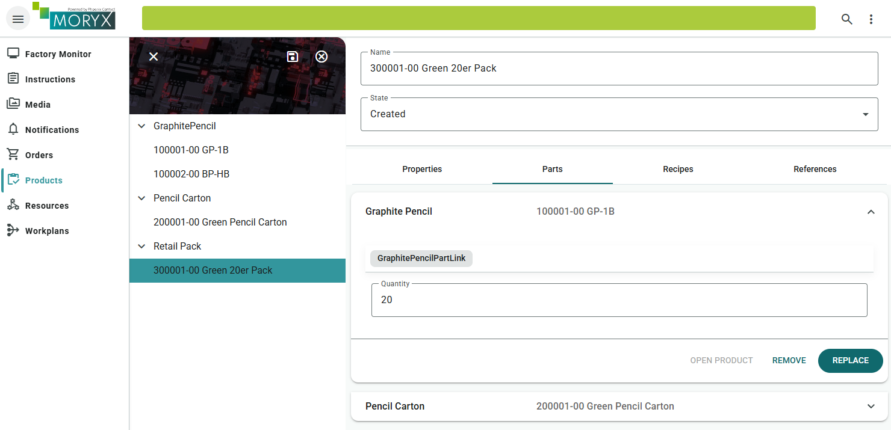
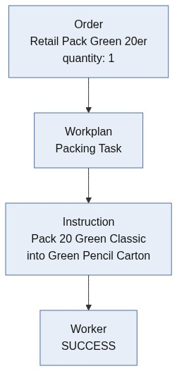

# Chapter 7 - PartLinks

Single pencils are fine for learning the line. For the shop, *Pencilla Inc.* now sells retail packs: twenty pencils of one type plus a matching carton. You model that bill of materials with PartLinks. Details: [Products / PartLinks](https://github.com/PHOENIXCONTACT/MORYX-Framework/blob/main/docs/articles/module-products/product-definition.md).

> [Table of contents](README.md) | [Previous](chapter-06-cleanup.md) | [Next](chapter-08-packing.md)

**On this page:** [Goals](#learning-goals) | [Starting point](#before-you-start) | [Practice](#practice) | [Check your reasoning](#check-your-reasoning) | [Troubleshooting](#troubleshooting)

## Learning goals

By the end of this chapter, you should be able to:

* Model carton and retail-pack product types with `ProductPartLink` and `Quantity`
* Configure products in the UI so part links / LinkStrategies are visible
* Explain why an order targets **one** product (pack vs pencil), not the whole BOM at once

## Where you are in the journey

* Chapters 1-6: pencil line (Assembling, Colorizing, Testing, plus setup/cleanup)
* **This chapter**: describe a retail pack (PartLinks / bill of materials)
* Packing: chapter 8

## Before you start

Finish chapter 6, so Assembling -> Colorizing -> Testing still runs, with setup and cleanup on one ColorizingCell.

Here you only define **what a pack consists of** (pencils + carton) in code and in Products. Building the Packing station comes in chapter 8. At the end of this chapter you only prepare the Packing step files.

## What you will touch

| Kind | Items |
| ---- | ----- |
| Projects / files | `PencilFactory/Products/` (carton, pack, part-link types) |
| Classes / types | `PencilCartonType`, `PencilPackType`, `GraphitePencilPartLink`, later `PackingCapabilities` |
| CLI | `moryx add step Packing` (prep at the end of this chapter) |
| UI | ProductManager (ConfigureType), Products (carton + pack) |

Let Visual Studio add missing usings (`Ctrl + .`). If a type stays unknown, check the project or package reference.

## Scenario

The line still makes graphite pencils first, then packs them for sale:

1. Produce graphite pencils: Assembling, Colorizing, Testing
2. Retail pack: for example 20 identical graphite pencils go into one carton

The bill of materials of a "Green 20er" pack could look like this:



So a retail pack consists of one carton and one pencil product type with a quantity of 20.

### A product per operation

> **Concept:** An order can contain multiple operations. In this training, each order has **one operation for one product**.
> PartLinks only describe **what** the pack consists of. They do **not** start pencil
> production by themselves. A reference to the graphite pencil type with Quantity 20 plus a reference
> to the carton is enough for chapter 8's packing instruction.

* Order on Green Classic: manufacture pencils (Assembling, Colorizing, Testing).
* Order on Green 20er Pack: packing workplan (next chapter).

## Create product types

Next, the types in code. A product type is the template. The instance is the
concrete piece in the process.

A retail pack consists of a carton and graphite pencils. The carton does not exist yet
as a product type, you model that first.

Create the following classes under `src/PencilFactory/Products/`.

### CartonColor.cs

```csharp
public enum CartonColor
{
    Green = 1,
    Red = 2,
    Blue = 3
}
```

### PencilCartonType.cs

```csharp
[Display(Name = "Pencil Carton")]
public class PencilCartonType : ProductType
{
    [EntrySerialize]
    [DataMember]
    public CartonColor Color { get; set; }

    protected override ProductInstance Instantiate()
        => new PencilCartonInstance();
}
```

### PencilCartonInstance.cs

```csharp
public class PencilCartonInstance : ProductInstance<PencilCartonType> { }
```

`[EntrySerialize]` ensures that `Color` appears in the Products UI (like `Color` on the graphite pencil).

Next, the bill of materials: ProductPartLinks connect pack, pencil and carton.

### GraphitePencilPartLink.cs (part link with Quantity)

```csharp
public class GraphitePencilPartLink : ProductPartLink<GraphitePencilType>
{
    [EntrySerialize]
    [DataMember]
    [Display(Name = "Quantity")]
    public int Quantity { get; set; } = 20;
}
```

### PencilPackType.cs

`GraphitePencil` carries Quantity, `Carton` is a simple PartLink without an extra field (exactly one carton).

```csharp
[Display(Name = "Retail Pack")]
public class PencilPackType : ProductType
{
    [Display(Name = "Graphite Pencil")]
    public GraphitePencilPartLink GraphitePencil { get; set; }

    [Display(Name = "Pencil Carton")]
    public ProductPartLink<PencilCartonType> Carton { get; set; }

    protected override ProductInstance Instantiate()
        => new PencilPackInstance();
}
```

| Property | Meaning |
| --- | --- |
| `GraphitePencil.Product` | Which pencil type (e.g. Green Classic) |
| `GraphitePencil.Quantity` | How many pencils in one pack (e.g. 20) |
| `Carton` | Which carton (exactly one) |

### PencilPackInstance.cs

```csharp
public class PencilPackInstance : ProductInstance<PencilPackType> { }

```

## Build and start

1. Stop the app
2. Build the solution, start `PencilFactory.App`.
3. Command Center: `https://localhost:5000/CommandCenter`

## Command Center: ConfigureType

So that ProductManager knows the new types and PartLinks:

1. MODULES, ProductManager, Console tab.
2. Run ConfigureType with `PencilFactory.Products.PencilCartonType` (INVOKE, then RESET RESULT).
3. Same for `PencilFactory.Products.PencilPackType`.
4. Run SaveConfig (INVOKE).
5. Under Module Overview, reincarnate the ProductManager.
6. Check Configuration tab:
    - TypeStrategies: `PencilCartonType`, `PencilPackType`
    - LinkStrategies (expand): `GraphitePencil`, `Carton`

`ConfigureType` creates the TypeStrategy and, for PartLinks, the LinkStrategies in the background.

The JSON under `Config/` is written when you save (Save + Restart).









ConfigureType is enough: It registers product types and PartLinks (bill of materials).
You only need ConfigureInstance when instances should be persisted permanently in the Product DB.
Produced graphite pencils are runtime objects of the Process Engine, so only GraphitePencilInstance
with SkipInstancesStrategy.

Now you can create products via the Product UI as usual.

## Products UI: create the bill of materials

### A) Graphite pencils

You should already have graphite pencils from earlier chapters.

### B) Carton

- Type: Pencil Carton
- Material number: 200001
- Name: `Green Pencil Carton`
- Color: Green
- Save





### C) Retail pack

- Type: Retail Pack
- Material number: 300001
- Name: `Green 20er Pack`
- Tab Parts:
    - Graphite Pencil: the Green pencil `100001` from chapter 1, Quantity = 20
    - Pencil Carton: Green Pencil Carton
- Save, open again. Links and Quantity must remain.




### Troubleshooting

- `ConfigureType` for `PencilPackType` + SAVE + RESTART?
- LinkStrategies for `GraphitePencil` and `Carton` visible?
- Does the graphite pencil really exist in the list?

## Outlook: Packing

Now that we have created new products and linked everything via PartLinks, we embed this in a more realistic scenario.

Until now PartLinks were only master data ("Pack consists of 20 pencils + carton").
Now you build a new production step Packing that reads this data at runtime and shows it to the worker.

So you can picture it better, a flow could look like the following example:



So we need a new workplan / production step that handles packing. Details on [Workplans](https://github.com/PHOENIXCONTACT/MORYX-Framework/blob/main/docs/articles/abstractions/processing/workplans.md) and [Activities](https://github.com/PHOENIXCONTACT/MORYX-Framework/blob/main/docs/articles/abstractions/processing/activities.md) in the framework.

In our factory we would then have, for example, two separate orders:

1. GraphitePencil, quantity 20 (manufacture pencils)
2. Retail Pack, quantity 1 (pack pencils in the right quantity into the right carton)

When do PartLinks become useful in our scenario? They become useful once we add Packing.

| Without Packing | With Packing |
| --- | --- |
| Quantity "just sits there" | Instruction shows Quantity from the PartLink |
| Carton only in the product list | Instruction shows carton name/color |
| Pencil type only linked | Instruction shows which pencil |

To create Packing, first use the CLI to add a new step.

From the solution root folder you can use:

```bash
moryx add step Packing
```

The CLI command generates the full Packing step including cell, capabilities and project references.

### PackingCapabilities

File: `src/PencilFactory/Capabilities/PackingCapabilities.cs`

We do not need `Value` matching (one packing cell is enough). Every PackingCell may execute Packing activities:

```csharp
public class PackingCapabilities : CapabilitiesBase
{
    protected override bool ProvidedBy(ICapabilities provided)
    {
        return provided is PackingCapabilities;
    }
}
```

If the CLI created `public int Value` in Capabilities and in `PackingCell`: remove or ignore `Value`. In the cell's `OnInitializeAsync` then:

```csharp
Capabilities = new PackingCapabilities();
```

In the next chapter you complete Parameters, Activity, Cell, Workplan and the test.

### Check your progress

* Carton and Retail Pack product types compile and appear in Products after restart
* Green Pencil Carton and Green 20er Pack exist with Quantity = 20 on the pencil part link
* Packing step added, `PackingCapabilities` accepts any PackingCell (no `Value` matching required)

## Checklist

* [ ] `CartonColor`, `PencilCartonType`/`Instance`, `GraphitePencilPartLink`, `PencilPackType`/`Instance` created
* [ ] ConfigureType for Carton and Retail Pack. LinkStrategies visible
* [ ] Green Pencil Carton and Green 20er Pack in the Products UI with Quantity = 20
* [ ] `moryx add step Packing` executed and `PackingCapabilities` without Value

## Summary

PartLinks describe the pack's bill of materials using product types and quantities. They neither execute production nor automatically consume physical components. ConfigureType supplies the strategies used to edit these relationships.

## Reflect

1. Why does a PartLink with Quantity 20 not start twenty pencil productions?
2. When do you need a new C# product type class and when is a new product in the UI enough?
3. Where does `Quantity` live in this model, on the pack type, or on the pencil part link?

## Practice

Create a second pack, `300002`, revision `0`: ten Brown pencils and the existing carton. For this exercise the carton color does not need to match the pencil, use a clear product name describing the combination.

Decide whether this needs new C# classes or only a new product in the UI. Configure the PartLinks, save, reopen the pack and check both references and Quantity.

**Acceptance checks:** the two packs reference different pencil products and quantities. The original pack remains unchanged, both use PencilPackType. Do not start packing yet, the next chapter provides its cell and recipe.

<details>
<summary>Hint</summary>

Reuse `PencilPackType`. Create another product in the Products UI and pick different pencil / quantity there.

</details>

## Check your reasoning

<details>
<summary>Compare your answers after attempting the questions and practice</summary>

1. PartLinks only describe the pack. Production starts only when you create an order with a recipe/workplan for that product.
2. A new pack with another quantity or pencil can reuse `PencilPackType`. Add a new class only if the structure itself must change.
3. `Quantity` belongs to `GraphitePencilPartLink` in this training. One pack can require 20 pencils while another 
requires 10.

**Practice feedback:** Second pack = new product in the UI, same classes. Green 20er stays unchanged.

</details>

## Troubleshooting

| Symptom | Likely cause |
| --- | --- |
| Part links missing in UI | ConfigureType / LinkStrategies not set, attributes missing, app not restarted |
| Quantity not editable | Property not EntrySerialize / wrong part-link type |
| Pack product cannot reference pencil | Wrong generic part-link type or product not saved |
| Packing step missing after CLI | Same as other `moryx add step` issues (see chapter 4) |

See also [Troubleshooting](troubleshooting.md) and [Help](README.md#help).

> [Table of contents](README.md) | [Previous](chapter-06-cleanup.md) | [Next](chapter-08-packing.md)
