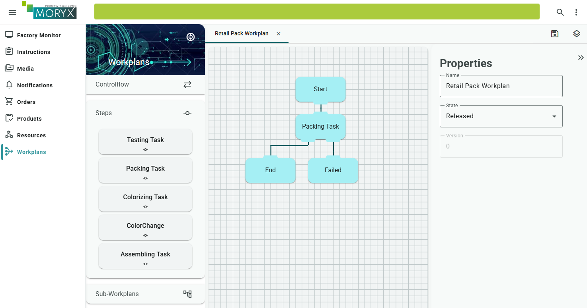
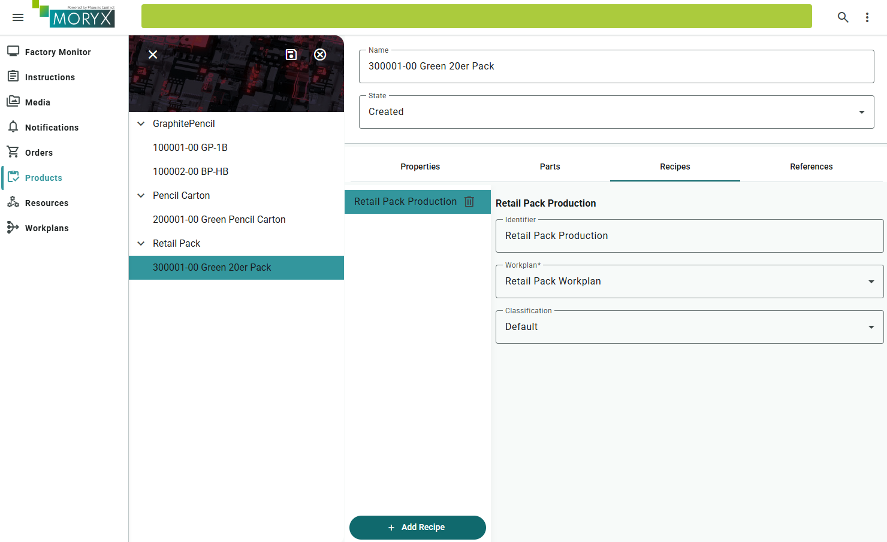

# Chapter 8 - Packing

The retail pack is defined, but nobody packs it yet. *Pencilla Inc.* needs a packing station where the worker sees how many pencils go into which carton. You build that cell and let `Populate` read the PartLinks at runtime.

Packing is a manual cell like Assembling. The difference is in `Populate`: parameters come from the Retail Pack's PartLinks, not from fixed workplan texts.

> [Table of contents](README.md) | [Previous](chapter-07-partlinks.md) | [Next](chapter-09-initializer-importer.md)

**On this page:** [Goals](#learning-goals) | [Starting point](#before-you-start) | [Practice](#practice) | [Check your reasoning](#check-your-reasoning) | [Troubleshooting](#troubleshooting)

## Learning goals

By the end of this chapter, you should be able to:

* Implement `PackingParameters.Populate` so the instruction shows Quantity, pencil and carton from PartLinks
* Mirror Assembling's manual cell for `PackingCell` and add a Retail Pack workplan
* Prove ParameterBinding by running a **second** pack product without changing `Populate`

## Where you are in the journey

* Chapter 7: PartLinks / bill of materials
* **This chapter**: Packing cell (`Populate` + manual cell)
* Chapters 9+: seed, modules, selectors, polish

## Before you start

From chapter 7 you should already have:

* Two pack products in Products, each with PartLinks (pencils + carton)
* Packing step added (`moryx add step Packing`) and `PackingCapabilities` without `Value`

This chapter: write `Populate`, build `PackingCell` like Assembling, add workplan and recipe, then test orders.

## What you will touch

| Kind | Items |
| ---- | ----- |
| Projects / files | `PackingStep/*`, `PencilFactory.Resources.Packing` |
| Classes / types | `PackingParameters`, `PackingActivity`, `PackingCell` |
| UI | Resources (PackingCell + VisualInstructor), Workplans, Products (recipe), Orders, Worker Support |

For new files, let Visual Studio add missing usings (`Ctrl + .`).

## Populate from PartLinks

In this chapter the only worked example is `Populate`. The PackingCell session lifecycle is your transfer from Assembling (chapter 1).

> **Concept:** Fixed workplan instruction text (chapter 1) is enough when every product
> gets the same sentence. Retail packs differ by Quantity and linked products, so
> `Populate` reads the current product's PartLinks at runtime.


File: `src/PencilFactory/Activities/PackingStep/PackingParameters.cs`

The first two fragments explain parts of the method. The full class in subgoal 3 is the replacement: merge it into the generated file once, retaining its namespace/usings. Do not paste the preview fragments in addition to the full method.

**Subgoal 1: Cast to the pack product type**

```csharp
var parameters = (PackingParameters)instance;
var productionProcess = (ProductionProcess)process;
var pack = (PencilPackType)productionProcess.ProductInstance.Type;
```

**Subgoal 2: Read PartLinks**

```csharp
var pencilLink = pack.GraphitePencil;
var cartonLink = pack.Carton;
```

**Subgoal 3: Fill parameters and build the worker instruction**

```csharp
public class PackingParameters : VisualInstructionParameters
{
    public int PencilQuantity { get; set; }
    public string PencilName { get; set; }
    public string CartonName { get; set; }
    public CartonColor CartonColor { get; set; }

    protected override void Populate(Process process, Parameters instance)
    {
        base.Populate(process, instance);

        var parameters = (PackingParameters)instance;
        var productionProcess = (ProductionProcess)process;
        var pack = (PencilPackType)productionProcess.ProductInstance.Type;

        var pencilLink = pack.GraphitePencil;
        var cartonLink = pack.Carton;

        parameters.PencilQuantity = pencilLink?.Quantity ?? 0;
        parameters.PencilName = pencilLink?.Product?.Name ?? "(no graphite pencil linked)";
        parameters.CartonName = cartonLink?.Product?.Name ?? "(no carton linked)";
        parameters.CartonColor = cartonLink?.Product?.Color ?? default;

        parameters.Instructions =
        [
            new VisualInstruction
            {
                Type = InstructionContentType.Text,
                Content =
                    $"Pack {parameters.PencilQuantity} graphite pencil(s) of '{parameters.PencilName}' " +
                    $"into carton '{parameters.CartonName}' ({parameters.CartonColor}). " +
                    "Confirm SUCCESS when the retail pack is complete."
            }
        ];
    }
}
```

When the activity starts, `ProductInstance.Type` is the Retail Pack from the order. `GraphitePencil` / `Carton` are the PartLinks.

> **Note:** If you cast to `GraphitePencilType` instead of `PencilPackType` here, it will fail at runtime. The Packing order must be for the Retail Pack.

## Activity: Capabilities without Value

File: `src/PencilFactory/Activities/PackingStep/PackingActivity.cs`

```csharp
public override ICapabilities RequiredCapabilities => new PackingCapabilities();
```

(Do not set `Value`.)

## Your task: PackingCell (mirror Assembling)

File: `src/PencilFactory.Resources.Packing/PackingCell.cs`

Open `AssemblingCell` as a reference. Implement Packing as a **manual** cell:

1. `IVisualInstructor` via `[ResourceReference(ResourceRelationType.Extension)]`
2. `OnInitializeAsync`: `Capabilities = new PackingCapabilities();`
3. `ProcessEngineAttached`: Production + `ReadyToWorkType.Push`
4. `StartActivity`: for `PackingActivity`, call `VisualInstructor.Execute(..., InstructionCompleted)`
5. `InstructionCompleted`: `CreateResult` + `PublishActivityCompleted`
6. `SequenceCompleted`: new ReadyToWork (Push)

No driver is needed (the worker clicks SUCCESS). Rename Assembling types to Packing types. Do not leave Assembling activity names in the Packing project.

### Check your progress

* PackingCell compiles and uses `PackingActivity` / `PackingCapabilities`
* You can name the Assembling methods you mirrored

## Reference for PackingCell (only if stuck)

<details>
<summary>Open the manual-cell reference after trying the task</summary>


Prefer mirroring `AssemblingCell`. If you are blocked, these are the usual pieces:

```csharp
protected override IEnumerable<Session> ProcessEngineAttached()
{
    yield return Session.StartSession(ActivityClassification.Production, ReadyToWorkType.Push);
}

public override void StartActivity(ActivityStart activityStart)
{
    _currentSession = activityStart;
    switch (activityStart.Activity)
    {
        case PackingActivity:
            _currentInstruction = VisualInstructor.Execute(Name, activityStart, InstructionCompleted);
            break;
    }
}

private void InstructionCompleted(int instructionResult, ActivityStart activity)
{
    _currentInstruction = 0;
    var result = activity.CreateResult(instructionResult);
    _currentSession = result;
    PublishActivityCompleted(result);
}

public override void SequenceCompleted(SequenceCompleted completed)
{
    _currentSession = completed;

    var rtw = Session.StartSession(ActivityClassification.Production, ReadyToWorkType.Push);
    PublishReadyToWork(rtw);
    _currentSession = rtw;
}
```

Also set `Capabilities = new PackingCapabilities();` on initialize and link `IVisualInstructor` like Assembling.

</details>

## Create the resource in the UI

1. Create a PackingCell, name e.g. `PackingCell`.
2. Open the cell, Extension VisualInstructor: the same Instructor as for Assembling and Colorizing.
3. Save.


## Own workplan for Retail Pack

1. Workplans, plus button
2. Name: `Retail Pack Workplan`
3. Palette: Packing Task
4. Connect: Start, Packing Task, End
5. Save

No Assembling/Colorizing/Testing in this plan.



## Recipe on the Retail Pack

1. Products, your Retail Pack (e.g. `Green 20er Pack`)
2. Recipes tab, edit, add Recipe
3. Type: ProductionRecipe
4. Name e.g. `Retail Pack Production`
5. Workplan: `Retail Pack Workplan`
6. Classification: Default
7. Save

Without a Default recipe the order will not start.



## Test in the UI

1. Worker Support / Display = VisualInstructor
2. Orders: product Retail Pack, quantity 1, CREATE, BEGIN
3. Worker assistance Instruction must show Quantity, pencil name and carton from the PartLinks
4. SUCCESS, order finished

Optional beforehand: order GraphitePencil quantity 20 (pencil line). Not technically required for Packing. The instruction simulates placing pencils into the carton.


### Check your progress

* Retail Pack order BEGIN: Worker Support instruction shows Quantity, pencil name and carton from PartLinks
* SUCCESS completes the order. Recipe Classification is Default on the Retail Pack
* Pencil-line workplan is unchanged (Assembling/Colorizing/Testing still for GraphitePencil products)

## Checklist

* [ ] `PackingParameters.Populate` reads PartLinks and builds the Instruction
* [ ] `PackingActivity` with `PackingCapabilities()` without Value
* [ ] PackingCell mirrored from Assembling (manual instructor session)
* [ ] PackingCell created in the UI and Instructor linked
* [ ] Retail Pack Workplan + Default recipe on the Retail Pack
* [ ] Order Retail Pack quantity 1: Instruction shows Quantity / pencil / carton

## Summary

Packing reuses the manual-cell lifecycle. `Populate` turns the ordered pack's PartLinks into a worker instruction, so several packs can share one implementation and workplan. Pencil production and packing stay separate orders.

## Reflect

1. What is reused from Assembling and what is new in PackingParameters?
2. Why does a Retail Pack use a different workplan from a GraphitePencil?
3. How would you tell a wrong PartLink quantity from ordering the wrong product?

## Practice

1. Give the **second** pack from chapter 7 a Default recipe on the **same** Retail Pack workplan (no C# changes). Predict the Worker Support instruction, then run an order and check Quantity / pencil / carton.

2. Customer request: "Change this pack from ten to twelve pencils, but keep the same packing process." Change only the Quantity in Products, predict the new instruction, run one order, then restore the original Quantity.

<details>
<summary>Hint</summary>

Check the product on the order, its GraphitePencil PartLink and Quantity and the Default recipe. You should not edit `PackingParameters.cs`.

</details>

## Check your reasoning

<details>
<summary>Compare your answers after attempting the questions and practice</summary>

1. ReadyToWork, StartActivity, instruction callback and SequenceCompleted follow Assembling. Populate builds the instruction from the pack's PartLinks.
2. The pack needs a Packing step. The pencil workplan runs Assembling/Colorizing/Testing for GraphitePencil. A different process needs a different workplan.
3. Check which product the order uses first, then that product's PartLinks.

**Practice feedback:** The second pack's instruction must match its PartLinks. Changing Quantity to 12 updates the text without changing code. Restore afterward.

</details>

## Troubleshooting

| Symptom | Likely cause |
| --- | --- |
| Instruction shows "(no ... linked)" or 0 | PartLinks / Quantity missing on the Retail Pack product |
| Order will not start | No Default recipe on the Retail Pack, wrong workplan |
| Packing never offered | PackingCell / VisualInstructor missing, capabilities mismatch |
| Wrong workplan steps appear | Recipe still points at pencil Workplan |

See also [Troubleshooting](troubleshooting.md) and [Help](README.md#help).

> [Table of contents](README.md) | [Previous](chapter-07-partlinks.md) | [Next](chapter-09-initializer-importer.md)
