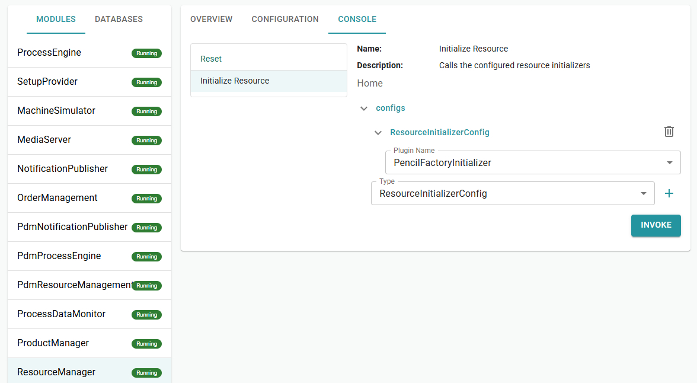
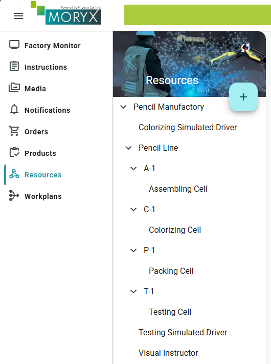
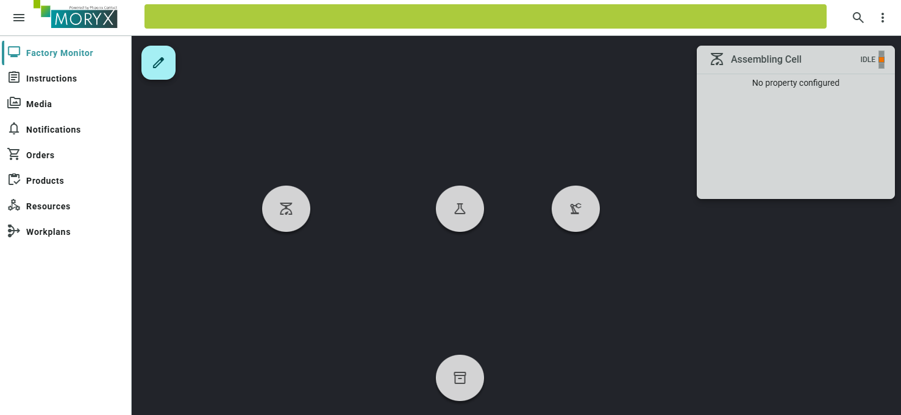
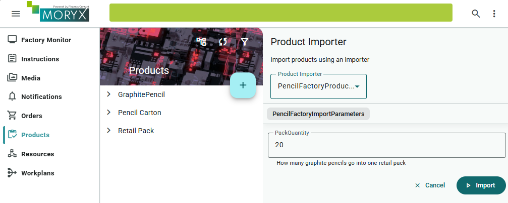

# Chapter 9 - Initializer and Importer

Building the factory click by click in the UI was fine while learning. A new machine or training lab, however, starts empty every time. *Pencilla Inc.* wants resources and products created from code, plus a Factory Monitor to see the line.

> [Table of contents](README.md) | [Previous](chapter-08-packing.md) | [Next](chapter-10-module-adapter.md)

**On this page:** [Goals](#learning-goals) | [Starting point](#before-you-start) | [Practice](#practice) | [Check your reasoning](#check-your-reasoning) | [Troubleshooting](#troubleshooting)

## Learning goals

By the end of this chapter, you should be able to:

* Seed the resource graph with a `ResourceInitializer` (cells, drivers, Factory Monitor layout)
* Import products, workplans and Default recipes with a `ProductImporter`
* Explain when `Saved = false` (initializer) vs `Saved = true` (importer) is appropriate

## Where you are in the journey

* Chapters 1-8: line built mostly by hand in the UI
* **This chapter**: reproducible seed from code + Factory Monitor
* Chapter 10: module / facade / ERP adapter

## Before you start

Finish chapter 8 so a Retail Pack order shows the packing instruction and completes with SUCCESS.
The next section clears the databases. Cells, products, workplans and orders from the UI will be gone.

## What you will touch

| Kind | Items |
| ---- | ----- |
| Projects / files | `PencilFactory.App` (packages, `PencilFactoryInitializer`), `PencilFactory.Products/Importer/*` |
| Classes | `PencilFactoryInitializer`, `PencilFactoryProductImporter`, import parameters/config |
| UI | Command Center (DBs, ResourceManager console, ProductManager config), Resources, Products Import, Factory Monitor |

For new files, let Visual Studio add missing usings (`Ctrl + .`). Keep the namespaces shown in the chapter examples.

## Clear the databases

This step deliberately replaces the manual training data. Save your chapter-8 application and runtime state first, then work in a training copy. Clear its databases, otherwise old cells and products can remain as duplicates.

* In the Command Center under **Databases**, open each DB context, Erase Database, Create Database. Repeat for all contexts.
* Reincarnate all modules or restart the app
* Products, resources, workplans and orders should be gone from the UI


## Factory Monitor packages

The monitor did not load so far because only the web UI was referenced, without API and without factory types.

Therefore add the packages to `PencilFactory.App.csproj`:

```xml
<!-- MORYX FactoryMonitor -->
<PackageReference Include="Moryx.Factory" />
<PackageReference Include="Moryx.FactoryMonitor.Endpoints" />
<PackageReference Include="Moryx.FactoryMonitor.Web" />
```

File: `Directory.Packages.props`:

```xml
 <!-- MORYX FactoryMonitor -->
<PackageVersion Include="Moryx.Factory" Version="$(MoryxVersion)" />
<PackageVersion Include="Moryx.FactoryMonitor.Endpoints" Version="$(MoryxVersion)" />
<PackageVersion Include="Moryx.FactoryMonitor.Web" Version="$(MoryxVersion)" />
```

### Check your progress

* All relevant DB contexts erased and recreated, modules reincarnated or app restarted
* Factory Monitor packages present in `PencilFactory.App.csproj` and `Directory.Packages.props`

---

## ResourceInitializer

Next we create the ResourceInitializer. It builds the complete resource graph from code, the same structure you would otherwise create by hand in the Resources UI.

> **Concept:** A **ResourceInitializer** is a one-shot seed for the ResourceManager graph:
> instantiate cells/drivers/locations, wire `[ResourceReference]` properties in code, return the
> factory root. Prefer this over documenting dozens of UI clicks when every training lab must
> look the same.

Create the file `src/PencilFactory.App/PencilFactoryInitializer.cs`. Start with the class header, then add each method **inside** the class body. Every fragment below is complete on its own.

#### Class header

```csharp
[Plugin(LifeCycle.Transient, typeof(IResourceInitializer), Name = nameof(PencilFactoryInitializer))]
[Display(Name = "Pencil Factory Initializer", Description = "Creates cells, visual instructor and factory layout.")]
public class PencilFactoryInitializer : ResourceInitializerBase
{
    public override string Name => nameof(PencilFactoryInitializer);
    public override string Description => "Setup the simulated pencil factory resources";

    // Add ExecuteAsync and Place below
}
```

#### ExecuteAsync: build the stations

Instantiate each station, connect its instructor or driver and place it in the line group. These references are the code equivalent of the Resources UI. Attach everything to a factory root. `Saved = false` delegates saving to ResourceManager.

```csharp
public override Task<ResourceInitializerResult> ExecuteAsync(IResourceGraph graph, object parameters, CancellationToken cancellationToken)
{
    var instructor = graph.Instantiate<VisualInstructor>();
    instructor.Name = "Visual Instructor";
    instructor.Description = "Shared display for assembling, colorizing, color change and packing";

    var lineGroup = graph.Instantiate<MachineGroup>();
    lineGroup.Name = "Pencil Line";
    lineGroup.Description = "Assembling, colorizing, testing and packing";

    // Manual: VisualInstructor
    var assemblingCell = graph.Instantiate<AssemblingCell>();
    assemblingCell.Name = "Assembling Cell";
    assemblingCell.VisualInstructor = instructor;
    assemblingCell.Value = 0;
    lineGroup.Children.Add(Place(graph, "A-1", "Assembling station", "scale", 0.18, 0.32, assemblingCell));

    // Manual + Automatic: VisualInstructor + Simulated Driver
    var colorizingDriver = graph.Instantiate<SimulatedColorizingDriver>();
    colorizingDriver.Name = "Colorizing Simulated Driver";

    var colorizingCell = graph.Instantiate<ColorizingCell>();
    colorizingCell.Name = "Colorizing Cell";
    colorizingCell.VisualInstructor = instructor;
    colorizingCell.Driver = colorizingDriver;
    colorizingCell.Color = PencilColor.Green;
    lineGroup.Children.Add(Place(graph, "C-1", "Colorizing station", "science", 0.42, 0.32, colorizingCell));

    // Automatic: Simulated Driver
    var testingDriver = graph.Instantiate<SimulatedTestingDriver>();
    testingDriver.Name = "Testing Simulated Driver";

    var testingCell = graph.Instantiate<TestingCell>();
    testingCell.Name = "Testing Cell";
    testingCell.Driver = testingDriver;
    testingCell.Value = 0;
    lineGroup.Children.Add(Place(graph, "T-1", "Testing station", "precision_manufacturing", 0.66, 0.32, testingCell));

    // Manual: VisualInstructor
    var packingCell = graph.Instantiate<PackingCell>();
    packingCell.Name = "Packing Cell";
    packingCell.VisualInstructor = instructor;
    lineGroup.Children.Add(Place(graph, "P-1", "Packing workplace", "inventory_2", 0.42, 0.68, packingCell));

    var factory = graph.Instantiate<ManufacturingFactory>();
    factory.Name = "Pencil Manufactory";
    factory.Description = "Simulated graphite pencil production and retail packing";
    factory.Children.Add(instructor);
    factory.Children.Add(lineGroup);
    factory.Children.Add(colorizingDriver);
    factory.Children.Add(testingDriver);

    return Task.FromResult(new ResourceInitializerResult
    {
        InitializedResources = [factory],
        Saved = false
    });
}
```

#### Place: Factory Monitor location helper

```csharp
private static MachineLocation Place(IResourceGraph graph, string name, string description, string icon, double x, double y, Resource cell)
{
    var location = graph.Instantiate<MachineLocation>();
    location.Name = name;
    location.Description = description;
    location.SpecificIcon = icon;
    location.PositionX = x;
    location.PositionY = y;
    location.Children.Add(cell);
    return location;
}
```

## Explanation

The ResourceInitializer is a plugin that you run once in the ResourceManager console. It builds the complete resource graph from code.

| Building block | Role |
| ---- | ----- |
| `IResourceGraph graph` | API to create resources in the graph |
| `graph.Instantiate<T>()` | Creates a resource of type `T` (cell, driver, group, ...) |
| `[ResourceReference]` properties | Wiring between resources (`VisualInstructor`, `Driver`), as in the UI |
| `MachineGroup` | Logical group (here: "Pencil Line"), groups cells together |
| `MachineLocation` | Place on the Factory Monitor: name, icon, position (`PositionX`/`PositionY` 0...1), contains the cell as child |
| `ManufacturingFactory` | Root of the factory, everything else hangs underneath |
| `Place(...)` | Helper: creates `MachineLocation` + sets layout, returns the location |
| `Children.Add(...)` | Attaches child resources in the tree |
| `Saved = false` | ResourceManager persists the graph itself, you only return the root |

> **Concept:** **`Saved = false`** on the initializer means *you* built the objects in memory;
> ResourceManager owns persistence. The ProductImporter later uses **`Saved = true`** because it
> persists products/workplans/recipes through its own storages (`IProductStorage`, `IWorkplans`).

### Config: register the initializer (Command Center)

1. Command Center, ResourceManager, Console: Initialize Resource. Under configs add a ResourceInitializerConfig, choose `PencilFactoryInitializer`, Invoke.
2. Module Overview: reincarnate ResourceManager



You should now see all resources created in code in the Resources UI.



In the Factory Monitor you should now see the pencil factory with four locations (A-1, C-1, T-1, P-1) at the `PositionX`/`PositionY` coordinates.



## Optional: change the background image in FactoryMonitor

Optionally you can replace the background image and align or move the stations on it.

1. Open the Media module (Launcher).
2. Upload an image (e.g. a sketch of the pencil line with four stations).
3. Click the image, right-click, Info (or Details), copy the Media URL to the clipboard. Typical format: `/api/moryx/media/{guid}/master/stream`
4. Open Factory Monitor, click the edit icon
5. Property BackgroundUrl: paste the copied URL and save.
6. Move the MachineLocations (A-1, C-1, T-1, P-1) via drag or `PositionX`/`PositionY` (0...1) to the matching places on the image.

The icons then sit on top of the background. This is pure visuals. Production runs unchanged.

### Check your progress

* `PencilFactoryInitializer` invoked. Resources UI shows Assembling, Colorizing, Testing, Packing (+ drivers/instructor)
* Factory Monitor shows locations A-1, C-1, T-1, P-1 (optional background image is not required)

---

## ProductImporter (products, workplans, recipes)

### Concept

The CLI stub `PencilFactoryProductImporter` was empty so far. Now it creates objects and saves them itself (`Saved = true`), because workplans are persisted via `IWorkplans` and recipes via `IProductStorage`, not only ProductTypes.

> **Concept:** Import **order** matters: parts (pencils, carton) before Retail Pack (PartLinks),
> workplans before recipes (a recipe needs product + workplan). Treat the importer as a
> reproducible master-data script, not as a replacement for the Products UI editor.

Order: parts first (pencils, carton), then Retail Pack (PartLinks), then workplans, then recipes (need product + workplan).

The ProductImporter is a plugin for the ProductManager. You start it in the Products UI via **Import**. It creates master data from code: reproducibly, instead of five products and two workplans by hand.

| Building block | Role |
| ---- | ----- |
| `[ProductImporter]` | Registers the class as an importer with the ProductManager |
| `PencilFactoryImportParameters` | Fields in the import dialog (`PackQuantity` becomes Quantity on `GraphitePencilPartLink`) |
| `IProductStorage` | Persists ProductTypes and Recipes |
| `IWorkplans` | Persists Workplans |
| `Saved = true` | Importer persists itself (unlike initializer with `Saved = false`) |
| Order | Parts first (pencils, carton), then Retail Pack (PartLinks), then workplans, then recipes |

If `PencilColor` still only has `Green` and `Brown` from Chapter 1, add a third value for for another product:

```csharp
public enum PencilColor
{
    Green = 1,
    Brown = 2,
    Blue = 3,
}
```

### Products created by the importer

This fresh seed uses revision **1** and the names below. It replaces the manually created revision-0 data from chapter 1. After the reset, use this table for chapters 10-12, old product names in earlier screenshots describe the earlier milestone.

| Material number | Name | Type |
| ---- | ----- | --- |
| `100001` | Green Classic | GraphitePencil, Green, Hardness B |
| `100002` | Brown Classic | GraphitePencil, Brown, Hardness HB |
| `100003` | Blue Premium | GraphitePencil, Blue, Hardness HB |
| `200001` | Green Pencil Carton | Purchased carton |
| `300001` | Green 20er | Retail Pack: 20x Green + 1x carton |

Workplans:
* Graphite pencil production (Assembling, Colorizing, Testing)
* Retail packing (Packing)

Recipes: Default recipe for all three pencils + one for the Retail Pack

### PencilFactoryImportParameters.cs

Path: `src/PencilFactory.Products/Importer/PencilFactoryImportParameters.cs`

The parameters appear in the import dialog, here you control the pack quantity:

```csharp
[DataContract]
public class PencilFactoryImportParameters
{
    [DataMember]
    [Description("How many graphite pencils go into one retail pack")]
    public int PackQuantity { get; set; } = 20;
}
```

### PencilFactoryProductImporterConfig.cs

Path: `src/PencilFactory.Products/Importer/PencilFactoryProductImporterConfig.cs`

The config connects the importer to the ProductManager:

```csharp
public class PencilFactoryProductImporterConfig : ProductImporterConfig
{
    public override string PluginName => nameof(PencilFactoryProductImporter);
}
```

### PencilFactoryProductImporter.cs

Path: `src/PencilFactory.Products/Importer/PencilFactoryProductImporter.cs`

Start with the class header, then add each method **inside** the class. Fragments are complete methods (no shared closing brace at the end).

#### Class header

```csharp
using Moryx.AbstractionLayer.Products;
using Moryx.AbstractionLayer.Recipes;
using Moryx.AbstractionLayer.Workplans;
using Moryx.Container;
using Moryx.Logging;
using Moryx.Modules;
using Moryx.Products.Management;
using Moryx.VisualInstructions;
using Moryx.Workplans;
using PencilFactory.Activities.AssemblingStep;
using PencilFactory.Activities.ColorizingStep;
using PencilFactory.Activities.PackingStep;
using PencilFactory.Activities.TestingStep;

namespace PencilFactory.Products.Importer;

/// <summary>
/// Imports products for PencilFactory
/// </summary>
[ExpectedConfig(typeof(PencilFactoryProductImporterConfig))]
[ProductImporter(nameof(PencilFactoryProductImporter))]
public class PencilFactoryProductImporter : ProductImporterBase<PencilFactoryProductImporterConfig, PencilFactoryImportParameters>, ILoggingComponent
{
    public IModuleLogger Logger { get; set; }
    public IProductStorage Storage { get; set; }
    public IWorkplans WorkplanStorage { get; set; }

    // Add ImportAsync and helpers below
}
```

#### ImportAsync: persist in dependency order

Part products precede the pack, workplans precede recipes. This method uses the helpers in the following fragments.

```csharp
protected override async Task<ProductImporterResult> ImportAsync(ProductImportContext context, PencilFactoryImportParameters parameters, CancellationToken cancellationToken)
{
    var quantity = parameters.PackQuantity > 0 ? parameters.PackQuantity : 20;

    var green = CreateGraphitePencil("100001", 1, "Green Classic", PencilColor.Green, GraphiteHardness.B);
    var brown = CreateGraphitePencil("100002", 1, "Brown Classic", PencilColor.Brown, GraphiteHardness.HB);
    var bluePremium = CreateGraphitePencil("100003", 1, "Blue Premium", PencilColor.Blue, GraphiteHardness.HB);
    var greenCarton = CreateCarton("200001", 1, "Green Pencil Carton", CartonColor.Green);
    var greenPack = CreateRetailPack("300001", 1, "Green 20er", green, quantity, greenCarton);

    await Storage.SaveTypeAsync(green, cancellationToken);
    await Storage.SaveTypeAsync(brown, cancellationToken);
    await Storage.SaveTypeAsync(bluePremium, cancellationToken);
    await Storage.SaveTypeAsync(greenCarton, cancellationToken);
    await Storage.SaveTypeAsync(greenPack, cancellationToken);

    var pencilWorkplan = CreateGraphitePencilWorkplan();
    var packWorkplan = CreatePackingWorkplan();
    await WorkplanStorage.SaveWorkplanAsync(pencilWorkplan, cancellationToken);
    await WorkplanStorage.SaveWorkplanAsync(packWorkplan, cancellationToken);

    await Storage.SaveRecipeAsync(CreateRecipe("Graphite pencil production", green, pencilWorkplan), cancellationToken);
    await Storage.SaveRecipeAsync(CreateRecipe("Graphite pencil production", brown, pencilWorkplan), cancellationToken);
    await Storage.SaveRecipeAsync(CreateRecipe("Graphite pencil production", bluePremium, pencilWorkplan), cancellationToken);
    await Storage.SaveRecipeAsync(CreateRecipe("Retail packing", greenPack, packWorkplan), cancellationToken);

    return new ProductImporterResult { Saved = true };
}
```

#### Helpers: construct products and recipes

These helpers construct objects. ImportAsync performs their persistence. Follow how quantity becomes a property of the pencil PartLink.

```csharp
private static GraphitePencilType CreateGraphitePencil(string materialNumber, short revision, string name, PencilColor color, GraphiteHardness hardness)
{
    return new GraphitePencilType
    {
        Identity = new ProductIdentity(materialNumber, revision),
        Name = name,
        Color = color,
        Hardness = hardness
    };
}

private static PencilCartonType CreateCarton(string materialNumber, short revision, string name, CartonColor color)
{
    return new PencilCartonType
    {
        Identity = new ProductIdentity(materialNumber, revision),
        Name = name,
        Color = color
    };
}

private static PencilPackType CreateRetailPack(string materialNumber, short revision, string name, GraphitePencilType pencil, int quantity, PencilCartonType carton)
{
    return new PencilPackType
    {
        Identity = new ProductIdentity(materialNumber, revision),
        Name = name,
        GraphitePencil = new GraphitePencilPartLink { Product = pencil, Quantity = quantity },
        Carton = new ProductPartLink<PencilCartonType> { Product = carton }
    };
}

private static ProductionRecipe CreateRecipe(string name, ProductType product, Workplan workplan)
{
    return new ProductionRecipe
    {
        Name = name,
        Product = product,
        Workplan = workplan,
        Classification = RecipeClassification.Default,
        State = RecipeState.Released
    };
}
```

#### Create Graphite Pencil Workplan

The connectors encode the same Assembling -> Colorizing -> Testing path you already tested in the UI.

```csharp
private static Workplan CreateGraphitePencilWorkplan()
{
    var workplan = new Workplan
    {
        Name = "Graphite pencil production (Imported)",
        State = WorkplanState.Released
    };

    var start = workplan.AddConnector("Start", NodeClassification.Start);
    var assembled = workplan.AddConnector("Assembled", NodeClassification.Intermediate);
    var colorized = workplan.AddConnector("Colorized", NodeClassification.Intermediate);
    var end = workplan.AddConnector("End", NodeClassification.End);
    var failed = workplan.AddConnector("Failed", NodeClassification.Failed);

    workplan.AddStep(new AssemblingTask(), new AssemblingParameters
    {
        Instructions =
        [
            new VisualInstruction
            {
                Type = InstructionContentType.Text,
                Content = "Assemble the graphite pencil, then confirm SUCCESS or FAILED."
            }
        ]
    }, start, assembled, failed);

    workplan.AddStep(new ColorizingTask(), new ColorizingParameters
    {
        Instructions =
        [
            new VisualInstruction
            {
                Type = InstructionContentType.Text,
                Content = "Colorize the pencil with the required color, then confirm SUCCESS."
            }
        ]
    }, assembled, colorized, failed);

    workplan.AddStep(new TestingTask(), new TestingParameters(), colorized, end, failed);

    return workplan;
}
```

#### Create Packing Workplan

Packing operates on PencilPackType. Reusing the pencil workplan here would execute the wrong activities for that product type.

```csharp
private static Workplan CreatePackingWorkplan()
{
    var workplan = new Workplan
    {
        Name = "Retail packing (Imported)",
        State = WorkplanState.Released
    };

    var start = workplan.AddConnector("Start", NodeClassification.Start);
    var end = workplan.AddConnector("End", NodeClassification.End);
    var failed = workplan.AddConnector("Failed", NodeClassification.Failed);

    workplan.AddStep(new PackingTask(), new PackingParameters(), start, end, failed);

    return workplan;
}
```

### Config: register the importer (Command Center)

1. ProductManager, CONFIGURATION, Importers: add plugin type PencilFactoryProductImporterConfig (+)
2. SAVE + RESTART


### Run

1. Open Products UI, **Import**.
2. Choose importer PencilFactoryProductImporter.
3. Leave **PackQuantity = 20** (default, as in the screenshot) and import.
4. Expectation: five products, two workplans, four Default recipes.




The UI is the editor. Initializer and Importer are the seed, this is how an application developer sets up a factory that everyone can reproduce.

### Check your progress

* Importer registered in ProductManager. Import completes without error
* Five products, two workplans, four Default recipes visible in the UI, pack Quantity matches the chosen import parameter

## Checklist

* [ ] Databases cleared and modules restarted
* [ ] Factory Monitor packages entered in `csproj` and `Directory.Packages.props`
* [ ] `PencilFactoryInitializer` created and run via the ResourceManager console
* [ ] Resources UI and Factory Monitor show A-1, C-1, T-1, P-1
* [ ] ProductImporter files created and importer registered in the config
* [ ] Import executed: five products, two workplans, four Default recipes

## Summary

The initializer creates a resource graph for ResourceManager to save. The importer explicitly persists products, workplans and recipes. Creating dependencies in order reproduces a coherent starting state, including the Factory Monitor layout.

## Reflect

1. What does Saved mean on each result object in this example?
2. Why do recipes follow products and workplans in the importer?
3. Does calling this a seed mean it is safe to rerun without clearing existing data?

## Practice

No second database clear needed. With the default import in place, check:

1. Which products use the pencil workplan and which use the packing workplan? Confirm under Products -> Recipes.
2. Stations A-1, C-1, T-1, P-1 appear in the Factory Monitor. Did the **initializer** or the **importer** create them?

<details>
<summary>Hint</summary>

Initializer -> resources and layout. Importer -> products, workplans, recipes.

</details>

## Check your reasoning

<details>
<summary>Compare your answers after attempting the questions and practice</summary>

1. `Saved = false`: ResourceManager should persist the returned graph. `Saved = true`: the importer already saved through storage APIs.
2. A recipe needs both a product and a workplan. Create and save those first. Same idea for PartLinks: linked products before the pack.
3. No. This seed expects a clean database. Rerunning can create duplicates.

**Practice feedback:** The three pencils share the graphite workplan. The retail pack uses packing. A-1 / C-1 / T-1 / P-1 come from the initializer, not from the importer.

</details>

## Troubleshooting

| Symptom | Likely cause |
| ---- | ----- |
| Duplicate cells or products after re-run | Databases not erased/created before initializer/import |
| Factory Monitor blank / packages missing | `Moryx.Factory` / Endpoints / Web not in csproj + `Directory.Packages.props` |
| Initializer type missing in console | Class not in loaded App assembly, rebuild / wrong plugin attributes |
| Import creates products but no recipes | Recipe save missing, workplan not Released, or wrong order of operations |
| PartLinks empty on Retail Pack | Pack saved before linked products existed, or PartLink not assigned in code |
| Resources appear but layout wrong | `MachineLocation` PositionX/Y or Children wiring incomplete |

See also [Troubleshooting](troubleshooting.md) and [Help](README.md#help).

> [Table of contents](README.md) | [Previous](chapter-08-packing.md) | [Next](chapter-10-module-adapter.md)
