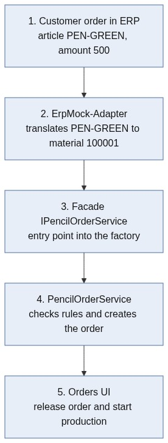
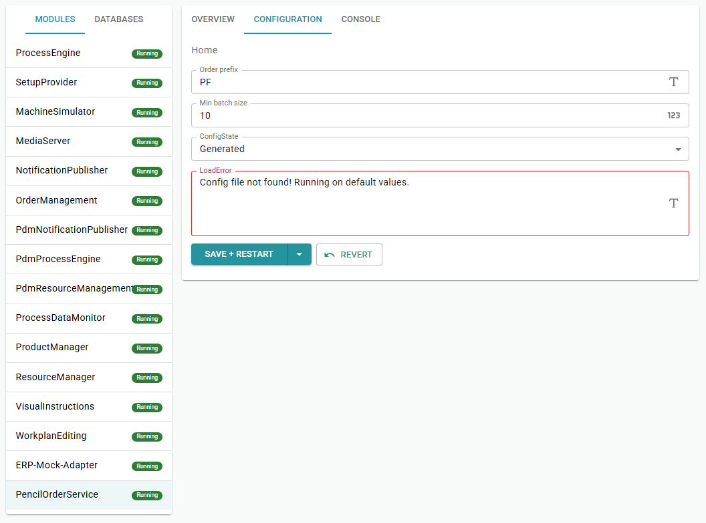
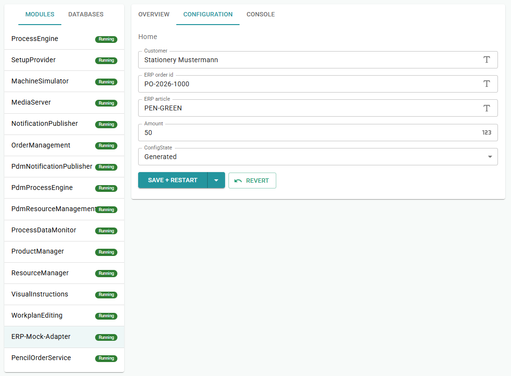
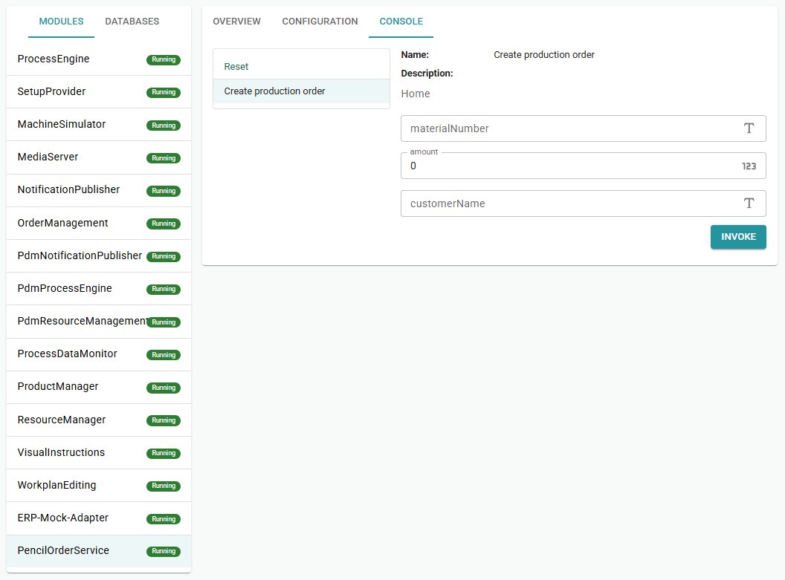
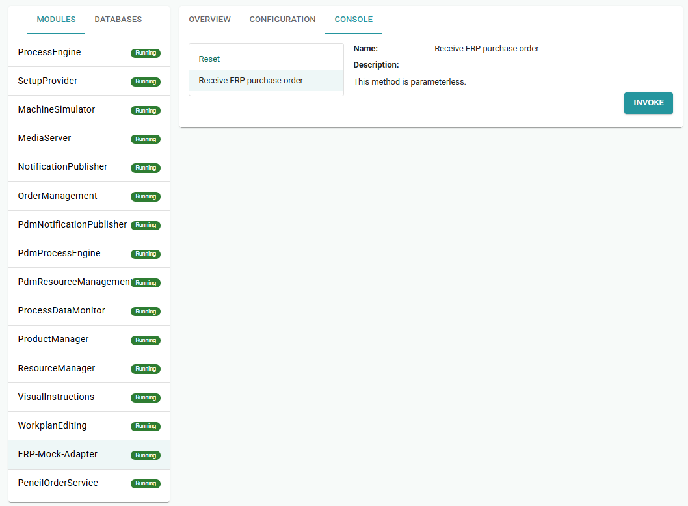

# Chapter 10 - Module, Facade, Adapter

Customers no longer place every order by hand in the Orders UI. Stationery shop Mustermann orders in an ERP under article `PEN-GREEN`, while PencilFactory knows material number `100001`. You build the bridge: an adapter for the mapping and a module facade that creates the factory order.

> [Table of contents](README.md) | [Previous](chapter-09-initializer-importer.md) | [Next](chapter-11-cell-selectors.md)

**On this page:** [Goals](#learning-goals) | [Starting point](#before-you-start) | [Practice](#practice) | [Check your reasoning](#check-your-reasoning) | [Troubleshooting](#troubleshooting)

## Learning goals

By the end of this chapter, you should be able to:

* Explain Module vs Facade vs Adapter and which side exports or imports the API
* Create a `ProductionBridge` module with a facade and an ERP-mock adapter
* Test intake via consoles, then release the order in the Orders UI

## Where you are in the journey

* Chapters 1-9: productive line + reproducible seed
* **This chapter**: bridge from ERP IDs into factory orders
* Chapter 11: smarter cell selection under load

## Before you start

Finish chapter 9 so the imported products exist (at least Green `100001`, Brown `100002`, Blue `100003`) with Default recipes.

You need a running line that can start a GraphitePencil order from the Orders UI.

## What you will touch

| Kind | Items |
| ---- | ----- |
| CLI | `moryx add module ProductionBridge`, `moryx add adapter ErpMock` |
| Projects / files | `PencilFactory.ProductionBridge`, `PencilFactory.ErpMock`, App ProjectReferences |
| Classes | `IPencilOrderService`, `PencilOrderFacade`, module/adapter controllers, `ErpArticleMapper` |
| UI | Command Center (module config + consoles), Orders UI (release/start) |

For new files, let Visual Studio add missing usings (`Ctrl + .`).

## Scenario

Stationery shop Mustermann orders 500 pencils in the ERP under article number `PEN-GREEN`.
MORYX knows the same product as material number `100001`. Two worlds, two IDs.

MORYX solves this with adapters, facades and modules:

1. The ERP (here a mock) only knows its article numbers.
2. The **adapter** translates `PEN-GREEN` into `100001` and calls the factory API.
3. The **facade** is that API: a thin interface that other modules may import.
4. The **module** (`PencilOrderService`) checks rules and creates the order.
5. In the [Orders UI](https://github.com/PHOENIXCONTACT/MORYX-Framework/blob/main/docs/articles/module-orders/index.md) you can release the order. The line works as before.

From the ERP into PencilFactory, the path looks like this:



| Material | Product | Via ERP? |
| ---- | ----- | --- |
| `100001` | Green Classic | Yes (`PEN-GREEN`) |
| `100002` | Brown Classic | Yes (`PEN-BROWN`) |
| `100003` | Blue Premium | Yes (`PEN-BLUE`) |
| `200001` | Green Pencil Carton | No (purchased part) |
| `300001` | Green 20er | No (packing) |

## The three terms

> **Concept:** A **module** owns lifecycle and config. A **facade** is the thin public API it
> exports (`IFacadeContainer<T>`). An **adapter** sits at the foreign-system boundary: it
> **imports** the facade (`[RequiredModuleApi]`) and maps data. It does not re-export the
> same order API. Keep ERP knowledge out of the facade. Keep factory rules out of the adapter.

| Term | What it is | In our case |
| ---- | ----- | --- |
| Module | Standalone MORYX building block (Config + Console) | `PencilOrderService` (project: `PencilFactory.ProductionBridge`) |
| Facade | Public API to the outside | `IPencilOrderService.CreateProductionOrderAsync` |
| Adapter | Bridge to the external system | `ERP-Mock-Adapter` (project: `PencilFactory.ErpMock`) |

The module exports the facade (`IFacadeContainer<IPencilOrderService>`).
The adapter only imports it (`[RequiredModuleApi] IPencilOrderService`).

More on [Server modules](https://github.com/PHOENIXCONTACT/MORYX-Framework/blob/main/docs/tutorials/server-module/server-module.md)
and [Facades](https://github.com/PHOENIXCONTACT/MORYX-Framework/blob/main/docs/tutorials/server-module/facades.md)
in the framework (adapters import a facade the same way another module would).

## CLI: create the module

In the solution root:

```bash
moryx add module ProductionBridge
```

The CLI creates (`src/PencilFactory.ProductionBridge/`):

| File | Role (stub) |
| ---- | ----- |
| `Facade/IMyFacade.cs` | rename/replace with `IPencilOrderService` |
| `Facade/MyFacade.cs` | replace with `PencilOrderFacade` |
| `ModuleController/ModuleController.cs` | module control |
| `ModuleController/ModuleConfig.cs` | config (JSON) |
| `ModuleController/ModuleConsole.cs` | console methods |
| `Components/` , `Implementation/` | demo stub, not needed, can be deleted |
| `PencilFactory.ProductionBridge.csproj` | project file |
| Entry in `PencilFactory.sln` | automatic |

## CLI: create the adapter

```bash
moryx add adapter ErpMock
```

Same scaffold as for the module (`src/PencilFactory.ErpMock/`).

Semantically it is an adapter. In this case you only use `ModuleController`, `ModuleConfig`, `ModuleConsole`.

Clean up in the adapter project:

- Delete folders `Facade/`, `Components/`, `Implementation/` (adapter does not export its own facade)

## Attach projects to PencilFactory.App

So that the modules are loaded, add the ProjectReferences in `src/PencilFactory.App/PencilFactory.App.csproj`:

```csharp
<ProjectReference Include="..\PencilFactory.ProductionBridge\PencilFactory.ProductionBridge.csproj" />

<ProjectReference Include="..\PencilFactory.ErpMock\PencilFactory.ErpMock.csproj" />
```

## Adjust the .csproj of the new projects

### PencilFactory.ProductionBridge.csproj

The module needs Orders and AbstractionLayer for product checks and order creation:

```csharp
<Project Sdk="Microsoft.NET.Sdk">

  <PropertyGroup>
    <TargetFramework>net10.0</TargetFramework>
  </PropertyGroup>

  <ItemGroup>
    <PackageReference Include="Moryx.Runtime" />
    <PackageReference Include="Moryx.Orders" />
    <PackageReference Include="Moryx.AbstractionLayer" />
  </ItemGroup>
  <ItemGroup>
    <ProjectReference Include="..\PencilFactory\PencilFactory.csproj" />
  </ItemGroup>

</Project>
```

### PencilFactory.ErpMock.csproj

The adapter references only Runtime and the facade from ProductionBridge:

```csharp
<Project Sdk="Microsoft.NET.Sdk">

  <PropertyGroup>
    <TargetFramework>net10.0</TargetFramework>
  </PropertyGroup>

  <ItemGroup>
    <PackageReference Include="Moryx.Runtime" />
  </ItemGroup>
  <ItemGroup>
    <ProjectReference Include="..\PencilFactory.ProductionBridge\PencilFactory.ProductionBridge.csproj" />
  </ItemGroup>

</Project>
```

### Check your progress

* `ProductionBridge` and `ErpMock` projects exist. App references both
* Adapter has no own `Facade/` export. ProductionBridge `.csproj` includes Orders + AbstractionLayer

---

## Module code (ProductionBridge)

### IPencilOrderService.cs

The facade is the only public API to the outside. One method is enough:

```csharp
using System.Threading.Tasks;

namespace PencilFactory.ProductionBridge;

public interface IPencilOrderService
{
    Task<string> CreateProductionOrderAsync(
        string materialNumber, int amount, string customerName, string erpOrderId);
}
```

### PencilOrderFacade.cs

The facade checks the product master and factory rules before creating the order:

```csharp
using System;
using System.Threading.Tasks;
using Moryx.AbstractionLayer.Products;
using Moryx.Orders;
using Moryx.Runtime.Modules;
using PencilFactory.Products;
using PencilFactory.ProductionBridge;

namespace PencilFactory.ProductionBridge;

public class PencilOrderFacade : FacadeBase, IPencilOrderService
{
    private IOrderManagement _orders;
    private IProductManagement _products;
    private ModuleConfig _config;

    public void Initialize(IOrderManagement orders, IProductManagement products, ModuleConfig config)
    {
        _orders = orders;
        _products = products;
        _config = config;
    }

    public async Task<string> CreateProductionOrderAsync(string materialNumber, int amount, string customerName, string erpOrderId)
    {
        ValidateHealthState?.Invoke();

        var product = await _products.LoadTypeAsync(new ProductIdentity(materialNumber, 1));
        if (product == null)
            return "Rejected: material " + materialNumber + " is not in the product data.";

        if (product is PencilCartonType)
            return "Rejected: " + product.Name + " is a purchased part.";

        if (product is PencilPackType)
            return "Rejected: " + product.Name + " belongs on the packing line.";

        if (product is not GraphitePencilType)
            return "Rejected: only graphite pencils can be ordered through this interface.";

        if (amount < _config.MinBatchSize)
            return "Rejected: quantity " + amount
                + " is below minimum batch size " + _config.MinBatchSize + ".";

        var orderNumber = _config.OrderPrefix + "-" + DateTime.Now.ToString("HHmmss");
        var orderName = string.IsNullOrWhiteSpace(erpOrderId)
            ? customerName
            : customerName + " / " + erpOrderId;

        await _orders.AddOperationAsync(new OperationCreationContext
        {
            Order = new OrderCreationContext { Number = orderNumber, Type = "PencilFactory" },
            Number = Random.Shared.Next(1000, 9999).ToString(),
            Name = orderName,
            ProductIdentifier = materialNumber,
            ProductRevision = 1,
            TotalAmount = amount,
            PlannedStart = DateTime.Now,
            PlannedEnd = DateTime.Now.AddHours(8)
        });

        return "Production order " + orderNumber + " created: "
            + amount + "x " + product.Name + " for " + orderName
            + ". Release and start it in the Orders UI.";
    }
}

```

### ModuleConfig.cs

Via the config you control order prefix and minimum batch size without changing code:

```csharp
using System.ComponentModel;
using System.ComponentModel.DataAnnotations;
using System.Runtime.Serialization;
using Moryx.Configuration;

namespace PencilFactory.ProductionBridge;

[DataContract]
public class ModuleConfig : ConfigBase
{
    [DataMember]
    [Display(Name = "Order prefix")]
    [DefaultValue("PF")]
    public string OrderPrefix { get; set; } = "PF";

    [DataMember]
    [Display(Name = "Min batch size")]
    [DefaultValue(10)]
    public int MinBatchSize { get; set; } = 10;
}
```



### ModuleController.cs

The ModuleController wires dependencies, activates the facade and exports it:

```csharp
using System.ComponentModel;
using System.Threading;
using System.Threading.Tasks;
using Microsoft.Extensions.Logging;
using Moryx.AbstractionLayer.Products;
using Moryx.Configuration;
using Moryx.Container;
using Moryx.Orders;
using Moryx.Runtime.Modules;

namespace PencilFactory.ProductionBridge;

[Description("Order intake: checks products and factory rules for ERP orders")]
public class ModuleController : ServerModuleBase<ModuleConfig>, IFacadeContainer<IPencilOrderService>
{
    private readonly PencilOrderFacade _facade = new();

    public override string Name => "PencilOrderService";

    [RequiredModuleApi(IsOptional = false, IsStartDependency = true)]
    public IOrderManagement OrderManagement { get; set; }

    [RequiredModuleApi(IsOptional = false, IsStartDependency = true)]
    public IProductManagement ProductManagement { get; set; }

    IPencilOrderService IFacadeContainer<IPencilOrderService>.Facade => _facade;

    public ModuleController(
        IModuleContainerFactory containerFactory,
        IConfigManager configManager,
        ILoggerFactory loggerFactory)
        : base(containerFactory, configManager, loggerFactory) { }

    protected override Task OnInitializeAsync(CancellationToken cancellationToken)
    {
        _facade.Initialize(OrderManagement, ProductManagement, Config);
        Container.SetInstance<IPencilOrderService>(_facade);
        return Task.CompletedTask;
    }

    protected override Task OnStartAsync(CancellationToken cancellationToken)
    {
        ActivateFacade(_facade);
        return Task.CompletedTask;
    }

    protected override Task OnStopAsync(CancellationToken cancellationToken)
    {
        DeactivateFacade(_facade);
        return Task.CompletedTask;
    }
}
```

### ModuleConsole.cs (test the facade directly)

Via the console you can call the facade without the ERP adapter:

```csharp
using System.ComponentModel;
using System.ComponentModel.DataAnnotations;
using Moryx.Runtime.Modules;
using Moryx.Serialization;

namespace PencilFactory.ProductionBridge;

[ServerModuleConsole]
public class ModuleConsole : IServerModuleConsole
{
    public IPencilOrderService PencilOrderService { get; set; }

    [EntrySerialize]
    [Display(Name = "Create production order")]
    public string CreateProductionOrder(
        [Description("100001 Green, 100002 Brown Classic")]
        string materialNumber,
        int amount,
        string customerName)
    {
        return PencilOrderService.CreateProductionOrderAsync(
            materialNumber.Trim(), amount, customerName.Trim(), "MANUAL")
            .GetAwaiter().GetResult();
    }
}
```

## Adapter code (ErpMock)

### ErpArticleMapper.cs (new file)

The mapping translates ERP articles into MORYX material numbers: only graphite pencils, no cartons or packs:

```csharp
namespace PencilFactory.ErpMock;

internal static class ErpArticleMapper
{
    private static readonly Dictionary<string, string> Map =
        new(StringComparer.OrdinalIgnoreCase)
        {
            ["PEN-GREEN"] = "100001",
            ["PEN-BROWN"] = "100002",
            ["PEN-BLUE"] = "100003",
        };

    public static bool TryMap(string erpArticle, out string materialNumber)
        => Map.TryGetValue(erpArticle?.Trim() ?? "", out materialNumber!);
}
```

### ModuleConfig.cs (ERP fields only, no material number)

The adapter config simulates the ERP purchase order. Article and quantity come from outside:

```csharp
using System.ComponentModel;
using System.ComponentModel.DataAnnotations;
using System.Runtime.Serialization;
using Moryx.Configuration;

namespace PencilFactory.ErpMock;

[DataContract]
public class ModuleConfig : ConfigBase
{
    [DataMember]
    [Display(Name = "Customer")]
    [DefaultValue("Stationery Mustermann")]
    public string Customer { get; set; } = "Stationery Mustermann";

    [DataMember]
    [Display(Name = "ERP order id")]
    [DefaultValue("PO-2026-1000")]
    public string ErpOrderId { get; set; } = "PO-2026-1000";

    [DataMember]
    [Display(Name = "ERP article")]
    [Description("PEN-GREEN, PEN-BROWN or PEN-BLUE")]
    [DefaultValue("PEN-GREEN")]
    public string ErpArticle { get; set; } = "PEN-GREEN";

    [DataMember]
    [Display(Name = "Amount")]
    [DefaultValue(500)]
    public int Amount { get; set; } = 500;
}
```



### ModuleController.cs

The adapter only imports the facade and provides it to the container:

```csharp
using System.ComponentModel;
using System.Threading;
using System.Threading.Tasks;
using Microsoft.Extensions.Logging;
using Moryx.Configuration;
using Moryx.Container;
using Moryx.Runtime.Modules;
using PencilFactory.ProductionBridge;

namespace PencilFactory.ErpMock;

[Description("ERP mock: receives wholesale purchase orders for the graphite pencil line")]
public class ModuleController : ServerModuleBase<ModuleConfig>
{
    public override string Name => "ERP-Mock-Adapter";

    [RequiredModuleApi(IsOptional = false, IsStartDependency = true)]
    public IPencilOrderService PencilOrderService { get; set; }

    public ModuleController(
        IModuleContainerFactory containerFactory,
        IConfigManager configManager,
        ILoggerFactory loggerFactory)
        : base(containerFactory, configManager, loggerFactory) { }

    protected override Task OnInitializeAsync(CancellationToken cancellationToken)
    {
        Container.SetInstance(PencilOrderService);
        return Task.CompletedTask;
    }

    protected override Task OnStartAsync(CancellationToken cancellationToken) => Task.CompletedTask;

    protected override Task OnStopAsync(CancellationToken cancellationToken) => Task.CompletedTask;
}
```

### ModuleConsole.cs

The console method simulates ERP intake: mapping, then call to the facade:

```csharp
using System.ComponentModel;
using System.ComponentModel.DataAnnotations;
using Moryx.Runtime.Modules;
using Moryx.Serialization;
using PencilFactory.ProductionBridge;

namespace PencilFactory.ErpMock;

[ServerModuleConsole]
public class ModuleConsole : IServerModuleConsole
{
    public IPencilOrderService PencilOrderService { get; set; }
    public ModuleConfig Config { get; set; }

    [EntrySerialize]
    [Display(Name = "Receive ERP purchase order")]
    public string ReceiveErpPurchaseOrder()
    {
        if (!ErpArticleMapper.TryMap(Config.ErpArticle, out var materialNumber))
            return "Rejected: unknown ERP article '" + Config.ErpArticle + "'.";

        var header =
            "Customer: " + Config.Customer + "\n"
            + "ERP order: " + Config.ErpOrderId + "\n"
            + "ERP article: " + Config.ErpArticle + "\n"
            + "Material: " + materialNumber + "\n"
            + "Amount: " + Config.Amount;

        var result = PencilOrderService.CreateProductionOrderAsync(
            materialNumber, Config.Amount, Config.Customer, Config.ErpOrderId)
            .GetAwaiter().GetResult();

        return header + "\n\n" + result;
    }
}
```

## Build & Start

1. Rebuild
2. Start the app
3. Command Center: modules PencilOrderService and ERP-Mock-Adapter Running

No extra entry in `Program.cs`. `AddMoryxModules()` finds the assemblies via the app references.

### Check your progress

* PencilOrderService and ERP-Mock-Adapter show as Running in Command Center
* Solution builds after the ProjectReferences and facade/adapter code

## Testing

### 1. Facade directly (without ERP)

PencilOrderService, Console tab, method Create production order

| Field | Value |
| ---- | ----- |
| materialNumber | `100001` |
| amount | `20` |
| customerName | `Factory planning` |



### Rejections

| materialNumber | amount | Expectation |
| ---- | ----- | --- |
| `200001` | 500 | Rejected (carton) |
| `300001` | 500 | Rejected (pack) |
| `100001` | `5` | Rejected (< MinBatchSize 10) |

### Check your progress

* Facade accepts a valid graphite-pencil order and rejects carton, pack and too-small batches

### 2. Via ERP adapter

ERP-Mock-Adapter, Configuration tab:

- ERP article: `PEN-GREEN` (or Brown)
- Amount: `500`
- SAVE + RESTART

CONSOLE, Receive ERP purchase order, INVOKE



### 3. Production

Orders UI: find the order, begin production, start

### Check your progress

* ERP article `PEN-GREEN` maps to `100001` and creates a production order
* Order can be released and started in the Orders UI like a UI-created order

## Checklist

* [ ] Module `ProductionBridge` and adapter `ErpMock` created via CLI
* [ ] ProjectReferences in the app and `.csproj` adjustments set
* [ ] Facade, ModuleController and Console implemented in the module
* [ ] ErpArticleMapper, adapter config and Console implemented
* [ ] Modules PencilOrderService and ERP-Mock-Adapter running
* [ ] Facade tested directly and via ERP adapter, rejections checked
* [ ] Order released and started in the Orders UI

## Summary

The adapter maps external vocabulary to the factory API. The facade exposes that API and the module provides lifecycle and dependencies. The example creates an operation, release and start remain explicit actions in Orders.

## Reflect

1. Why does the adapter call IPencilOrderService instead of duplicating factory rules?
2. Which validation belongs at the ERP boundary and which belongs in the factory service?
3. Would an adapter exporting another facade always be wrong? Explain the scope of this example.

## Practice

A second ERP customer calls the existing Green pencil **PEN-GREEN-ALT**. Support this alias without changing factory products or creating another module. Decide where the change belongs, implement it and invoke the adapter with the alias.

**Acceptance checks:** the alias resolves to material 100001

<details>
<summary>Hint</summary>

Add the alias in `ErpArticleMapper` to the same material number. Do not change the facade signature.

</details>

## Check your reasoning

<details>
<summary>Compare your answers after attempting the questions and practice</summary>

1. One factory service keeps the rules the same for every caller (ERP). The adapter only translates the external request.
2. Unknown ERP article names belong to the mapper/boundary. Whether a material can be produced through this 
service and whether the batch is large enough are factory rules.
3. Not always wrong. This example only needs the adapter to **call** the order service. Another facade would be extra work you do not need here.

**Practice feedback:** `PEN-GREEN-ALT` is one more map entry to `100001`. Check Orders for accepted requests. Rejected ones should create no new order.

</details>

## Troubleshooting

| Symptom | Likely cause |
| ---- | ----- |
| Modules missing / not Running | App ProjectReference missing, rebuild, check Command Center |
| Cannot resolve `IPencilOrderService` on adapter | Facade not activated / not exported, start dependency not set |
| Always "unknown ERP article" | Mapper key mismatch, config ERP article typo |
| Rejected purchased part / pack | Expected (facade rules). Use graphite material or `PEN-*` that maps to one |
| Compile errors in stubs | CLI leftover `MyFacade` / demo Components not replaced or deleted |

See also [Troubleshooting](troubleshooting.md) and [Help](README.md#help).

> [Table of contents](README.md) | [Previous](chapter-09-initializer-importer.md) | [Next](chapter-11-cell-selectors.md)
