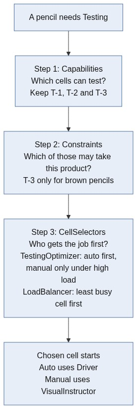
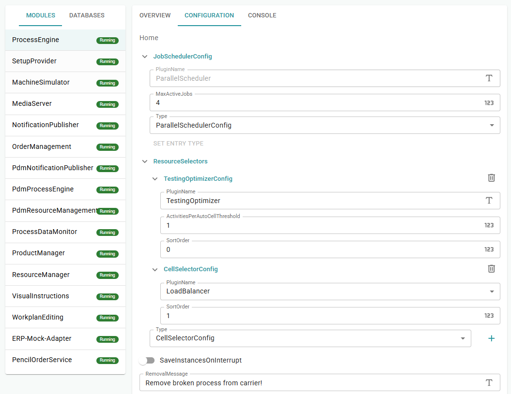
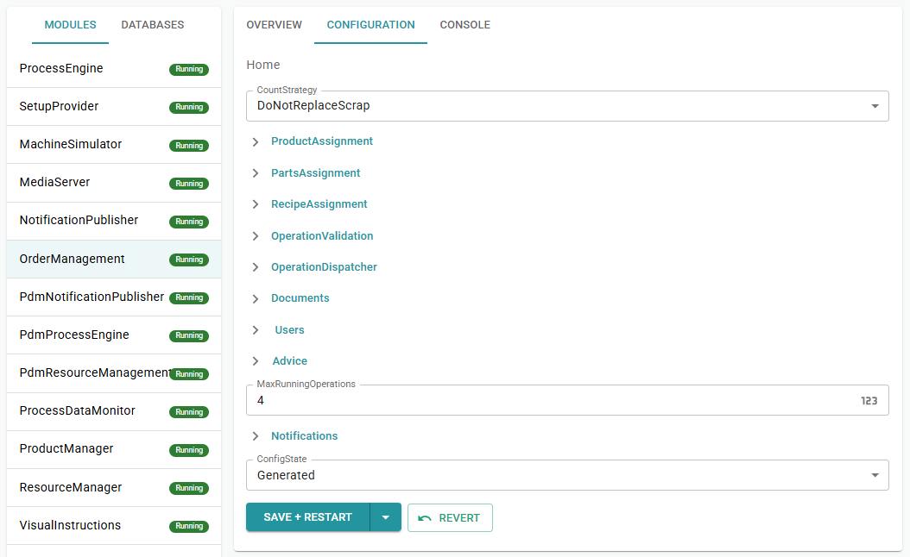
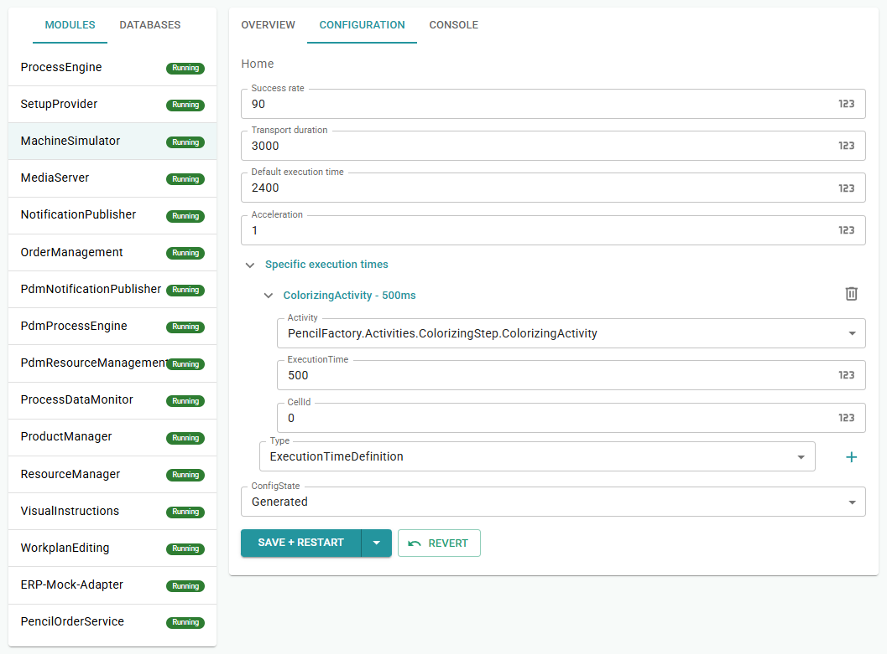

# Chapter 11 - CellSelectors

One testing station cannot keep up when several orders run in parallel. *Pencilla Inc.* adds a second automatic tester and a slower manual backup for Brown Premium. You distribute work with Capabilities, Constraints, and CellSelectors.

> [Table of contents](README.md) | [Previous](chapter-10-module-adapter.md) | [Next](chapter-12-advanced-topics.md)

Until now you had one testing station (T-1): `TestingCell` with `SimulatedTestingDriver`, fully automatic.

Extend it like this:

* Two automatic testing machines (T-1, T-2): distribute load fairly
* One manual backup station (T-3): slower, but helps under high load. It is only for Brown Premium (`100002`). Other colors are rejected via a constraint.

The Process Engine picks a testing cell in three steps:



More on [Cell Selectors](https://github.com/PHOENIXCONTACT/MORYX-Framework/blob/dev/docs/articles/abstractions/control-system/cell-selector.md) and [Constraints](https://github.com/PHOENIXCONTACT/MORYX-Framework/blob/dev/docs/articles/abstractions/processing/constraints.md) in the framework documentation.

## Extend TestingCapabilities

Path: `src/PencilFactory/Capabilities/TestingCapabilities.cs`

So that auto and manual cells are distinguishable, add the flag `ManualTesting`:

```csharp
/// <summary>
/// When required by an activity, only cells that provide manual testing match.
/// </summary>
public bool ManualTesting { get; set; }
```

In `ProvidedBy`, insert before `return true;`:

```csharp
if (ManualTesting && !providedTesting.ManualTesting)
    return false;
```

`TestingActivity` does not require Manual by default. Therefore auto and
manual cells both match the capability check. Differentiation comes only through
Constraints and Selectors.

## Mark TestingCell as automatic

Path: `src/PencilFactory.Resources.Testing/TestingCell.cs`

Action: Change one line in `OnInitializeAsync`; the automatic cell sets `ManualTesting = false`:

```csharp
// Before:
Capabilities = new TestingCapabilities { Value = Value };

// After:
Capabilities = new TestingCapabilities { Value = Value, ManualTesting = false };
```

Rest of the file unchanged.

## Create PencilProductConstraints

Path: `src/PencilFactory/Constraints/PencilProductConstraints.cs`

Action: New file (create folder `Constraints/`). The constraint checks the pencil color on the product of the activity:

```csharp
using Moryx.AbstractionLayer.Activities;
using Moryx.AbstractionLayer.Constraints;
using Moryx.AbstractionLayer.Recipes;
using PencilFactory.Products;

namespace PencilFactory.Constraints;

/// <summary>
/// Process constraints: which graphite pencil color may be dispatched to a cell.
/// </summary>
public static class PencilProductConstraints
{
    public static IConstraint ForPencilColor(PencilColor color) =>
        ExpressionConstraint.Equals<ActivityConstraintContext>(
            c => ((GraphitePencilType)((IProductRecipe)c.Process.Recipe).Product).Color,
            color);
}
```

## Create ManualTestingCell

Path: `src/PencilFactory.Resources.Testing/ManualTestingCell.cs`

Action: New file, modeled after `AssemblingCell` (VisualInstructor, no Driver). The manual cell provides `ManualTesting = true` and attaches the constraint to ReadyToWork:

```csharp
namespace PencilFactory.Resources.Testing;

/// <summary>
/// Manual testing workplace for premium Brown Premium graphite pencils
/// Uses a process constraint so only Brown Premium orders are dispatched here
/// </summary>
[ResourceRegistration]
public class ManualTestingCell : Cell, IAsyncStateContext
{
    private Session _currentSession;
    private long _currentInstruction;

    [ResourceReference(ResourceRelationType.Extension)]
    public IVisualInstructor VisualInstructor { get; set; }

    [DataMember, EntrySerialize]
    [Description("Configured value for the capabilities")]
    public int Value { get; set; }

    [DataMember, EntrySerialize]
    [Description("Pencil color this manual testing station accepts (process constraint)")]
    public PencilColor AcceptedColor { get; set; } = PencilColor.Brown;

    protected override async Task OnInitializeAsync(CancellationToken cancellationToken)
    {
        await base.OnInitializeAsync(cancellationToken);
        Capabilities = new TestingCapabilities { Value = Value, ManualTesting = true };
    }

    protected override IEnumerable<Session> ProcessEngineAttached()
    {
        yield return CreateProductionReadyToWork(ReadyToWorkType.Push);
    }

    protected override IEnumerable<Session> ProcessEngineDetached()
    {
        yield break;
    }

    public override void StartActivity(ActivityStart activityStart)
    {
        _currentSession = activityStart;
        switch (activityStart.Activity)
        {
            case TestingActivity:
                _currentInstruction = VisualInstructor.Execute(Name, activityStart, InstructionCompleted);
                break;
        }
    }

    private void InstructionCompleted(int instructionResult, ActivityStart activity)
    {
        _currentInstruction = 0;
        var result = activity.CreateResult(instructionResult);
        _currentSession = result;
        PublishActivityCompleted(result);
    }

    public override void ProcessAborting(Activity affectedActivity)
    {
        if (_currentSession is ActivityStart activityStart)
        {
            VisualInstructor?.Clear(_currentInstruction);
            _currentInstruction = 0;
            activityStart.CreateResult((int)TestingActivityResults.Failed);
        }
    }

    public override void SequenceCompleted(SequenceCompleted completed)
    {
        _currentSession = completed;

        var rtw = CreateProductionReadyToWork(ReadyToWorkType.Push);
        PublishReadyToWork(rtw);
        _currentSession = rtw;
    }

    private ReadyToWork CreateProductionReadyToWork(ReadyToWorkType type) =>
        Session.StartSession(
            ActivityClassification.Production,
            type,
            PencilProductConstraints.ForPencilColor(AcceptedColor));

    Task IAsyncStateContext.SetStateAsync(StateBase state, CancellationToken cancellationToken)
    {
        throw new System.NotImplementedException();
    }
}

```

## TestingParameters for Manual text

Path: `src/PencilFactory/Activities/TestingStep/TestingParameters.cs`

Action: Replace/extend method `Populate` (rest of the class stays).

If the class was empty so far, only add `Populate` so that T-3 gets a readable instruction text:

```csharp
protected override void Populate(Process process, Parameters instance)
{
    base.Populate(process, instance);

    var parameters = (TestingParameters)instance;

    if (parameters.Instructions is { Length: > 0 })
        return;

    var color = "(unknown)";
    if (process is ProductionProcess production && production.ProductInstance?.Type is GraphitePencilType pencil)
        color = pencil.Color.ToString();

    parameters.Instructions =
    [
        new VisualInstruction
        {
            Type = InstructionContentType.Text,
            Content =
                $"MANUAL TESTING: Test the graphite pencil ({color}). " +
                "Confirm SUCCESS when the pencil has been tested."
        }
    ];
}
```

Auto cells ignore the text (Driver). Without `Populate` you only see empty SUCCESS/Failed buttons at T-3.

## Create CellSelectors

Folder: `src/PencilFactory.ControlSystem/CellSelectors/`

Action: Add 3 new files.

### TestingOptimizerConfig.cs (new)

The config controls from which load manual cells are included:

```csharp
namespace PencilFactory.ControlSystem.CellSelectors;

public class TestingOptimizerConfig : CellSelectorConfig
{
    public override string PluginName
    {
        get => nameof(TestingOptimizer);
        set { }
    }

    [DataMember, DefaultValue(3)]
    [Description("Open testing activities per automatic cell before manual cells are included")]
    public int ActivitiesPerAutoCellThreshold { get; set; } = 3;
}
```

### TestingOptimizer.cs (new)

Below the threshold the optimizer returns only auto cells; from the threshold the full list including Manual:

```csharp

namespace PencilFactory.ControlSystem.CellSelectors;

[ExpectedConfig(typeof(TestingOptimizerConfig))]
[Plugin(LifeCycle.Transient, typeof(ICellSelector), Name = nameof(TestingOptimizer))]
public class TestingOptimizer : CellSelectorBase<TestingOptimizerConfig>
{
    public IActivityPool ActivityPool { get; set; }

    public override Task<IReadOnlyList<ICell>> SelectCellsAsync(
        Activity activity,
        IReadOnlyList<ICell> availableCells,
        CancellationToken cancellationToken)
    {
        if (activity is not TestingActivity || availableCells.Count <= 1)
            return Task.FromResult(availableCells);

        var manualCapability = new TestingCapabilities { ManualTesting = true };
        var automaticCells = availableCells
            .Where(c => !c.Capabilities.Provides(manualCapability))
            .ToList();

        if (automaticCells.Count == 0)
            return Task.FromResult(availableCells);

        var openTestingActivities = ActivityPool.GetByCondition(a => a is TestingActivity).Count;
        var threshold = Config.ActivitiesPerAutoCellThreshold * automaticCells.Count;

        return openTestingActivities >= threshold
            ? Task.FromResult(availableCells)
            : Task.FromResult((IReadOnlyList<ICell>)automaticCells);
    }
}
```

Example: With 2 auto cells and threshold 3, the manual cell (T-3) only comes in from
6 open Testing activities.

### LoadBalancer.cs (new)

The LoadBalancer does not change the set of candidates, only the order - least loaded cell first:

```csharp
namespace PencilFactory.ControlSystem.CellSelectors;

/// <summary>
/// Reorders candidate cells by load (least busy first). Same cells as input, different order.
/// </summary>
[Plugin(LifeCycle.Transient, typeof(ICellSelector), Name = nameof(LoadBalancer))]
public class LoadBalancer : CellSelectorBase
{
    // Persists across calls: open activity maps to the cell we ranked first for it
    private readonly Dictionary<IActivity, ICell> _primaryTarget = [];

    public override Task<IReadOnlyList<ICell>> SelectCellsAsync(
        Activity activity,
        IReadOnlyList<ICell> availableCells,
        CancellationToken cancellationToken)
    {
        if (availableCells.Count <= 1)
        {
            return Task.FromResult(availableCells);
        }

        // Rebuilt every call, the load is derived from _primaryTarget below
        var cellLoad = availableCells.ToDictionary(c => c, _ => 0);

        lock (_primaryTarget)
        {
            // Drop finished activities
            foreach (var key in _primaryTarget.Keys.ToList())
            {
                if (key.Result != null)
                {
                    _primaryTarget.Remove(key);
                }
            }

            // Bump load for cells still booked by running activities
            foreach (var cell in _primaryTarget.Values.Where(cellLoad.ContainsKey))
            {
                cellLoad[cell]++;
            }
        }

        var loadBalanced = cellLoad.OrderBy(pair => pair.Value).Select(pair => pair.Key).ToList();

        lock (_primaryTarget)
        {
            // Remember for the next call so parallel orders see this cell as busy
            _primaryTarget[activity] = loadBalanced[0];
        }

        return Task.FromResult((IReadOnlyList<ICell>)loadBalanced);
    }
}

```

## Extend the initializer

Path: `src/PencilFactory.App/PencilFactoryInitializer.cs`

### Adjust Display Description (optional)

```csharp
[Display(..., Description = "Creates cells (two automatic and one manual testing station), visual instructor and factory layout.")]
```

### Insert block after T-1 (second auto cell)

Replace the previous single Testing block (one driver, one cell, location `"T-1"`) with two automatic stations:

```csharp
// Automated testing cells (LoadBalancer distributes between T-1 and T-2)
var testingDriver1 = graph.Instantiate<SimulatedTestingDriver>();
testingDriver1.Name = "Testing Simulated Driver 1";

var testingCell1 = graph.Instantiate<TestingCell>();
testingCell1.Name = "Testing Cell 1";
testingCell1.Driver = testingDriver1;
testingCell1.Value = 0;
lineGroup.Children.Add(Place(graph, "T-1", "Automatic testing 1", "precision_manufacturing", 0.58, 0.32, testingCell1));

var testingDriver2 = graph.Instantiate<SimulatedTestingDriver>();
testingDriver2.Name = "Testing Simulated Driver 2";

var testingCell2 = graph.Instantiate<TestingCell>();
testingCell2.Name = "Testing Cell 2";
testingCell2.Driver = testingDriver2;
testingCell2.Value = 0;
lineGroup.Children.Add(Place(graph, "T-2", "Automatic testing 2", "precision_manufacturing", 0.74, 0.32, testingCell2));
```

### Insert Manual cell before Packing

```csharp
var manualTestingCell = graph.Instantiate<ManualTestingCell>();
manualTestingCell.Name = "Manual Testing Cell";
manualTestingCell.VisualInstructor = instructor;
manualTestingCell.Value = 0;
manualTestingCell.AcceptedColor = PencilColor.Brown;
lineGroup.Children.Add(Place(graph, "T-3", "Manual testing (Brown Premium)", "handyman", 0.66, 0.52, manualTestingCell));
```

### Factory children: add second driver

```csharp
factory.Children.Add(testingDriver1);
factory.Children.Add(testingDriver2);
```

### Afterwards

1. Clear Resources DB
2. Command Center, ResourceManager, Console: Initialize Resource
3. Check: A-1, C-1, T-1, T-2, T-3, P-1 + both drivers under Pencil Manufactory

## ProcessEngine + Orders Management (Command Center)

### ProcessEngine

1. CONFIGURATION, ResourceSelectors: TestingOptimizer (Threshold 1, SortOrder 0)
2. ResourceSelectors: LoadBalancer (SortOrder 1)
3. JobSchedulerConfig, MaxActiveJobs: 4
4. SAVE + RESTART



### Orders Management

1. CONFIGURATION, MaxRunningOperations: 4
2. SAVE + RESTART



Selector chain:

| SortOrder | Plugin | Task |
| --- | --- | --- |
| 0 | TestingOptimizer | Manual only under load |
| 1 | LoadBalancer | Fair distribution T-1 / T-2 |

Order matters: LoadBalancer after Optimizer.

## Testing

Note: Under the "Processes" view you can track which cell the ProcessEngine chooses for a TestingActivity.

### Why Manual is hard to hit in this line

Each pencil runs the workplan **in sequence**: Assembling -> Colorizing -> Testing.
With **one** Assembling cell and **one** Colorizing cell, pieces rarely pile up at
Testing at the same time. Auto cells T-1/T-2 usually finish before a third Testing
activity is waiting  -  so the Optimizer threshold is almost never reached and T-3
stays unused. That is expected with this layout, not a broken Manual cell.

### Practical trick: shorten Colorizing in MachineSimulator

The bottleneck before Testing is often Colorizing (default ~2400 ms). If Colorizing
is much faster, more pencils reach Testing while T-1/T-2 are still busy  -  then the
Optimizer can include Manual.

In **Command Center** -> **MachineSimulator** -> **CONFIGURATION**:

1. **Specific execution times** -> add / set:
   - **Activity:** `PencilFactory.Activities.ColorizingStep.ColorizingActivity`
   - **ExecutionTime:** `500 ms)
   - **CellId:** `0` (all cells)
2. **SAVE + RESTART**
3. Start several **Brown** orders (`100002`) in parallel and work Assembling promptly



In practice this alone is often enough to see T-3 (Manual) a few times. You do **not**
need to change Testing execution time or Success rate for that.

### A) Green (100001): Constraints

One order is enough.

- Testing only T-1 / T-2 (automatic)
- T-3 gets nothing. Constraint: only Brown Premium.

### B) Brown (100002): Optimizer + Constraints

Start several Brown orders in parallel (ideally with Colorizing at 500 ms as in B0).

- Normal / low load: like Green, only T-1 and T-2
- Under load (Threshold 1, enough **parallel** processes already at Testing): additionally Instruction at T-3 (Manual)
- Raise threshold to 3: T-3 less often

Here T-1, T-2, and T-3 can all be in play at once - that is the Optimizer, not a pure LoadBalancer test.

### C) LoadBalancer: T-1 / T-2

Several parallel orders with Green (`100001`) in parallel, not Brown Premium.

- Only auto cells (T-3 excluded via constraint)
- Observe: jobs alternate between T-1 and T-2

Note: VisualInstructor under parallel operation. One shared `VisualInstructor` for
all manual stations is enough for sequential tests. If you start several operations
in parallel (`MaxRunningOperations` / `MaxActiveJobs` greater than 1), you should assign
a separate instructor per cell in the initializer. Otherwise A-1, C-1, T-3, and
P-1 share the same instruction list. That can lead to race conditions and errors like
`An item with the same key has already been added.`

## Checklist

* [ ] `TestingCapabilities.ManualTesting` and `TestingCell` adjusted
* [ ] `PencilProductConstraints` and `ManualTestingCell` created
* [ ] `TestingParameters.Populate` added for Manual text
* [ ] `TestingOptimizer` and `LoadBalancer` created and configured in ProcessEngine
* [ ] Initializer extended with T-2 and T-3, resources re-initialized
* [ ] MaxActiveJobs / MaxRunningOperations set
* [ ] Tests A-C (Green, Brown Premium, LoadBalancer) completed
* [ ] Colorizing `ExecutionTime` 500 ms in MachineSimulator -  sees Manual under load

> [Table of contents](README.md) | [Previous](chapter-10-module-adapter.md) | [Next](chapter-12-advanced-topics.md)
