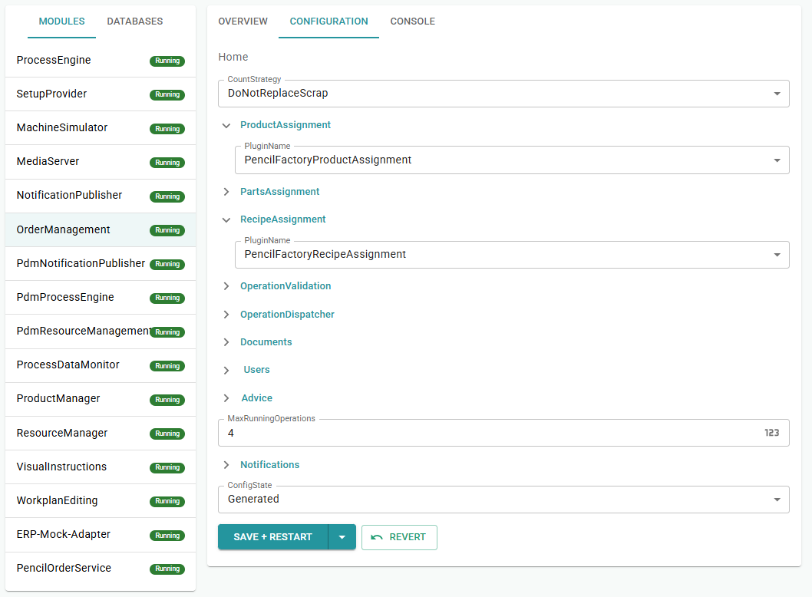
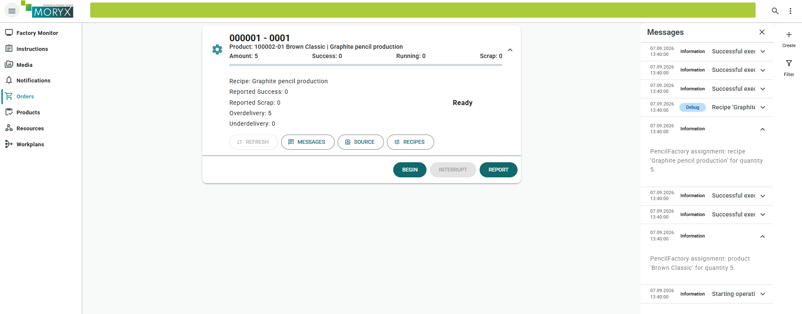
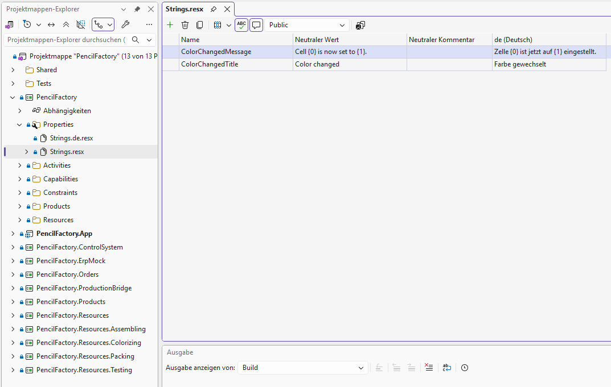
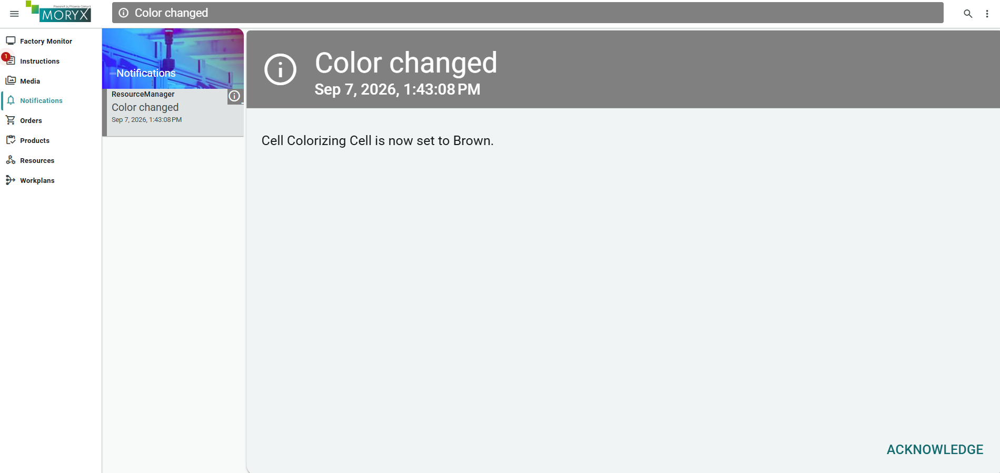
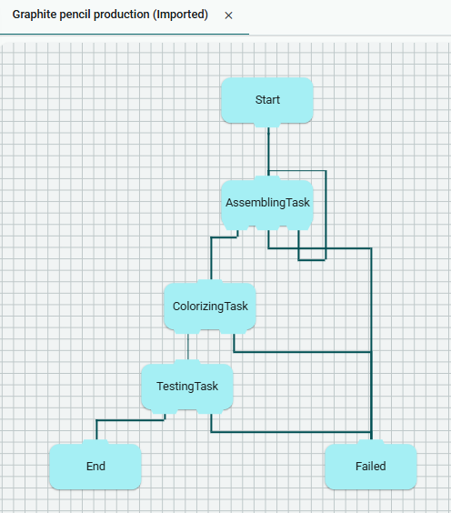
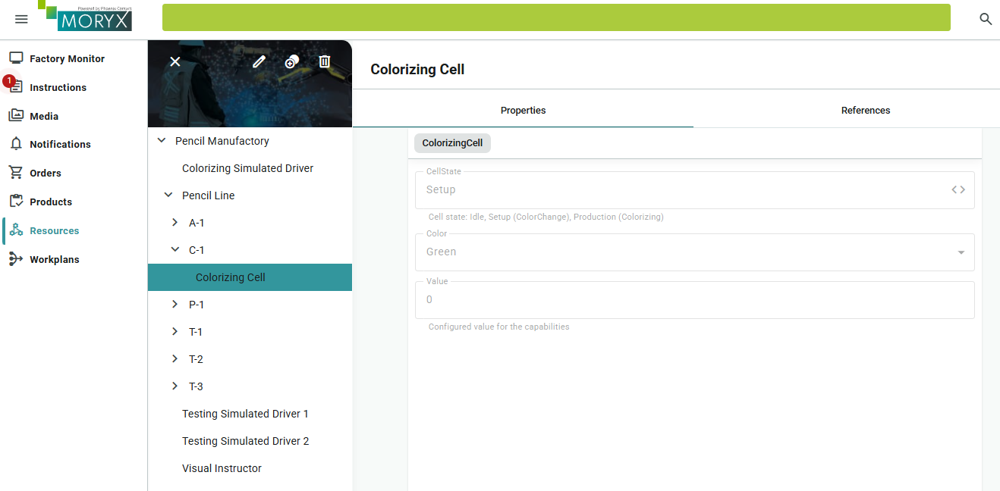
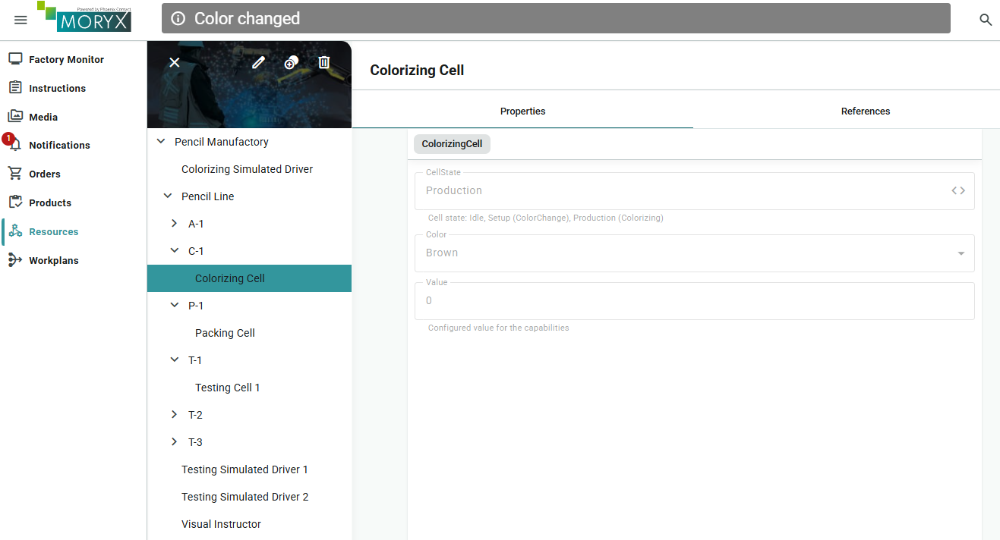
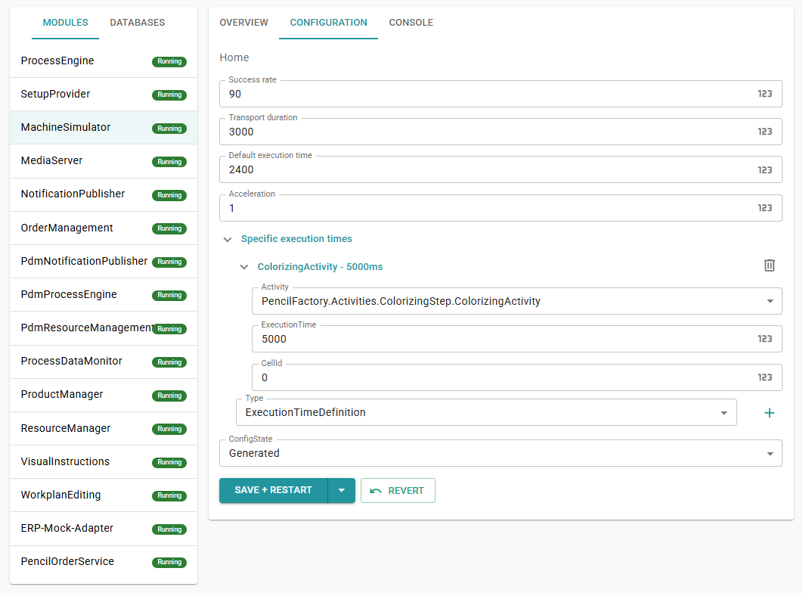

# Chapter 12 - Advanced Topics

The line is productive. *Pencilla Inc.* now asks for the extras that show up in almost every real project: clearer order assignment, texts in more than one language, notifications for operators, richer activity results, and a visible cell state on Colorizing.

> [Table of contents](README.md) | [Previous](chapter-11-cell-selectors.md)

Each section is short, then applied to PencilFactory:

* **Assignments:** Which product and recipe belong to an operation
* **Localization:** Texts in multiple languages (`.resx`)
* **Notifications:** Inform operators after events
* **ActivityResults:** More than Success and Failed, for example Retry
* **States:** Cell operating state (Idle, Setup, Production) for the UI

## Assignments

When creating an operation, OrderManagement must resolve two things: which
**product** and which **recipe**. That is what assignment plugins are for. The CLI template
already creates files, but they only run when you enter them as
PluginName in the Command Center. As long as the default assignment is active, you will not see your logs.

In our example the plugins stay thin functionally: They load type or Default recipe
as before and additionally write to the operations logger. That way you see that *your*
code is active.

The CLI already created the following files:

- `src/PencilFactory.Orders/PencilFactoryProductAssignment.cs`
- `src/PencilFactory.Orders/PencilFactoryRecipeAssignment.cs`

### PencilFactoryProductAssignment.cs

Replace method `SelectProductAsync` with this, so you see in the log which product was assigned:

```csharp
public override async Task<ProductType> SelectProductAsync(Operation operation, IOperationLogger operationLogger, CancellationToken cancellationToken)
{
    var identity = (ProductIdentity)operation.Product.Identity;
    var product = await ProductManagement.LoadTypeAsync(identity, cancellationToken);
    if (product == null)
    {
        operationLogger.Log(LogLevel.Error, "Product '{0}' not found.", identity.Identifier);
        return null;
    }

    operationLogger.Log(
        LogLevel.Information,
        "PencilFactory assignment: product '{0}' for quantity {1}.",
        product.Name,
        operation.TotalAmount);

    return product;
}
```

### PencilFactoryRecipeAssignment.cs

Replace both methods, load Default recipe, link order/operation number, and log:

```csharp
public override async Task<IReadOnlyList<IProductRecipe>> SelectRecipesAsync(Operation operation, IOperationLogger operationLogger, CancellationToken cancellationToken)
{
    var recipe = await LoadDefaultRecipeAsync(operation.Product, cancellationToken);
    if (recipe == null)
    {
        operationLogger.Log(LogLevel.Error, "No default recipe found for product '{0}'.", operation.Product.Name);
        return [];
    }

    operationLogger.Log(
        LogLevel.Information,
        "PencilFactory assignment: recipe '{0}' for quantity {1}.",
        recipe.Name,
        operation.TotalAmount);

    return [recipe];
}

public override Task<bool> ProcessRecipeAsync(IProductRecipe clone, Operation operation, IOperationLogger operationLogger, CancellationToken cancellationToken)
{
    if (clone is IOrderBasedRecipe orderBasedRecipe)
    {
        orderBasedRecipe.OrderNumber = operation.Order.Number;
        orderBasedRecipe.OperationNumber = operation.Number;
    }

    operationLogger.Log(LogLevel.Debug, "Recipe '{0}' linked to operation.", clone.Name);
    return Task.FromResult(true);
}
```

Placeholders `{0}` and `{1}`: This is C# syntax for `string.Format`. `{0}` = first argument after (`recipe.Name`), `{1}` = second (`operation.TotalAmount`). `IOperationLogger` requires these numbers; `{Name}` would crash.

### Command Center

1. Module OrderManagement, Register CONFIGURATION
2. ProductAssignment, PluginName: `PencilFactoryProductAssignment`
3. RecipeAssignment, PluginName: `PencilFactoryRecipeAssignment`
4. SAVE and RESTART, then reincarnate the module



### Test

Create an order. Under messages you should now see our own logs.



## Localization

Maintain texts in multiple languages.

### Steps to reproduce

In Visual Studio:

- In the PencilFactory project create a new folder named Properties (convention)
- Folder Properties: two new items, Resource file, `Strings.resx` and `Strings.de.resx`
- Open `Strings.resx`, set visibility from "internal" to "public", add keys
- Build the PencilFactory project so that the `Strings.Designer` file is created automatically



Keys (example):

| Key | EN | DE |
| --- | --- | --- |
| `ColorChangedTitle` | `Color changed` | `Farbe gewechselt` |
| `ColorChangedMessage` | `Cell {0} is now set to {1}.` | `Zelle {0} ist jetzt auf {1} eingestellt.` |

### What do {0} and {1} mean in the .resx?

Placeholders for variable parts in the text. When displaying, `string.Format` replaces them with values from code:

```csharp
string.Format(Strings.ColorChangedMessage, Name, Color.ToString())
```

Example:

- DE: `Zelle ColorizingCell1 ist jetzt auf Brown eingestellt.`
- EN: `Cell ColorizingCell1 is now set to Brown.`

The placeholders `{0}`/`{1}` stay in the same place in all languages; only the surrounding text is translated.

## Notifications (code in ColorizingCell)

### Purpose

After a successful ColorChange, a notification should appear in the [Notification](https://github.com/PHOENIXCONTACT/MORYX-Framework/blob/dev/docs/articles/module-notifications/index.md) module and in the notification bar. As a small example we use the localization strings to demonstrate different languages.

### Package reference

`PencilFactory.Resources.Colorizing.csproj`, add Moryx.Notifications as a package reference:

```csharp
<PackageReference Include="Moryx.Notifications" />
```

### ColorizingCell.cs

1. Add usings:

```csharp
using System.Globalization;
using PencilFactory.Properties;
using Moryx.Notifications;
```

2. Class: implement `INotificationSender`
3. Add properties:
   1. `public INotificationAdapter NotificationAdapter { get; set; }`
   2. `string INotificationSender.Identifier => Name;`
4. In `ColorChangeCompleted` on Success:

```
NotificationAdapter?.Publish(this, new Notification
{
    Title = Strings.ColorChangedTitle,
    Message = string.Format(CultureInfo.CurrentUICulture,
    Strings.ColorChangedMessage, Name, Color.ToString()),
    Severity = Severity.Info,
    IsAcknowledgable = true
});
```

`CultureInfo.CurrentUICulture` ensures that `{0}`/`{1}` are replaced in the correct format.

5. Add `Acknowledge` method:

```csharp
public void Acknowledge(Notification notification, object tag) => NotificationAdapter?.Acknowledge(this, notification);
```

### Test

1. App language German, new order with ColorChange setup. Notification: "Farbe gewechselt"
2. Language English, new setup. Notification: "Color changed"



## ActivityResults (more than Success / Failed)

By default the CLI creates only two outputs for an activity (Success and Failed).

You do not have to stay with Success/Failed. For example, on the Assembling activity you can add a third output (Out of tolerance) and wire that output back to Assembling.

### 1. Extend the enum (AssemblingActivityResults.cs)

```csharp
/// <summary>Out of tolerance, wire this output back to Assembling in the workplan (retry).</summary>
    [Display(Name = "Out of tolerance")]
    OutOfTolerance = 2
```

### 2. Adjust workplan (PencilFactoryProductImporter.cs)

The fourth connector parameter connects output 2 back to Start (= Retry):

```csharp
// Output 0 = Success = assembled
// Output 1 = Failed  = failed
// Output 2 = OutOfTolerance = start (back to Assembling = Retry)
workplan.AddStep(new AssemblingTask(), new AssemblingParameters
{
    Instructions =
    [
        new VisualInstruction
        {
            Type = InstructionContentType.Text,
            Content = "Assemble the graphite pencil. SUCCESS = ok, FAILED = abort, OUT OF TOLERANCE = retry assembling."
        }
    ]
}, start, assembled, failed, start);
```

### 3. Cell

The cell returns result `2` when worker assistance reports result `2` (`AssemblingCell` calls `CreateResult(instructionResult)`).

Purpose: A functional intermediate case (dimension slightly off), so assemble again without aborting the whole order.

UI test: Start order, Assembling, in worker assistance result 2 (Out of tolerance). The workplan jumps back to Assembling instead of Failed.



## States: Cell State Machine

A [State Machine](https://github.com/PHOENIXCONTACT/MORYX-Framework/blob/dev/docs/articles/framework/state-machine.md)
on the cell is application logic, not the workplan and not the driver.

You model operating states (Idle, Setup, Production). The CLI generates state classes
and `IAsyncStateContext`. The framework changes states when you call `NextStateAsync`
or start the machine with `WithAsync`. In `OnEnterAsync` you typically only set
the visible property `CellState`. You do not call `OnEnterAsync` yourself from the cell.

The cell only fires events (`OnSetupStartedAsync`, `OnActivityCompletedAsync`, ...).
The state classes decide which follow-up state applies. That keeps the cell readable,
and in the Resources UI you see the state independently of the current workplan step.


### Purpose

`CellState` in Resources UI: Idle / Setup / Production, independent of workplan & driver.

### CLI

```bash
moryx add states ColorizingCell --states "Idle, Setup, Production"
```

Creates `src/PencilFactory.Resources.Colorizing/States/*` + `IAsyncStateContext`.

### ColorizingCell.cs

#### Step 1 - CLI

In the project folder:

```powershell
dotnet moryx add states ColorizingCell --states Idle,Setup,Production
```

Creates among others `States/ColorizingCellStateBase.cs`, `IdleState.cs`, ... and adds `IAsyncStateContext` to `ColorizingCell`.

Reference in the repo: `PencilFactory.Resources.Colorizing/States/`

#### Step 2 - Property in ColorizingCell.cs

So that the state is visible in the Resources UI:

```csharp
[DataMember, EntrySerialize]
[Description("Cell state: Idle, Setup (ColorChange), Production (Colorizing)")]
public string CellState { get; internal set; } = "Idle";
```

#### Step 3 - Start the state machine

At the end of `OnInitializeAsync`, starts the machine in the initial state and calls its `OnEnterAsync`.
Use the **state base that contains the `[StateDefinition]` attributes**
(`ColorizingCellStateBase` in `States/`), not an empty stub base class:

```csharp
using PencilFactory.Resources.Colorizing.States;

await StateMachine.ForAsyncContext(this).WithAsync<ColorizingCellStateBase>(cancellationToken);
```

If `WithAsync` points at a base type **without** `StateDefinition`s, the machine never
enters Idle/Setup/Production and `CellState` stays stuck / empty in the UI.

#### Step 4 - Field and SetStateAsync

The framework sets the current state via `SetStateAsync`:

```csharp
private ColorizingCellStateBase _state;

Task IAsyncStateContext.SetStateAsync(StateBase state, CancellationToken cancellationToken)
{
    _state = (ColorizingCellStateBase)state;
    return Task.CompletedTask;
}
```

#### Step 5 - Transitions in ColorizingCell.cs

`StartActivity`, depending on activity:

```csharp
case ColorChangeActivity:
    _ = _state?.OnSetupStartedAsync();
    _currentInstruction = VisualInstructor.Execute(Name, activityStart, ColorChangeCompleted);
    break;
case ColorizingActivity:
    _ = _state?.OnProductionStartedAsync();
    Driver.Output[ProcessStart] = true; // simulated production, not VisualInstructor
    break;
```

Call `_ = _state?.OnActivityCompletedAsync();` wherever an **activity actually finishes**
(before `PublishActivityCompleted`):

| Place | Call `OnActivityCompletedAsync`? |
|-------|----------------------------------|
| `ColorChangeCompleted` (setup via Instructor) | **yes** |
| `OnInputChanged` when `ProcessResult` completes Colorizing | **yes** |
| `SequenceCompleted` | **no**, activity is already done; here you only open a new ReadyToWork |
| `OnInputChanged` for `Ready` (Pull RTW) | **no**, no activity finished |

`ProcessAborting`, when aborting an active activity:

```csharp
_ = _state?.OnAbortAsync();
```

#### Step 6: Logic in the state classes

Folder: `src/PencilFactory.Resources.Colorizing/States/`

Each state sets `CellState` on enter and defines which transitions are allowed.
Default handlers in the base class call `InvalidStateAsync` (not allowed in that state).

**File:** `States/ColorizingCellStateBase.cs`

Shared events and state IDs. Defaults call `InvalidStateAsync`: that transition is not allowed in this state. Each concrete state overrides only what it allows (classic state pattern: base = reject, state = allow).

```csharp
internal abstract class ColorizingCellStateBase(ColorizingCell context, StateBase.StateMap stateMap) : AsyncStateBase<ColorizingCell>(context, stateMap)
{
    public virtual Task OnSetupStartedAsync() => InvalidStateAsync();

    public virtual Task OnProductionStartedAsync() => InvalidStateAsync();

    public virtual Task OnActivityCompletedAsync() => InvalidStateAsync();

    public virtual Task OnAbortAsync() => InvalidStateAsync();

    [StateDefinition(typeof(IdleState), IsInitial = true)]
    public const int Idle = 10;

    [StateDefinition(typeof(SetupState))]
    public const int Setup = 20;

    [StateDefinition(typeof(ProductionState))]
    public const int Production = 30;
}
```

**File:** `States/IdleState.cs`

From Idle you may start Setup (ColorChange) or Production (Colorizing):

```csharp
internal class IdleState(ColorizingCell context, StateBase.StateMap stateMap) : ColorizingCellStateBase(context, stateMap)
{
    public override Task OnEnterAsync(CancellationToken cancellationToken)
    {
        Context.CellState = "Idle";
        return Task.CompletedTask;
    }

    public override Task OnSetupStartedAsync() => NextStateAsync(Setup);

    public override Task OnProductionStartedAsync() => NextStateAsync(Production);
}
```

**File:** `States/SetupState.cs`

After ColorChange finishes or aborts, go back to Idle:

```csharp
internal class SetupState(ColorizingCell context, StateBase.StateMap stateMap) : ColorizingCellStateBase(context, stateMap)
{
    public override Task OnEnterAsync(CancellationToken cancellationToken)
    {
        Context.CellState = "Setup";
        return Task.CompletedTask;
    }

    public override Task OnActivityCompletedAsync() => NextStateAsync(Idle);

    public override Task OnAbortAsync() => NextStateAsync(Idle);
}
```

**File:** `States/ProductionState.cs`

After Colorizing finishes or aborts, go back to Idle:

```csharp
internal class ProductionState(ColorizingCell context, StateBase.StateMap stateMap) : ColorizingCellStateBase(context, stateMap)
{
    public override Task OnEnterAsync(CancellationToken cancellationToken)
    {
        Context.CellState = "Production";
        return Task.CompletedTask;
    }

    public override Task OnActivityCompletedAsync() => NextStateAsync(Idle);

    public override Task OnAbortAsync() => NextStateAsync(Idle);
}
```

### Test

1. Resources UI, ColorizingCell: `CellState` is `Idle`
2. Start ColorChange setup: `Setup` (stays until you confirm, easy to see)



3. Setup finished: `Idle`
4. Production Colorizing: `Production`, then back to `Idle`



**Seeing `Production`:** Colorizing is driven by the simulator and can finish in
well under a second (especially if Colorizing `ExecutionTime` is `500 ms`. Keep the Resources view open on the ColorizingCell **during** Colorizing,
or temporarily raise Colorizing execution time (e.g. `5000`) in MachineSimulator so
`Production` stays visible longer. Setup stays visible longer because it waits for
the worker.




Start an order that requires a ColorChange setup and watch `CellState`: Idle, then Setup (ColorChange), then Idle, then Production (Colorizing), then Idle.

## Checklist

* [ ] Product and Recipe assignment with logs implemented and activated in OrderManagement
* [ ] `Strings.resx` / `Strings.de.resx` created and keys filled
* [ ] Notifications in ColorizingCell wired with localization and tested
* [ ] Optional: `OutOfTolerance` as third ActivityResult and workplan retry
* [ ] States created via CLI, `CellState` and transitions wired in ColorizingCell
* [ ] CellState changes checked in the UI (Idle, Setup, Idle, Production, Idle)

> [Table of contents](README.md) | [Previous](chapter-11-cell-selectors.md)
