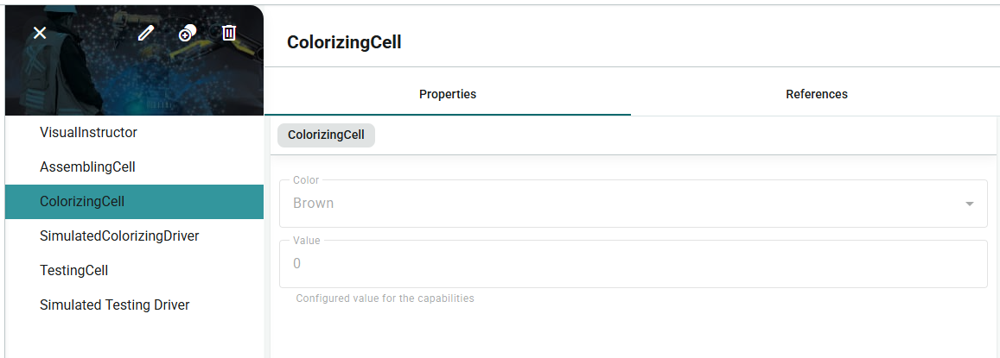
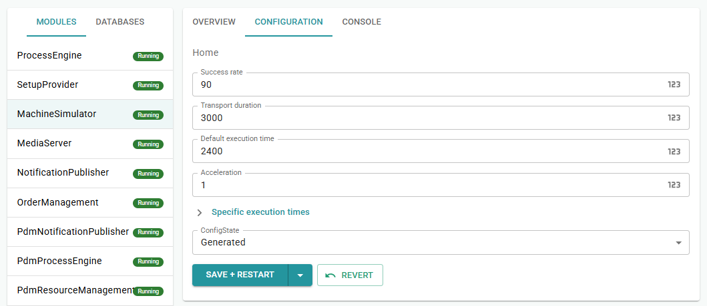

# Chapter 5 - Setup

Keeping a ColorizingCell for every color turned out to be costly. *Pencilla Inc.* goes back to a single cell and expects MORYX to prepare it first whenever the paint does not match the order. You implement that as a ColorChange setup before Assembling, Colorizing, and Testing.

> [Table of contents](README.md) | [Previous](chapter-4-testing.md) | [Next](chapter-6-cleanup.md)

## Why setup?

Chapter 3 used a ColorizingCell per color. Now the other extreme: **one**
ColorizingCell, Color = Green. A Brown order then finds no matching cell.
The production activity requires Colorizing with Brown; the cell only offers Green.
Without setup, the order stalls.

**Setup** is a separate job **before** production. It changes the plant state
(here: Color of the ColorizingCell) until capabilities match again.

Flow:

1. Setup job: ColorChange to Brown
2. Production job: Assembling, Colorizing, Testing (as often as the target quantity)

More on [Activities](https://github.com/PHOENIXCONTACT/MORYX-Framework/blob/dev/docs/articles/abstractions/processing/activities.md)
and [Cells](https://github.com/PHOENIXCONTACT/MORYX-Framework/blob/dev/docs/articles/abstractions/control-system/cell-resource.md)
in the framework. Setup jobs are created by the **SetupProvider** from triggers, not
by hand in the workplan.

## Create the ColorChange step

In the project directory run:

```bash
moryx add step ColorChange
```

The CLI creates more than you need. Delete the following:

- `src/PencilFactory.Resources.ColorChange/` (entire folder)
- `src/Tests/PencilFactory.Tests/ColorChangeCellTest.cs`
- `src/PencilFactory/Capabilities/ColorChangeCapabilities.cs`
- `src/PencilFactory/Resources/IColorChangeResource.cs`

Keep:

- `src/PencilFactory/Activities/ColorChangeStep/*`

### Remove references

From these files, remove references to the deleted resource project:

- `PencilFactory.sln`
- `src/PencilFactory.App/PencilFactory.App.csproj`
- `src/Tests/PencilFactory.Tests/PencilFactory.Tests.csproj`

## Update ColorizingCapabilities for setup

Chapter 3 matched a concrete color only. Setup needs **any** ColorizingCell:
`ColorChangeActivity` uses `new ColorizingCapabilities()` without a color.
Make `Color` nullable and treat `null` as "any cell" (same idea as Tea `Blend == null`):

File: `src/PencilFactory/Capabilities/ColorizingCapabilities.cs`

```cs
public class ColorizingCapabilities : CapabilitiesBase
{
    /// <summary>
    /// Required color for production matching.
    /// Null means "any colorizing cell" (used by setup / color change).
    /// </summary>
    public PencilColor? Color { get; set; }

    protected override bool ProvidedBy(ICapabilities provided)
    {
        if (provided is not ColorizingCapabilities providedColorizing)
        {
            return false;
        }

        // Setup: no specific color required -> any colorizing cell matches
        if (Color == null)
        {
            return true;
        }

        return providedColorizing.Color == Color;
    }
}
```

Without this, Brown orders fail with: `No resource has required capabilities for 'ColorChangeActivity'`.

## ColorChangeActivity

Adjust the file: `src/PencilFactory/Activities/ColorChangeStep/ColorChangeActivity.cs`

Why these changes? Setup is not production: the activity needs `ActivityClassification.Setup`,
no process object, and any ColorizingCell (`Color == null` means "any").

- Usings: `Moryx.ControlSystem.Activities`, `PencilFactory.Capabilities`
- Implement `IControlSystemActivity`
- `Classification => ActivityClassification.Setup`
- `RequiredCapabilities => new ColorizingCapabilities()` without Color

```cs
/// <summary>
/// Setup activity: change the paint color on a colorizing cell before production.
/// </summary>
[ActivityResults(typeof(ColorChangeActivityResults))]
public class ColorChangeActivity : Activity<ColorChangeParameters>, IControlSystemActivity
{
    public ActivityClassification Classification => ActivityClassification.Setup;

    public override ProcessRequirement ProcessRequirement => ProcessRequirement.NotRequired;

    /// <summary>
    /// Any colorizing cell can perform a color change (Color == null means "any").
    /// </summary>
    public override ICapabilities RequiredCapabilities => new ColorizingCapabilities();

    protected override ActivityResult CreateResult(long resultNumber)
    {
        return ActivityResult.Create((ColorChangeActivityResults)resultNumber);
    }

    protected override ActivityResult CreateFailureResult()
    {
        return ActivityResult.Create(ColorChangeActivityResults.Failed);
    }
}

```

## ColorChangeActivityResults

File: `src/PencilFactory/Activities/ColorChangeStep/ColorChangeActivityResults.cs`

> **Note:** Setup steps need exactly 3 outputs so the SetupProvider can wire the
> workplan correctly: Success, TechnicalError, Failed.

```cs
public enum ColorChangeActivityResults
{
    [Display(Name = "Success")]
    Success = 0,

	[Display(Name = "Technical Error")]
    TechnicalError = 1,

    [Display(Name = "Failed")]
    Failed = 2
}
```

## ColorChangeParameters

In `ColorChangeParameters.cs` add the property `PencilColor Color` and revise the
`Populate` method so the setup step knows the target color and can pass it to the cell.

```cs
public class ColorChangeParameters : VisualInstructionParameters
{
    public PencilColor Color { get; set; }

    protected override void Populate(Process process, Parameters instance)
    {
        base.Populate(process, instance);
        var parameters = (ColorChangeParameters)instance;
        parameters.Color = Color;
    }
}
```

## ColorChangeTask

File: `ColorChangeTask.cs`

Optional: a clear Description on the task makes it easier to read in the workplan editor.

```cs
[Display(Name = "ColorChange", Description = "Change the paint color on a colorizing cell (typically used as setup)")]
public class ColorChangeTask : TaskStep<ColorChangeActivity, ColorChangeParameters>
{
}
```

## Extend ColorizingCell for setup

The ColorizingCell must offer setup sessions and run ColorChange like a manual
instruction, similar to Assembling, but with `ActivityClassification.Setup`.


### Setup and production sessions

```cs
protected override IEnumerable<Session> ProcessEngineAttached()
{
    yield return Session.StartSession(ActivityClassification.Setup, ReadyToWorkType.Push);
    yield return Session.StartSession(ActivityClassification.Production, ReadyToWorkType.Push);
}
```

### ColorChange in StartActivity

```cs
case ColorChangeActivity:
    _currentInstruction = VisualInstructor.Execute(Name, activityStart, ColorChangeCompleted);
    break;
```

**Important: don't let the simulated driver finish ColorChange:**  
The ColorizingCell has a `SimulatedColorizingDriver` for production. The Process Simulator
also schedules a `Result` when *any* activity on that cell becomes `Running`, including
setup. If `OnInputChanged` treats every `ProcessResult` as "activity done", ColorChange
is auto-completed after ~1-3 seconds, production starts, and Assembling appears while the
ColorChange instruction is still open.

Unlike chapter 3's manual-only cells, this cell mixes **Instructor (setup)** and **Driver
(production)**. Guard both places:

```cs
// ColorizingCell.OnInputChanged  -  only production
else if (args.Key == ProcessResult
         && _currentSession is ActivityStart activitySession
         && activitySession.Activity is ColorizingActivity)
{
    // ... complete Colorizing as before ...
}
```

```cs
// SimulatedColorizingDriver.Result
if (result.Activity is not ColorizingActivity)
    return;
```

### Set Color after confirmation

Only on Success is the cell color changed; Failed / TechnicalError keep the old color.

```cs
private void ColorChangeCompleted(int instructionResult, ActivityStart activity)
{
    // Only Success changes the cell color - Failed / TechnicalError keep the old color
    if (instructionResult == (int)ColorChangeActivityResults.Success)
    {
        var colorChange = (ColorChangeActivity)activity.Activity;
        Color = colorChange.Parameters.Color;
    }

    _currentInstruction = 0;
    var result = activity.CreateResult(instructionResult);
    _currentSession = result;
    PublishActivityCompleted(result);
}
```

### SequenceCompleted: Setup vs Production

After setup, offer a setup session again; after production, offer production again,
otherwise the cell hangs.

```cs
public override void SequenceCompleted(SequenceCompleted completed)
{
    _currentSession = completed;

    if (completed.AcceptedClassification == ActivityClassification.Setup)
    {
        var setupRtw = Session.StartSession(ActivityClassification.Setup, ReadyToWorkType.Push);
        PublishReadyToWork(setupRtw);
        _currentSession = setupRtw;
        return;
    }

    var rtw = Session.StartSession(ActivityClassification.Production, ReadyToWorkType.Push);
    PublishReadyToWork(rtw);
    _currentSession = rtw;
}
```

## SetupTrigger

The trigger decides whether setup is needed before production and creates the
ColorChange task. Under the PencilFactory.ControlSystem project, create the folder
SetupTriggers and the following files.

### Config class

File: `src/PencilFactory.ControlSystem/SetupTriggers/ProvideColorConfig.cs`

```cs
using Moryx.ControlSystem.Setups;

namespace PencilFactory.ControlSystem.SetupTriggers;

public class ProvideColorConfig : SetupTriggerConfig
{
    public override string PluginName => nameof(ProvideColorTrigger);
}
```

### Trigger

File: `ProvideColorTrigger.cs`

Remember two methods:

1. `Evaluate`  -  Do we need setup? Which capabilities are missing?
2. `CreateSteps`  -  Which task do we create?

`Execution = BeforeProduction` means this trigger runs before production.
Cleanup with `AfterProduction` follows in the next chapter.

```cs
[ExpectedConfig(typeof(ProvideColorConfig))]
[Plugin(LifeCycle.Transient, typeof(ISetupTrigger), Name = nameof(ProvideColorTrigger))]
public class ProvideColorTrigger : SetupTriggerBase<ProvideColorConfig>
{
    public override SetupExecution Execution => SetupExecution.BeforeProduction;

    public override SetupEvaluation Evaluate(IProductRecipe recipe)
    {
        if (recipe.Product is not GraphitePencilType product)
            return false;

        return SetupEvaluation.Provide(
            new ColorizingCapabilities { Color = product.Color },
            SetupClassification.Manual);
    }

    public override IReadOnlyList<IWorkplanStep> CreateSteps(IProductRecipe recipe)
    {
        var product = (GraphitePencilType)recipe.Product;

        return
        [
            new ColorChangeTask
            {
                Parameters = new ColorChangeParameters
                {
                    Color = product.Color,
                    Instructions =
                    [
                        new VisualInstruction
                        {
                            Type = InstructionContentType.Text,
                            Content = $"Please change the colorizing cell to color '{product.Color}'."
                        }
                    ]
                }
            }
        ];
    }
}
```

### Activate the config (Command Center)

In the Command Center open the **SetupProvider** module, **Configuration** tab,
**SetupTriggers** section. Select type `ProvideColorConfig`, add it with Plus,
then Save and Restart. Don't forget to reincarnate the module.


After you change configs in the Command Center, config files are created under
`src/PencilFactory.App/Config/`.

## Test setup

Chapters 2-3 used **one ColorizingCell per color**, each with a **Driver** only.
For setup you switch to **one** ColorizingCell that can be reconfigured.

1. Delete the extra ColorizingCells (keep one, e.g. `ColorizingCell_Green`).
2. Rename it to `ColorizingCell` if you like; set **Color = Green**.
3. Keep **one** `SimulatedColorizingDriver` linked as **Driver** (remove unused drivers).
4. **New in this chapter:** also link **VisualInstructor** (the same one as Assembling from chapter 1) on this ColorizingCell.

Until chapter 4 the ColorizingCell had **no** VisualInstructor. Setup (ColorChange) is a
**manual** confirmation, so the cell now needs **both** references:

Without the Instructor, a Brown order fails immediately (NullReferenceException) and no
worker instruction appears. Green can still work if the cell color already matches.


That forces a changeover: one cell, default Green, Brown order. Create a Brown order and start production.


In worker assistance the instruction to switch to Brown appears.
After Success, under **Resources** the ColorizingCell **Color** is **Brown**.



Then production runs as before (Assembling, Colorizing, Testing).

### Control test

1. ColorizingCell.Color already set to Brown
2. Start an order for Brown
3. No ColorChange in worker assistance. Production steps start directly.

## Tip: Simulation success rate

When you produce larger orders, the simulated drivers often fail steps on purpose
(scrap). By default the success rate is often around **50%**, so roughly every
second simulated result can be Failed.

For smoother training runs, open the **Simulation** settings and raise the **Success rate** (e.g. from `50` to `90`). To do this, you need to open the configuration tab in the **MachineSimulator** module within the **CommandCenter**. Then most simulated Colorizing/Testing steps succeed. 



## Checklist

* [ ] Ran `moryx add step ColorChange` and deleted unused resource/capabilities files
* [ ] `ColorizingCapabilities`: nullable `Color`, `null` means any cell
* [ ] `ColorChangeActivity` as setup with `ColorizingCapabilities()` without Color
* [ ] Results Success / TechnicalError / Failed; Parameters with `Color`
* [ ] ColorizingCell: **VisualInstructor** and **Driver** both linked in the Resources UI
* [ ] ColorizingCell: setup and production sessions, ColorChange in StartActivity / SequenceCompleted
* [ ] `ProvideColorTrigger` created and activated in SetupProvider
* [ ] With one ColorizingCell (Green) tested a Brown order: setup first, then production
* [ ] (Optional) Simulation success rate increased (e.g. to 90)

> [Table of contents](README.md) | [Previous](chapter-4-testing.md) | [Next](chapter-6-cleanup.md)
