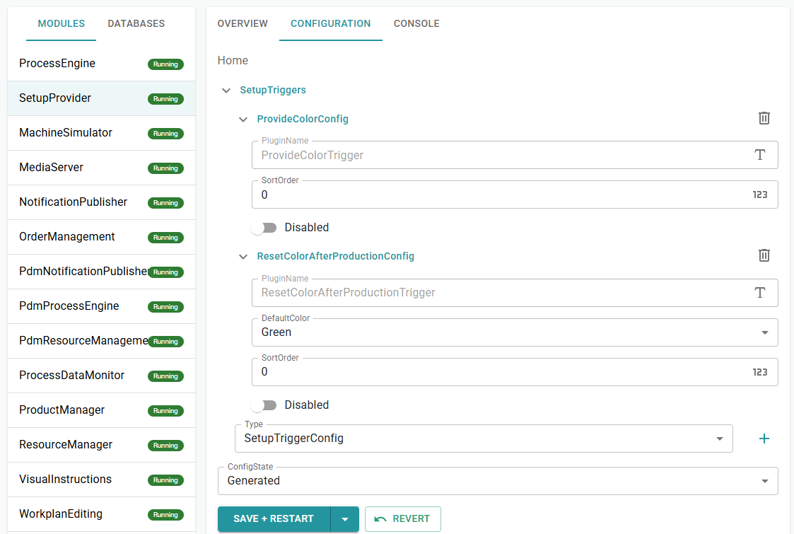
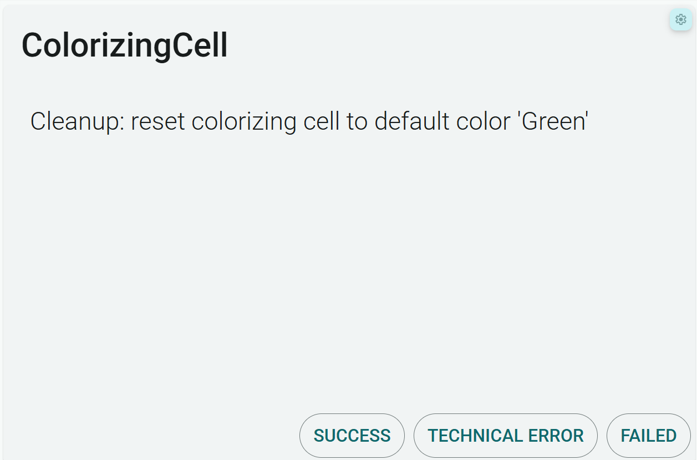

# Chapter 6 - Cleanup

A brown order leaves the ColorizingCell brown. The next green order would then need another setup first, or worse, start from the wrong state. *Pencilla Inc.* wants the cell reset to a default color after the job. You reuse ColorChange with an `AfterProduction` trigger. See also [Process Engine](https://github.com/PHOENIXCONTACT/MORYX-Framework/blob/dev/docs/articles/module-process-engine/index.md).

> [Table of contents](README.md) | [Previous](chapter-5-setup.md) | [Next](chapter-7-partlinks.md)

## Setup vs Cleanup

|  | Setup | Cleanup |
| --- | --- | --- |
| When | Before production | After production |
| Why | Plant does not yet match the order | Return plant to a neutral state |
| Here | Set Color to the product color | Reset Color to default (Green) |

Overall flow with one ColorizingCell:


Cleanup is tied to the production job, not to the individual pencil. With quantity
20, cleanup runs only when all 20 are done, not after the first piece.

The cleanup instruction appears only when the production job is finished.

On the next order (e.g. Brown again after a Green reset), the cell is back on Green.
Setup must change over again. That way you see setup and cleanup alternating.

## Cleanup trigger

Reuse `ColorChangeTask` / `ColorChangeActivity`  -  no new activity type is needed.
Only a second trigger with `AfterProduction`.

Create two new files under `src/PencilFactory.ControlSystem/SetupTriggers/`.

### ResetColorAfterProductionConfig

`ResetColorAfterProductionConfig.cs`

The config holds the default color to reset to after production, typically Green.

```cs
namespace PencilFactory.ControlSystem.SetupTriggers;

/// <summary>
/// Config for <see cref="ResetColorAfterProductionTrigger"/>.
/// </summary>
public class ResetColorAfterProductionConfig : SetupTriggerConfig
{
    public override string PluginName => nameof(ResetColorAfterProductionTrigger);

    /// <summary>
    /// Color the colorizing cell is reset to after production (cleanup).
    /// </summary>
    [DataMember]
    [EntrySerialize]
    public PencilColor DefaultColor { get; set; } = PencilColor.Green;
}

```

### ResetColorAfterProductionTrigger

`ResetColorAfterProductionTrigger.cs`

Important: same two methods as setup, `Evaluate` and `CreateSteps`. Only `Execution` differs.

`Evaluate` checks whether the product differs from the default at all.
`SetupEvaluation.Remove` tells the SetupProvider: remove the production capability and
restore the default state.

```cs
namespace PencilFactory.ControlSystem.SetupTriggers;

/// <summary>
/// After the production job finished: reset the colorizing cell to the default color (cleanup)
/// Runs once per production job (e.g. after all 20 pencils), not after each single piece
/// </summary>
[ExpectedConfig(typeof(ResetColorAfterProductionConfig))]
[Plugin(LifeCycle.Transient, typeof(ISetupTrigger), Name = nameof(ResetColorAfterProductionTrigger))]
public class ResetColorAfterProductionTrigger : SetupTriggerBase<ResetColorAfterProductionConfig>
{
    public override SetupExecution Execution => SetupExecution.AfterProduction;

    public override SetupEvaluation Evaluate(IProductRecipe recipe)
    {
        if (recipe.Product is not GraphitePencilType product)
            return false;

        // Product already uses the default color, nothing to reset
        if (product.Color == Config.DefaultColor)
            return false;

        // Remove the production color, target state is the default color on the cell
        // SetupProvider can skip cleanup if no cell still provides the production color
        return SetupEvaluation.Remove(
            new ColorizingCapabilities { Color = product.Color },
            new ColorizingCapabilities { Color = Config.DefaultColor },
            SetupClassification.Manual);
    }

    public override IReadOnlyList<IWorkplanStep> CreateSteps(IProductRecipe recipe)
    {
        return
        [
            new ColorChangeTask
            {
                Parameters = new ColorChangeParameters
                {
                    Color = Config.DefaultColor,
                    Instructions =
                    [
                        new VisualInstruction
                        {
                            Type = InstructionContentType.Text,
                            Content = $"Cleanup: reset colorizing cell to default color '{Config.DefaultColor}'"
                        }
                    ]
                }
            }
        ];
    }
}
```

## Activate the config

Restart the app after the code change. In Command Center **SetupProvider**, tab
**Configuration**, **SetupTriggers**: add type `ResetColorAfterProductionConfig`,
then Save and Restart.



## Test flow

1. ColorizingCell starts on Green (check Resources UI)
2. Create a Brown order and BEGIN
3. Setup: instruction to Brown, then SUCCESS
4. Run production completely (full quantity)
5. Cleanup: instruction to Green, then SUCCESS



6. ColorizingCell property Color is Green again

### Troubleshooting

- Did the order fully complete? Cleanup starts only after production.
- Was the product Green? Then `Evaluate` returns `false`; cleanup is unnecessary.
- Is the trigger in the config set to `Disabled: true`?
- Did you restart the app after the config change?

## Checklist

* [ ] `ResetColorAfterProductionConfig` and `-Trigger` created under SetupTriggers
* [ ] `Execution = AfterProduction`; same activity as setup
* [ ] Trigger activated in SetupProvider (Save + Restart)
* [ ] Order with a color other than Green: setup, production, cleanup tested
* [ ] ColorizingCell.Color is Green again after cleanup

> [Table of contents](README.md) | [Previous](chapter-5-setup.md) | [Next](chapter-7-partlinks.md)
