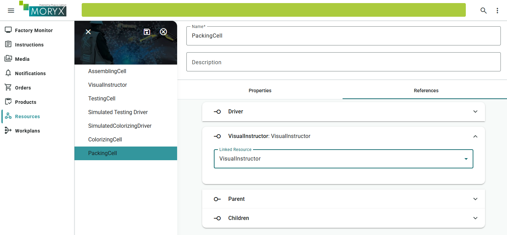
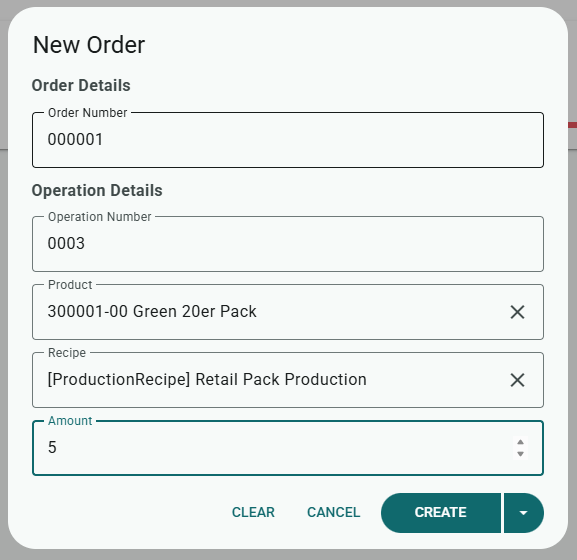
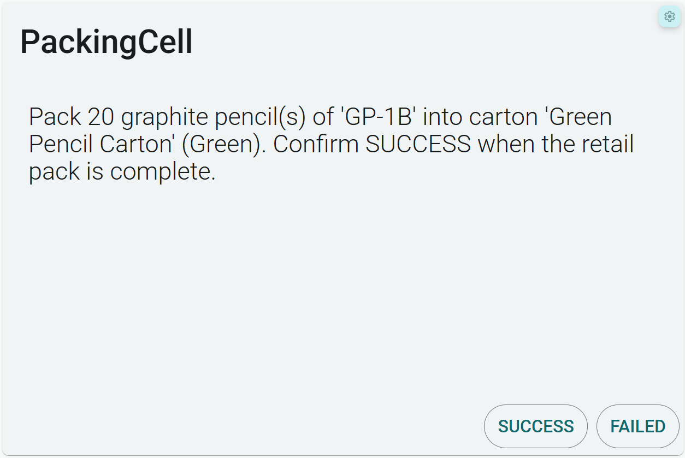

# Chapter 8 - Packing

The retail pack exists as master data, but nobody packs it yet. *Pencilla Inc.* needs a packing station where the worker sees how many pencils go into which carton. You build that cell and let `Populate` read the PartLinks at runtime.

Packing is a manual cell like Assembling. The difference is in `Populate`: parameters come from the Retail Pack, not from fixed workplan texts.

See also [Cells](https://github.com/PHOENIXCONTACT/MORYX-Framework/blob/dev/docs/articles/abstractions/control-system/cell-resource.md),
[Activities](https://github.com/PHOENIXCONTACT/MORYX-Framework/blob/dev/docs/articles/abstractions/processing/activities.md)
and [Workplans](https://github.com/PHOENIXCONTACT/MORYX-Framework/blob/dev/docs/articles/abstractions/processing/workplans.md).

> [Table of contents](README.md) | [Previous](chapter-7-partlinks.md) | [Next](chapter-9-initializer-importer.md)

## Parameters: read PartLinks at runtime

File: `src/PencilFactory/Activities/PackingStep/PackingParameters.cs`

Replace the empty `Populate` from the CLI. Here the bill of materials is read from the current product (Retail Pack); Quantity, pencil name, and carton end up in the Instruction.

```csharp
public class PackingParameters : VisualInstructionParameters
{
    public int PencilQuantity { get; set; }
    public string PencilName { get; set; }
    public string CartonName { get; set; }
    public CartonColor CartonColor { get; set; }

    protected override void Populate(Process process, Parameters instance)
    {
        base.Populate(process, instance);

        var parameters = (PackingParameters)instance;
        var productionProcess = (ProductionProcess)process;
        var pack = (PencilPackType)productionProcess.ProductInstance.Type;

        var pencilLink = pack.GraphitePencil;
        var cartonLink = pack.Carton;

        parameters.PencilQuantity = pencilLink?.Quantity ?? 0;
        parameters.PencilName = pencilLink?.Product?.Name ?? "(no graphite pencil linked)";
        parameters.CartonName = cartonLink?.Product?.Name ?? "(no carton linked)";
        parameters.CartonColor = cartonLink?.Product?.Color ?? default;

        parameters.Instructions =
        [
            new VisualInstruction
            {
                Type = InstructionContentType.Text,
                Content =
                    $"Pack {parameters.PencilQuantity} graphite pencil(s) of '{parameters.PencilName}' " +
                    $"into carton '{parameters.CartonName}' ({parameters.CartonColor}). " +
                    "Confirm SUCCESS when the retail pack is complete."
            }
        ];
    }
}
```

What happens? When the activity starts, `ProductInstance.Type` is the Retail Pack from the order. `GraphitePencil` / `Carton` are the PartLinks.

> **Note:** If you cast to `GraphitePencilType` instead of `PencilPackType` here, it will fail at runtime; the Packing order must be for the Retail Pack.

## Activity: Capabilities without Value

File: `src/PencilFactory/Activities/PackingStep/PackingActivity.cs`

```csharp
public override ICapabilities RequiredCapabilities => new PackingCapabilities();
```

(Do not set `Value`.)

## Cell: Visual Instructor like Assembling

File: `src/PencilFactory.Resources.Packing/PackingCell.cs`

The CLI cell often already has `IVisualInstructor` and `StartActivity`. Make sure:

1. `[ResourceReference(ResourceRelationType.Extension)] public IVisualInstructor VisualInstructor { get; set; }`
2. In `OnInitializeAsync`: `Capabilities = new PackingCapabilities();`
3. `ProcessEngineAttached`: Production + Push (like Assembling)

```csharp
protected override IEnumerable<Session> ProcessEngineAttached()
{
    yield return Session.StartSession(ActivityClassification.Production, ReadyToWorkType.Push);
}
```

4. In `StartActivity` for `PackingActivity`:

```csharp
public override void StartActivity(ActivityStart activityStart)
{
    _currentSession = activityStart;
    switch (activityStart.Activity)
    {
        case PackingActivity:
            _currentInstruction = VisualInstructor.Execute(Name, activityStart, InstructionCompleted);
            break;
    }
}
```

5. `InstructionCompleted`

```csharp
private void InstructionCompleted(int instructionResult, ActivityStart activity)
    {
        _currentInstruction = 0;
        var result = activity.CreateResult(instructionResult);
        _currentSession = result;
        PublishActivityCompleted(result);
    }
```

6. `SequenceCompleted`

```csharp
    public override void SequenceCompleted(SequenceCompleted completed)
    {
        _currentSession = completed;

        var rtw = Session.StartSession(ActivityClassification.Production, ReadyToWorkType.Push);
        PublishReadyToWork(rtw);
        _currentSession = rtw;
    }
```

A driver is not needed for this learning step (the worker clicks SUCCESS).

7. Start the app

## Create the resource in the UI

1. Create a PackingCell, name e.g. `PackingCell`.
2. Open the cell, Extension VisualInstructor: the same Instructor as for Assembling and Colorizing.
3. Save.



## Own workplan for Retail Pack

1. Workplans, plus button
2. Name: `Retail Pack Workplan`
3. Palette: Packing Task
4. Connect: Start, Packing Task, End
5. Save

No Assembling/Colorizing/Testing in this plan.


## Recipe on the Retail Pack

1. Products, your Retail Pack (e.g. `Green 20er Pack`)
2. Recipes tab, edit, add Recipe
3. Type: ProductionRecipe
4. Name e.g. `Retail Pack Production`
5. Workplan: `Retail Pack Workplan`
6. Classification: Default
7. Save

Without a Default recipe the order will not start.


## Test in the UI

1. Worker Support / Display = VisualInstructor
2. Orders: product Retail Pack, quantity 1, CREATE, BEGIN
3. Worker assistance Instruction must show Quantity, pencil name, and carton from the PartLinks
4. SUCCESS, order finished

Optional beforehand: order GraphitePencil quantity 20 (pencil line). Not technically required for Packing; the instruction simulates placing pencils into the carton.





## Checklist

* [ ] `PackingParameters.Populate` reads PartLinks and builds the Instruction
* [ ] `PackingActivity` with `PackingCapabilities()` without Value
* [ ] PackingCell with VisualInstructor, Production session, StartActivity / SequenceCompleted
* [ ] PackingCell created in the UI and Instructor linked
* [ ] Retail Pack Workplan + Default recipe on the Retail Pack
* [ ] Order Retail Pack quantity 1: Instruction shows Quantity / pencil / carton

> [Table of contents](README.md) | [Previous](chapter-7-partlinks.md) | [Next](chapter-9-initializer-importer.md)
