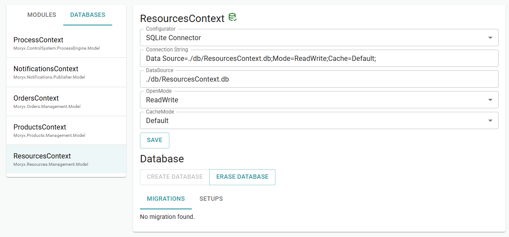
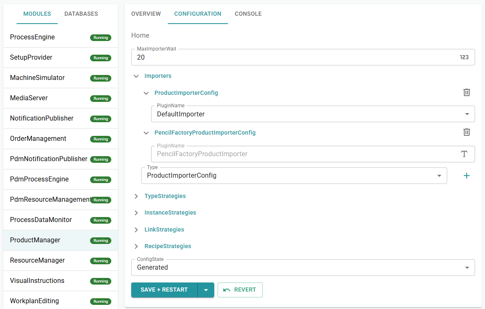
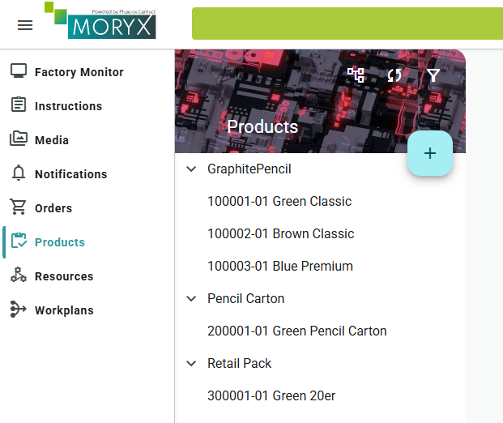

# Chapter 9 - Initializer and Importer

Building the factory click by click in the UI was fine while learning. A new machine or training lab, however, starts empty every time. *Pencilla Inc.* wants resources and master data created from code, plus a Factory Monitor to see the line.

> [Table of contents](README.md) | [Previous](chapter-8-packing.md) | [Next](chapter-10-module-adapter.md)

You will add two plugins:

* **ResourceInitializer** (ResourceManager): builds the pencil line (Assembling, Colorizing, Testing, Packing, Instructor, and a simulated Testing driver). See [Resource management](https://github.com/PHOENIXCONTACT/MORYX-Framework/blob/dev/docs/articles/module-resources/resource-management.md).
* **ProductImporter** (ProductManager): creates products, workplans, and Default recipes. See [Product import](https://github.com/PHOENIXCONTACT/MORYX-Framework/blob/dev/docs/articles/module-products/product-import.md).

You also wire the [Factory Monitor](https://github.com/PHOENIXCONTACT/MORYX-Framework/blob/dev/docs/articles/module-factory-monitor/index.md) with a resource graph (`ManufacturingFactory` / `MachineLocation`).

## Clear the databases

Clear all databases first; otherwise old cells and products remain as duplicates.

* In the Command Center under **Databases**, open each DB context, Erase Database, Create Database. Repeat for all contexts.
* Reincarnate all modules or restart the app
* Products, resources, workplans, and orders should be gone from the UI



## Factory Monitor packages

The monitor did not load so far because only the web UI was referenced, without API and without factory types.

Therefore add the packages to `PencilFactory.App.csproj`:

```xml
<!-- MORYX FactoryMonitor -->
<PackageReference Include="Moryx.Factory" />
<PackageReference Include="Moryx.FactoryMonitor.Endpoints" />
<PackageReference Include="Moryx.FactoryMonitor.Web" />
```

File: `Directory.Packages.props`:

```xml
 <!-- MORYX FactoryMonitor -->
<PackageVersion Include="Moryx.Factory" Version="$(MoryxVersion)" />
<PackageVersion Include="Moryx.FactoryMonitor.Endpoints" Version="$(MoryxVersion)" />
<PackageVersion Include="Moryx.FactoryMonitor.Web" Version="$(MoryxVersion)" />
```

## ResourceInitializer

Next we create the ResourceInitializer. It builds the complete resource graph from code - the same structure you would otherwise create by hand in the Resources UI.

Create the file `src/PencilFactory.App/PencilFactoryInitializer.cs` and paste the following. The code is largely self-explanatory; afterwards we walk through the building blocks once more.

```csharp
[Plugin(LifeCycle.Transient, typeof(IResourceInitializer), Name = nameof(PencilFactoryInitializer))]
[Display(Name = "Pencil Factory Initializer", Description = "Creates cells, visual instructor and factory layout.")]
public class PencilFactoryInitializer : ResourceInitializerBase
{
    public override string Name => nameof(PencilFactoryInitializer);
    public override string Description => "Setup the simulated pencil factory resources";
    public override Task<ResourceInitializerResult> ExecuteAsync(IResourceGraph graph, object parameters, CancellationToken cancellationToken)
    {
        var instructor = graph.Instantiate<VisualInstructor>();
        instructor.Name = "Visual Instructor";
        instructor.Description = "Shared display for assembling, colorizing, color change and packing";

        var lineGroup = graph.Instantiate<MachineGroup>();
        lineGroup.Name = "Pencil Line";
        lineGroup.Description = "Assembling, colorizing, testing and packing";

        // Manual: VisualInstructor
        var assemblingCell = graph.Instantiate<AssemblingCell>();
        assemblingCell.Name = "Assembling Cell";
        assemblingCell.VisualInstructor = instructor;
        assemblingCell.Value = 0;
        lineGroup.Children.Add(Place(graph, "A-1", "Assembling station", "scale", 0.18, 0.32, assemblingCell));

        // Manual + Automatic: VisualInstructor + Simulated Driver
        var colorizingDriver = graph.Instantiate<SimulatedColorizingDriver>();
        colorizingDriver.Name = "Colorizing Simulated Driver";

        var colorizingCell = graph.Instantiate<ColorizingCell>();
        colorizingCell.Name = "Colorizing Cell";
        colorizingCell.VisualInstructor = instructor;
        colorizingCell.Driver = colorizingDriver;
        colorizingCell.Color = PencilColor.Green;
        lineGroup.Children.Add(Place(graph, "C-1", "Colorizing station", "science", 0.42, 0.32, colorizingCell));

        // Automatic: Simulated Driver 
        var testingDriver = graph.Instantiate<SimulatedTestingDriver>();
        testingDriver.Name = "Testing Simulated Driver";

        var testingCell = graph.Instantiate<TestingCell>();
        testingCell.Name = "Testing Cell";
        testingCell.Driver = testingDriver;
        testingCell.Value = 0;
        lineGroup.Children.Add(Place(graph, "T-1", "Testing station", "precision_manufacturing", 0.66, 0.32, testingCell));

        // Manual: Visualinstructor
        var packingCell = graph.Instantiate<PackingCell>();
        packingCell.Name = "Packing Cell";
        packingCell.VisualInstructor = instructor;
        lineGroup.Children.Add(Place(graph, "P-1", "Packing workplace", "inventory_2", 0.42, 0.68, packingCell));

        var factory = graph.Instantiate<ManufacturingFactory>();
        factory.Name = "Pencil Manufactory";
        factory.Description = "Simulated graphite pencil production and retail packing";
        factory.Children.Add(instructor);
        factory.Children.Add(lineGroup);
        factory.Children.Add(colorizingDriver);
        factory.Children.Add(testingDriver);

        return Task.FromResult(new ResourceInitializerResult
        {
            InitializedResources = [factory],
            Saved = false
        });
    }

    private static MachineLocation Place(IResourceGraph graph, string name, string description, string icon, double x, double y, Resource cell)
    {
        var location = graph.Instantiate<MachineLocation>();
        location.Name = name;
        location.Description = description;
        location.SpecificIcon = icon;
        location.PositionX = x;
        location.PositionY = y;
        location.Children.Add(cell);
        return location;
    }
}
```

## Explanation

The ResourceInitializer is a plugin that you run once in the ResourceManager console. It builds the complete resource graph from code.

| Building block | Role |
| --- | --- |
| `IResourceGraph graph` | API to create resources in the graph |
| `graph.Instantiate<T>()` | Creates a resource of type `T` (cell, driver, group, ...) |
| `[ResourceReference]` properties | Wiring between resources (`VisualInstructor`, `Driver`), as in the UI |
| `MachineGroup` | Logical group (here: "Pencil Line"), groups cells together |
| `MachineLocation` | Place on the Factory Monitor: name, icon, position (`PositionX`/`PositionY` 0...1), contains the cell as child |
| `ManufacturingFactory` | Root of the factory; everything else hangs underneath |
| `Place(...)` | Helper: creates `MachineLocation` + sets layout, returns the location |
| `Children.Add(...)` | Attaches child resources in the tree |
| `Saved = false` | ResourceManager persists the graph itself; you only return the root |

### Config: register the initializer (Command Center)

1. Command Center, ResourceManager, Console: Initialize Resource. Under configs add a ResourceInitializerConfig, choose `PencilFactoryInitializer`, Invoke.
2. Module Overview: reincarnate ResourceManager


You should now see all resources created in code in the Resources UI.


In the Factory Monitor you should now see the pencil factory with four locations (A-1, C-1, T-1, P-1) at the `PositionX`/`PositionY` coordinates.


## Optional: change the background image in FactoryMonitor

Optionally you can replace the background image and align or move the stations on it.

1. Open the Media module (Launcher).
2. Upload an image (e.g. a sketch of the pencil line with four stations).
3. Click the image, right-click, Info (or Details), copy the Media URL to the clipboard. Typical format: `/api/moryx/media/{guid}/master/stream`
4. Open Factory Monitor, click the edit icon
5. Property BackgroundUrl: paste the copied URL and save.
6. Move the MachineLocations (A-1, C-1, T-1, P-1) via drag or `PositionX`/`PositionY` (0...1) to the matching places on the image.

The icons then sit on top of the background. This is pure visuals; production runs unchanged.

## ProductImporter (products, workplans, recipes)

### Concept

The CLI stub `PencilFactoryProductImporter` was empty so far. Now it creates objects and saves them itself (`Saved = true`), because workplans are persisted via `IWorkplans` and recipes via `IProductStorage`, not only ProductTypes.

Order: parts first (pencils, carton), then Retail Pack (PartLinks), then workplans, then recipes (need product + workplan).

The ProductImporter is a plugin for the ProductManager. You start it in the Products UI via **Import**. It creates master data from code: reproducibly, instead of five products and two workplans by hand.

| Building block | Role |
| --- | --- |
| `[ProductImporter]` | Registers the class as an importer with the ProductManager |
| `PencilFactoryImportParameters` | Fields in the import dialog (`PackQuantity` becomes Quantity on `GraphitePencilPartLink`) |
| `IProductStorage` | Persists ProductTypes and Recipes |
| `IWorkplans` | Persists Workplans |
| `Saved = true` | Importer persists itself (unlike initializer with `Saved = false`) |
| Order | Parts first (pencils, carton), then Retail Pack (PartLinks), then workplans, then recipes |

If `PencilColor` still only has `Green` and `Brown` from Chapter 1, add a third value for the premium product used later in constraints (Chapter 11):

```csharp
public enum PencilColor
{
    Green = 1,
    Brown = 2,
    Blue = 3,
}
```

### Master data created

| Material number | Name | Type |
| --- | --- | --- |
| `100001` | Green Classic | GraphitePencil, Green, Hardness B |
| `100002` | Brown Premium | GraphitePencil, Brown, Hardness HB (premium product) |
| `200001` | Green Pencil Carton | Purchased carton |
| `300001` | Green 20er | Retail Pack: 20x Green + 1x carton |

Workplans: Graphite pencil production (Assembling, Colorizing, Testing) | Retail packing (Packing)

Recipes: Default recipe for all three pencils + one for the Retail Pack (4 total)

### PencilFactoryImportParameters.cs

Path: `src/PencilFactory.Products/Importer/PencilFactoryImportParameters.cs`

The parameters appear in the import dialog; here you control the pack quantity:

```csharp
[DataContract]
public class PencilFactoryImportParameters
{
    [DataMember]
    [Description("How many graphite pencils go into one retail pack")]
    public int PackQuantity { get; set; } = 20;
}
```

### PencilFactoryProductImporterConfig.cs

Path: `src/PencilFactory.Products/Importer/PencilFactoryProductImporterConfig.cs`

The config connects the importer to the ProductManager:

```csharp
public class PencilFactoryProductImporterConfig : ProductImporterConfig
{
    public override string PluginName => nameof(PencilFactoryProductImporter);
}
```

### PencilFactoryProductImporter.cs

Path: `src/PencilFactory.Products/Importer/PencilFactoryProductImporter.cs`

Here the full master-data seed is built: save products, create workplans, wire Default recipes:

```csharp
using Moryx.AbstractionLayer.Products;
using Moryx.AbstractionLayer.Recipes;
using Moryx.AbstractionLayer.Workplans;
using Moryx.Container;
using Moryx.Logging;
using Moryx.Modules;
using Moryx.Products.Management;
using Moryx.VisualInstructions;
using Moryx.Workplans;
using PencilFactory.Activities.AssemblingStep;
using PencilFactory.Activities.ColorizingStep;
using PencilFactory.Activities.PackingStep;
using PencilFactory.Activities.TestingStep;

namespace PencilFactory.Products.Importer;

/// <summary>
/// Imports products for PencilFactory
/// </summary>
[ExpectedConfig(typeof(PencilFactoryProductImporterConfig))]
[ProductImporter(nameof(PencilFactoryProductImporter))]
public class PencilFactoryProductImporter : ProductImporterBase<PencilFactoryProductImporterConfig, PencilFactoryImportParameters>, ILoggingComponent
{
    public IModuleLogger Logger { get; set; }
    public IProductStorage Storage { get; set; }
    public IWorkplans WorkplanStorage { get; set; }

    protected override async Task<ProductImporterResult> ImportAsync(ProductImportContext context, PencilFactoryImportParameters parameters, CancellationToken cancellationToken)
    {
        var quantity = parameters.PackQuantity > 0 ? parameters.PackQuantity : 20;

        var green = CreateGraphitePencil("100001", 1, "Green Classic", PencilColor.Green, GraphiteHardness.B);
        var brown = CreateGraphitePencil("100002", 1, "Brown Classic", PencilColor.Brown, GraphiteHardness.HB);
        var bluePremium = CreateGraphitePencil("100003", 1, "Blue Premium", PencilColor.Blue, GraphiteHardness.HB);
        var greenCarton = CreateCarton("200001", 1, "Green Pencil Carton", CartonColor.Green);
        var greenPack = CreateRetailPack("300001", 1, "Green 20er", green, quantity, greenCarton);

        await Storage.SaveTypeAsync(green, cancellationToken);
        await Storage.SaveTypeAsync(brown, cancellationToken);
        await Storage.SaveTypeAsync(bluePremium, cancellationToken);
        await Storage.SaveTypeAsync(greenCarton, cancellationToken);
        await Storage.SaveTypeAsync(greenPack, cancellationToken);

        var pencilWorkplan = CreateGraphitePencilWorkplan();
        var packWorkplan = CreatePackingWorkplan();
        await WorkplanStorage.SaveWorkplanAsync(pencilWorkplan, cancellationToken);
        await WorkplanStorage.SaveWorkplanAsync(packWorkplan, cancellationToken);

        await Storage.SaveRecipeAsync(CreateRecipe("Graphite pencil production", green, pencilWorkplan), cancellationToken);
        await Storage.SaveRecipeAsync(CreateRecipe("Graphite pencil production", brown, pencilWorkplan), cancellationToken);
        await Storage.SaveRecipeAsync(CreateRecipe("Graphite pencil production", bluePremium, pencilWorkplan), cancellationToken);
        await Storage.SaveRecipeAsync(CreateRecipe("Retail packing", greenPack, packWorkplan), cancellationToken);

        return new ProductImporterResult { Saved = true };
    }

    private static GraphitePencilType CreateGraphitePencil(string materialNumber, short revision, string name, PencilColor color, GraphiteHardness hardness)
    {
        return new GraphitePencilType
        {
            Identity = new ProductIdentity(materialNumber, revision),
            Name = name,
            Color = color,
            Hardness = hardness
        };
    }

    private static PencilCartonType CreateCarton(string materialNumber, short revision, string name, CartonColor color)
    {
        return new PencilCartonType
        {
            Identity = new ProductIdentity(materialNumber, revision),
            Name = name,
            Color = color
        };
    }

    private static PencilPackType CreateRetailPack(string materialNumber, short revision, string name, GraphitePencilType pencil, int quantity, PencilCartonType carton)
    {
        return new PencilPackType
        {
            Identity = new ProductIdentity(materialNumber, revision),
            Name = name,
            GraphitePencil = new GraphitePencilPartLink { Product = pencil, Quantity = quantity },
            Carton = new ProductPartLink<PencilCartonType> { Product = carton }
        };
    }

    private static ProductionRecipe CreateRecipe(string name, ProductType product, Workplan workplan)
    {
        return new ProductionRecipe
        {
            Name = name,
            Product = product,
            Workplan = workplan,
            Classification = RecipeClassification.Default,
            State = RecipeState.Released
        };
    }

    private static Workplan CreateGraphitePencilWorkplan()
    {
        var workplan = new Workplan
        {
            Name = "Graphite pencil production (Imported)",
            State = WorkplanState.Released
        };

        var start = workplan.AddConnector("Start", NodeClassification.Start);
        var assembled = workplan.AddConnector("Assembled", NodeClassification.Intermediate);
        var colorized = workplan.AddConnector("Colorized", NodeClassification.Intermediate);
        var end = workplan.AddConnector("End", NodeClassification.End);
        var failed = workplan.AddConnector("Failed", NodeClassification.Failed);

        workplan.AddStep(new AssemblingTask(), new AssemblingParameters
        {
            Instructions =
            [
                new VisualInstruction
                    {
                        Type = InstructionContentType.Text,
                        Content = "Assemble the graphite pencil, then confirm SUCCESS or FAILED."
                    }
            ]
        }, start, assembled, failed);

        workplan.AddStep(new ColorizingTask(), new ColorizingParameters
        {
            Instructions =
            [
                new VisualInstruction
                    {
                        Type = InstructionContentType.Text,
                        Content = "Colorize the pencil with the required color, then confirm SUCCESS."
                    }
            ]
        }, assembled, colorized, failed);

        workplan.AddStep(new TestingTask(), new TestingParameters(), colorized, end, failed);

        return workplan;
    }

    private static Workplan CreatePackingWorkplan()
    {
        var workplan = new Workplan
        {
            Name = "Retail packing (Imported)",
            State = WorkplanState.Released
        };

        var start = workplan.AddConnector("Start", NodeClassification.Start);
        var end = workplan.AddConnector("End", NodeClassification.End);
        var failed = workplan.AddConnector("Failed", NodeClassification.Failed);

        workplan.AddStep(new PackingTask(), new PackingParameters(), start, end, failed);

        return workplan;
    }
}
```

### Config: register the importer (Command Center)

1. ProductManager, CONFIGURATION, Importers: add plugin type PencilFactoryProductImporterConfig (+)
2. SAVE + RESTART



### Run

1. Open Products UI, **Import**.
2. Choose importer PencilFactoryProductImporter.
3. Leave `PackQuantity` at e.g. 20 and start Import.
4. Expectation: five products, two workplans, four Default recipes.




The UI is the editor. Initializer and Importer are the seed, this is how an application developer sets up a factory that everyone can reproduce.

## Checklist

* [ ] Databases cleared and modules restarted
* [ ] Factory Monitor packages entered in `csproj` and `Directory.Packages.props`
* [ ] `PencilFactoryInitializer` created and run via the ResourceManager console
* [ ] Resources UI and Factory Monitor show A-1, C-1, T-1, P-1
* [ ] ProductImporter files created and importer registered in the config
* [ ] Import executed: five products, two workplans, four Default recipes

> [Table of contents](README.md) | [Previous](chapter-8-packing.md) | [Next](chapter-10-module-adapter.md)
